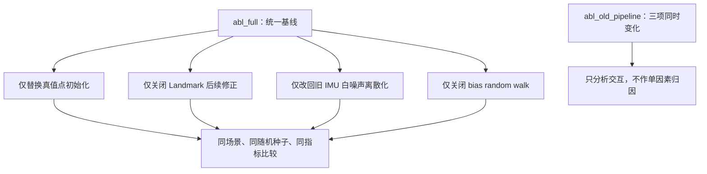

# Schur 视觉后验严格消融实验

## 1. 目的与控制变量

本实验用于解释新旧仿真结果差异，并区分以下四个因素：

1. landmark 使用真实多视图三角化还是仿真真值初始化；
2. Schur 状态更新后是否继续修正 landmark；
3. IMU 连续白噪声密度是否按正确规则离散化；
4. 仿真真值中的 IMU 偏置是否随机游走。

以下是引入一次性调度前的**历史严格消融**。所有配置固定使用：Schur 路径、LDLT、
`uv_var=1e-2`、过程噪声倍率 1、
`ESTIMATE_GRAVITY=false`、30 s、600 个特征点、相机 20 Hz、IMU 200 Hz，以及各场景
固定且相互独立的随机数流。单因素配置相对 `abl_full` 只改变一项。`abl_old_pipeline`
同时改变三项，仅检查交互效应，不参与单因素因果归因。

这里的 `uv_var` 属于当时的重复窗口噪声语义；当前默认一次性 MSCKF 使用
`triangulation_uv_std^2 * msckf_visual_noise_scale`，二者不能直接横向调参。



对单因素 $j$，报告不仅比较绝对值，还比较相对效应

$$
\Delta_j=m_j-m_{base},\qquad
\rho_j=\frac{m_j}{m_{base}},
$$

其中 $m$ 可取 ATE、RPE、NEES 或耗时。只有当其它输入与随机序列完全一致时，
$\Delta_j$ 才能解释为该因素在当前数据分布上的因果效应。

| 配置 | 点初始化 | 点后续修正 | IMU 白噪声 | 偏置随机游走 | 用途 |
|---|---|---:|---|---:|---|
| `abl_full` | 三角化 | 开 | 正确密度离散化 | 开 | 当前完整基线 |
| `abl_gt_init` | 三角化门控/协方差 + 真值位置 | 开 | 正确密度离散化 | 开 | 只隔离三角化位置误差 |
| `abl_no_refine` | 三角化 | 关 | 正确密度离散化 | 开 | 只隔离 landmark 修正 |
| `abl_legacy_white` | 三角化 | 开 | 旧离散化 | 开 | 只隔离白噪声离散化 |
| `abl_no_bias_rw` | 三角化 | 开 | 正确密度离散化 | 关 | 只隔离偏置随机游走 |
| `abl_old_pipeline` | 真值 | 开 | 旧离散化 | 关 | 旧流程组合/交互检查 |

运行命令：

```powershell
tools/run_strict_ablation.ps1 -Duration 30 -Features 600
```

中断后可以接续：

```powershell
tools/run_strict_ablation.ps1 -Duration 30 -Features 600 -Resume
```

脚本按“场景 + 配置”去重，并拒绝在另一个 `VinsAnalysis` 仍运行时启动，避免长实验中断后
出现重复写入或并发污染。

## 2. 评价指标

原始绝对位置 RMSE 保留全局平移、全局偏航和累计漂移：

$$
\operatorname{ATE}_{raw}=\sqrt{\frac{1}{N}\sum_i
\left\|\hat{\mathbf p}_i-\mathbf p_i\right\|^2}.
$$

为避免把不可观全局坐标系偏移全部算到局部里程计质量中，另计算不允许缩放的刚体对齐
ATE：

$$
(\mathbf R^*,\mathbf t^*)=\arg\min_{\mathbf R\in SO(3),\mathbf t}
\sum_i\left\|\mathbf p_i-(\mathbf R\hat{\mathbf p}_i+\mathbf t)\right\|^2,
$$

$$
\operatorname{ATE}_{SE(3)}=\sqrt{\frac{1}{N}\sum_i
\left\|\mathbf p_i-(\mathbf R^*\hat{\mathbf p}_i+\mathbf t^*)\right\|^2}.
$$

1 秒相对位姿误差使用每个起始位姿的局部坐标系：

$$
\Delta\mathbf T_i=\mathbf T_i^{-1}\mathbf T_{i+1s},\qquad
\mathbf E_i=\Delta\mathbf T_{i,gt}^{-1}\Delta\mathbf T_{i,est}.
$$

报告分别统计 $\mathbf E_i$ 的平移 RMSE 和旋转对数映射 RMSE。该指标对固定的全局刚体变换
不敏感，更适合判断局部 VIO 约束是否正确。

同时记录视觉后验使位置误差下降的比例、Huber 降权率、硬拒绝率、NEES/NIS、三角化
成功率及负协方差帧数。耗时会受机器负载显著影响，本轮仅作诊断，不用于性能排名。

## 3. 核心结果

下表为刚体对齐位置 ATE / 1 秒平移 RPE，单位均为 m：

| 场景 | 完整基线 | 真值点 | 关点修正 | 旧白噪声 | 关偏置 RW | 旧流程组合 |
|---|---:|---:|---:|---:|---:|---:|
| Circle-out | 1.0486 / 0.2420 | 0.4374 / 0.1100 | 0.8999 / 0.2014 | 0.0250 / 0.0070 | 0.9877 / 0.2243 | 0.0121 / 0.0050 |
| Circle-in | 0.5190 / 0.1509 | 0.5352 / 0.1526 | 0.0929 / 0.0418 | 0.0574 / 0.0083 | 0.4658 / 0.1336 | 0.0289 / 0.0050 |
| Helix-3D | 0.0395 / 0.0231 | 0.0460 / 0.0234 | 0.0315 / 0.0289 | 0.0071 / 0.0027 | 0.0350 / 0.0226 | 0.0096 / 0.0028 |
| Stop-go | 0.0674 / 0.0507 | 0.0672 / 0.0514 | 0.0645 / 0.0495 | 0.0122 / 0.0081 | 0.0701 / 0.0502 | 0.0110 / 0.0067 |

相对完整基线，四场景等权平均比率为：

| 单因素 | 对齐 ATE 变化 | 1 秒 RPE 变化 | 方向一致性 |
|---|---:|---:|---|
| 仅替换成功三角化点的位置为真值 | -9.7% | -12.7% | 只在 Circle-out 显著改善，其余场景基本不变或略差 |
| 关闭 landmark 修正 | -30.2% | -16.6% | 三个场景改善；Helix RPE 恶化 25.1% |
| 旧白噪声离散化 | -87.6% | -91.0% | 四场景都大幅变“容易” |
| 关闭偏置随机游走 | -5.9% | -5.5% | 影响较小且方向混合 |

24 组实验的负协方差帧数均为 0。

## 4. 结论

### 4.1 圆周场景变差不只是全局 gauge

Circle-out 原始 ATE 为 1.2033 m，对齐后仍为 1.0486 m；Circle-in 分别为 0.6210 m 和
0.5190 m。刚体对齐只消除一部分误差，因此当前差距不能全部解释为全局原点/偏航漂移，
局部相对运动和 landmark 几何质量也有实质影响。

保持同一三角化成功集合和同一初始协方差、只把成功点位置替换成真值后，Circle-out 的
对齐 ATE/RPE 分别下降 58.3%/54.6%；Circle-in 则变化 +3.1%/+1.1%，Helix 和 Stop-go
也基本不变。这直接说明 Circle-out 明显受成功点的位置精度影响；Circle-in 的主要问题并
不是成功三角化点的初始位置，而更可能在 landmark 后续修正、长期相关性反馈和场景退化性。

历史“全真值点”初始化会绕过三角化失败门控、改变参与点集合，并使用固定 `1e-4 I`
协方差，所以它在 Circle-in 上产生的大幅收益不能归因于“位置更准”这一项。该历史行为只
保留在 `abl_old_pipeline` 组合中。Circle-out 向外视场的短 track、较弱重叠和缺少回环约束
仍会放大上述问题。

### 4.2 当前 landmark 后续修正需要重做一致性设计

关闭 landmark 修正后，平均轨迹指标反而改善，但平均 Huber 降权率从 20.7% 上升到
57.7%，且 Helix 的 1 秒 RPE 恶化 25.1%。因此不能简单得出“永久关闭修正更好”。更合理
的判断是：当前实现把 landmark 当作具有独立协方差的状态更新，却没有维护它与滑窗状态
的交叉协方差；随后又把修正后的点重复用于状态残差，容易造成相关信息重复使用和错误
线性化反馈。

这部分已在后续修复中完成独立实验：比较了固定三角化点、从原始观测重三角化和当前批次
Schur 回代，并保留旧独立 EKF 作为历史参考。受当前架构边界限制，Schur 回代只保证单批
联合方程的一阶一致性，不冒充完整的长期 $P_{xl}$。正式结果、数学推导和默认策略见
[LANDMARK_UPDATE_STRATEGIES.md](LANDMARK_UPDATE_STRATEGIES.md)。

### 4.3 旧白噪声结果好，是因为数据被大幅简化

连续白噪声密度 $\sigma_c$ 在采样周期 $dt$ 下的单样本标准差应为

$$
\sigma_d=\frac{\sigma_c}{\sqrt{dt}}=\sigma_c\sqrt{f_s}.
$$

旧实现使用 $\sigma_c\sqrt{dt}=\sigma_c/\sqrt{f_s}$。两者之比为 $f_s$；在 200 Hz 下，
旧实现把每个 IMU 样本的白噪声标准差缩小了 200 倍。因此 `abl_legacy_white` 和
`abl_old_pipeline` 的低误差只说明输入更接近无噪声，不说明旧离散化更正确，也不能与当前
完整基线做“算法优劣”比较。

### 4.4 偏置游走不是圆周差异的主因

只关闭偏置随机游走的平均改善约 5%～6%，而且 Stop-go 的对齐 ATE 略有恶化。它会改变
仿真难度和一致性，但远不足以解释 Circle-out/Circle-in 与旧测试之间的数量级差异。

## 5. 统计边界与后续实验

本轮严格之处是每个单因素使用完全相同的确定性输入流和算法配置，因此差异可重复；但每个
场景仍只有一个随机种子，不能提供置信区间。若要形成统计结论，应增加至少 10～30 个种子，
报告中位数、P10/P90 和配对差值置信区间，同时保持每对实验共享同一随机样本。

完整逐行数据位于 `out/ablation_summary.csv`，可视化位于 `out/report.html` 的“严格消融
实验”章节。
