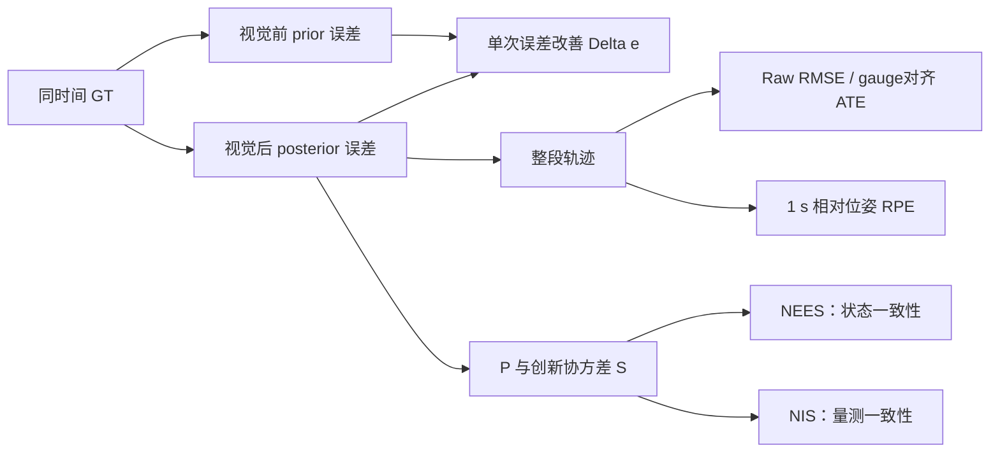

# SchurVIO 视觉后验、噪声参数与多场景分析

配套交互报告：`out/report.html`。当前分析统一使用 `USE_SCHUR`；`Hpp` 默认
LDLT，Schur 消元中的 3×3 `Hll` 使用带阈值特征伪逆。外参雅可比保留但由
`ESTIMATE_EXTRINSIC=false` 屏蔽。

## 1. 生成方法

```powershell
cmake --build cmake-build-release --target VinsAnalysis VinsReport
tools/run_multi_scenario_analysis.ps1 -Duration 30 -Features 600
```

报告同时展示四类仿真：Circle-out、Circle-in、Helix-3D 和 Stop-go。除详细的三维轨迹、
坐标系朝向、特征点和三角化图外，多场景表还包含：

- 位置/速度/姿态 RMSE 与最大位置误差；
- 视觉更新前后误差、后验改善率和修正量；
- NEES/NIS、协方差包络和负协方差计数；
- Huber 降权率、硬残差拒绝率；
- 三角化成功率、误差、视差、条件数与耗时；
- landmark 最终 NEES、95% 置信椭球覆盖率和解耦影子地图误差；
- 一致硬投影的零空间泄漏、秩、删除梯度能量和耗时；
- 过程噪声倍率扫描，以及兼容模式历史 `uv_var` 扫描；一次性 MSCKF 会跳过无效的
  `uv_var` 重复行。

场景定义和传感器噪声见 [SIMULATION_SCENARIOS.md](SIMULATION_SCENARIOS.md)。

## 2. 当前视觉噪声与历史 `uv_var`

当前默认是一次性 Hybrid MSCKF。普通轨迹每个像素样本最多使用一次，公共量测方差为

\[
\sigma_v^2=
\texttt{triangulation\_uv\_std}^2
\max(\texttt{msckf\_visual\_noise\_scale},1).
\]

仿真中
\(\texttt{triangulation\_uv\_std}\approx1/184.75=0.0054\)，单轴归一化方差约
\(2.93\times10^{-5}\)。对 Hpp 的有效信息方向 \(d_i\)，序贯伪量测使用

\[
R_i=\frac{\sigma_v^2}{d_i}.
\]

这里不除以相机周期；同一幅图像的样本方差不会因相机频率提高而自动下降。

`uv_var=1e-2` 只保留给 Legacy/VINS-Mono 等历史重复窗口对照，其旧语义是

\[
R_i=\frac{\texttt{uv\_var}}{d_i\Delta t}.
\]

所以 `uv_var` 不是当前默认 MSCKF 的像素方差。一次性模式下扫描它不会改变普通轨迹
后验，多场景脚本会主动跳过这类无效扫描。

早期 30 秒 Circle-out 的 `uv_var` 扫描仍有历史价值：它证明重复窗口模式下短测试会
掩盖过度自信，最终在该旧语义中选择了 `1e-2`。但这些 RMSE 不能用于标定当前一次性
MSCKF。当前还要单独考虑已晋升持久点；它们跨关键帧重复观测，使用

\[
R_{persistent}=64\,\sigma_v^2I/w
\]

的保守方差和二维 NIS 门控。完整分层见
[VISUAL_RESIDUAL_NOISE_MODEL.md](VISUAL_RESIDUAL_NOISE_MODEL.md)。

## 3. Schur 视觉鲁棒门控

进入 Hessian 累计前，每条观测依次执行：

1. 相机深度有限且 `z>0.05 m`；
2. 归一化重投影残差有限且小于 `0.1`；
3. 以 `3*triangulation_uv_std` 为阈值计算 Huber 权重；
4. 一个 landmark 至少保留两个有效观测，否则不参与 Schur 消元和更新。

Huber 权重同时作用于 `Hpp/Hll/Hpl/gp/gl`，保证正规方程内部一致。日志记录每次更新的
`obs_used/obs_downweighted/obs_rejected`，报告按场景显示降权率和硬拒绝率。门控稳定了
Helix-3D 的偶发尖峰，但不能替代正确的单帧方差、一次性生命周期和持久点长期噪声模型。
仅剩一条有效观测的 landmark 不写入 Hessian；第一条先暂存，第二条到来后再一起累计，
避免把未消元点错误当成固定地图约束。

## 4. IMU 噪声离散化与过程噪声

模拟器参数改为连续时间噪声密度。采样周期为 `dt` 时：

```math
\sigma_{white,sample}=\frac{\sigma_c}{\sqrt{dt}},\qquad
\sigma_{bias,step}=\sigma_{rw}\sqrt{dt}.
```

原实现使用 `density/sqrt(rate)`，等价于 `density*sqrt(dt)`，把白噪声标准差低估了
`rate` 倍。现已修复，并恢复偏置随机游走。

统一仿真标称密度和 ESKF 默认过程标准差为：

| 状态方向 | 仿真标称 | ESKF 默认 | 说明 |
|---|---:|---:|---|
| 姿态/gyro | 0.002 | 0.003 | 1.5 倍裕量 |
| 速度/accel | 0.020 | 0.030 | 1.5 倍裕量 |
| gyro bias RW | 0.0001 | 0.0002 | 2 倍裕量 |
| accel bias RW | 0.0005 | 0.0010 | 2 倍裕量 |
| 位置直接 RW | — | 0.0003 | 小量模型裕度 |

早期重复窗口模式曾得到另一组过程噪声敏感度，它只应作为历史记录。2026-08-11 当前默认
Hybrid MSCKF 的 100 秒 Circle-out 严格扫描为：

| `proc_scale` | 位置 RMSE | 最大位置误差 |
|---:|---:|---:|
| 0.5 | 0.3344 m | 0.6811 m |
| 1.0 | **0.3262 m** | **0.6316 m** |
| 2.0 | 0.3772 m | 0.6845 m |

默认保留 `proc_scale=1`。这只是确定性仿真中的稳定区间；真实 IMU 应以 Allan 方差为
主。当前 Qd 还是直接状态空间对角密度近似，而不是完整 \(GQ_cG^T\) 离散积分，详见 ESKF
传播专题。

## 5. 为什么关闭重力估计

四个仿真器都使用

```math
g_{true}=[0,0,9.81]^T\ \mathrm{m/s^2},
```

ESKF 初值也是完全相同的向量。在这种已知真值验证中继续估计 `g` 没有收益，反而增加 3 个
状态维度，并引入重力横向分量与横滚/俯仰、加速度计零偏之间的弱可观耦合。因此默认设置

```cpp
INSState::ESTIMATE_GRAVITY = false;
```

关闭后报告中的 `gx/gy/gz` 只用于检查固定值是否被意外修改，`gravity_error` 应严格为 0。
这不代表真实 VIO 一律应关闭重力：若设备初始姿态或重力方向未知，应先做可靠静止初始化，
或开启重力估计并使用有足够三轴激励的数据。

## 6. 视觉后验是否正确修正 ESKF



分析日志在每次视觉更新前后分别保存 `q/p/v`，并与同时间 GT 比较。报告给出：

```math
\Delta e_p=\|p_{prior}-p_{gt}\|-\|p_{post}-p_{gt}\|.
```

`Delta e_p>0` 代表该次视觉更新把位置拉近真值。单次改善率不应机械要求 100%：量测含噪、
状态耦合以及滤波目标是最小化期望协方差而非每次都减小已知真值误差。更重要的是检查：

- 长期 RMSE 是否小于纯 IMU 漂移；
- 先验/后验散点是否大多在对角线下；
- 修正量是否有限、是否出现孤立大尖峰；
- NEES/NIS 是否显示过度自信；
- 四种几何和运动下是否都不发散。

姿态误差使用四元数差的对数映射，避免直接相减欧拉角的跳变：

$$
e_R=\operatorname{Log}(R_{gt}^TR_{est}),
\qquad
\operatorname{RMSE}_R=
\sqrt{\frac1N\sum_i\|e_{R,i}\|^2}.
$$

对状态误差 $e_x$ 和对应协方差块 $P_x$，归一化估计误差平方为

$$
\operatorname{NEES}=e_x^TP_x^{+}e_x.
$$

对量测创新 $r$、雅可比 $H$ 和创新协方差 $S=HP^-H^T+R$，归一化创新平方为

$$
\operatorname{NIS}=r^TS^{+}r.
$$

这里使用伪逆是为了兼容视觉 gauge 和被主动截断的退化方向。NEES/NIS 应与其**实际有效
自由度**的卡方分布比较；只看均值或把名义矩阵维数直接当自由度，会误判一致性。

报告中的多场景汇总正是为避免只凭一条“好看”的圆周轨迹判断算法正确。

### 当前默认 100 秒 / 600 点基线

2026-08-11 重新构建并运行默认 Schur + LDLT + MSCKF + AUTO(KeyframeOnly) +
WORLD_XYZ + Hybrid 配置：

| 场景 | 位置 RMSE | 最大位置误差 | 速度 RMSE | 姿态 RMSE | mean NEES | mean NIS |
|---|---:|---:|---:|---:|---:|---:|
| Circle-out | 0.3262 m | 0.6316 m | 0.0585 | 0.00423 | 1.235 | 0.982 |
| Circle-in | 0.3124 m | 0.6157 m | 0.0531 | 0.00431 | 0.986 | 0.955 |
| Helix-3D | 0.0867 m | 0.3025 m | 0.0492 | 0.00413 | 0.449 | 0.921 |
| Stop-go | 0.0604 m | 0.1543 m | 0.0581 | 0.00578 | 0.588 | 0.602 |

四个场景均满足 neg_cov=0、reused=0、blocked=0。Stop-go 触发 5772 个无深度旋转约束，
说明纯旋转/低视差降级路径确实参与了长期回归，而不是只在文档中存在。当前
out/report.html 对应这组结果；早期 30 秒重复窗口表不再作为默认基线。

## 7. 协方差负值结论

此前负协方差的根因不是 Joseph 视觉更新，而是 IMU 预测只传播 `P_ii`、遗漏
INS 与 clone 的互协方差 `P_ic`。联合状态转移 `F=diag(A,I)` 必须满足

```math
P'_{ii}=AP_{ii}A^T+Q,\qquad P'_{ic}=AP_{ic},\qquad
P'_{ci}=P_{ic}'^T,\qquad P'_{cc}=P_{cc}.
```

三条固定尺寸预测实现路径现均补全该传播；默认使用不显式构造 `A` 的优化分块路径：
`CONFIG_DEBUG=false`、`USE_STABLE_COVARIANCE_PREDICTION=false`。已有持久点使协方差
动态扩维时，代码自动使用局部 15×15 的 A 同时传播全部 \(P_{xL}\)。视觉标量更新保留
Joseph 等价形式。多场景汇总中的 `neg_cov` 必须为 0；机器精度量级的小负特征值需按
相对阈值判断，不能与真实不定混为一谈。

当前姿态误差注入后尚未显式应用 reset Jacobian，采用小修正下 \(G_{reset}\approx I\)
的近似。它不是本次负协方差修复的根因，但属于后续若提高严格一致性时需要单独验证的边界。
完整传播、增广和 reset 推导见
[ESKF_STATE_PROPAGATION_AND_AUGMENTATION.md](ESKF_STATE_PROPAGATION_AND_AUGMENTATION.md)。

## 8. 三角化与真值隔离

未三角化点不再执行 `lmk->position=lmk_map.at(id)`。当前流程为多视图射线初值、带相对
clone 协方差的鲁棒重投影优化、质量门限和初始 landmark 协方差。失败点等新增关键帧观测
后重试，成功点才进入 Schur 后验。

详细公式、失败原因、复杂度和报告字段见 [TRIANGULATION.md](TRIANGULATION.md)。

## 9. 相关文档

- [SIMULATION_SCENARIOS.md](SIMULATION_SCENARIOS.md)：四类仿真和统一噪声模型
- [TRIANGULATION.md](TRIANGULATION.md)：多视图三角化与初始协方差
- [ABLATION_STUDY.md](ABLATION_STUDY.md)：24 组严格单因素/组合消融、SE(3) 对齐 ATE 与 1 秒 RPE
- [OPT_SCHUR_PATH.md](OPT_SCHUR_PATH.md)：Schur 性能优化
- [OPT_LDLT.md](OPT_LDLT.md)：Hpp LDLT 开关、历史性能与退化验证
- [HPP_NULLSPACE.md](HPP_NULLSPACE.md)：Hpp 结构性零空间
- [HLL_STRUCTURE.md](HLL_STRUCTURE.md)：landmark 深度弱方向
- [CONSISTENT_SUBSPACE_AND_LANDMARK_COVARIANCE.md](CONSISTENT_SUBSPACE_AND_LANDMARK_COVARIANCE.md)：
  `Hll/Hpp/gp` 同域投影、landmark NEES/覆盖率、协方差膨胀与影子地图严格实验
- [VISUAL_RESIDUAL_NOISE_MODEL.md](VISUAL_RESIDUAL_NOISE_MODEL.md)：当前 MSCKF、持久点与历史
  `uv_var` 的三种噪声语义
- [ESKF_STATE_PROPAGATION_AND_AUGMENTATION.md](ESKF_STATE_PROPAGATION_AND_AUGMENTATION.md)：
  坐标、传播、增广、Joseph 与 reset 边界
