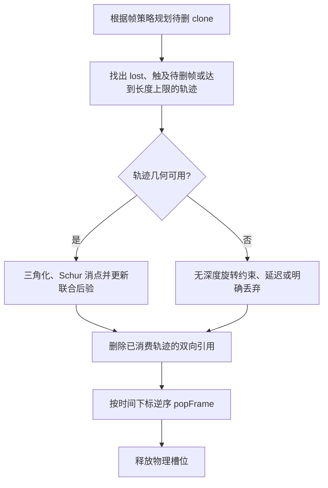
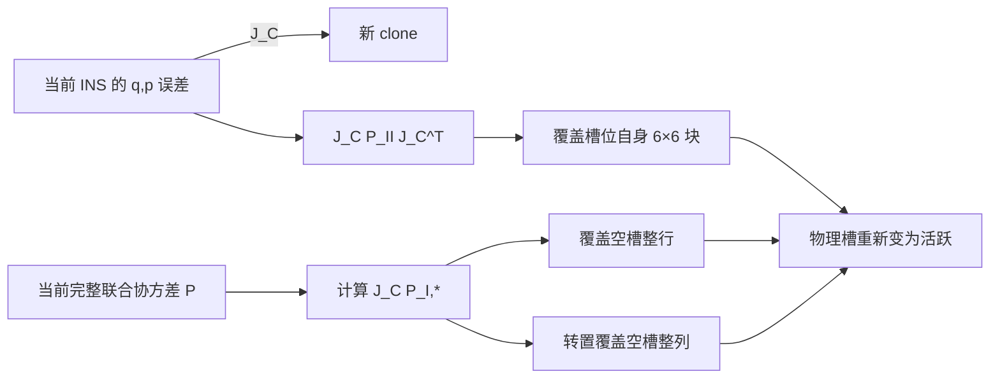

# Clone 删除、协方差边缘化与固定槽位复用

本文澄清一个在滑窗 VIO 中很容易混用的术语：代码里的 `popFrame()` 常被口头称为
“边缘化一帧”，但当前 SchurVIO 保存的是联合**协方差**，并采用固定容量物理槽位；它与
优化器在信息矩阵上构造边缘化先验不是同一个操作。

结论先行：

- 一次性轨迹必须在其依赖的 clone 删除前完成更新或明确丢弃；
- 后验已经写入协方差后，丢弃一个 clone 在协方差形式下只需保留主子块，不再做一次
  Schur 补；
- 当前实现不搬动矩阵，而是把被删 clone 的物理槽标为空闲；
- 空闲槽里的旧数值不会影响活跃状态后验，前提是所有量测列对空槽严格为零；
- 槽位再次使用时，必须完整覆盖它与 INS、全部 clone 和持久 landmark 的行列交叉块；
- 固定槽位在数学上可正确，但仍有固定维数分解和序贯更新的性能开销。

## 1. 三种容易混淆的操作

把待保留变量记为 \(x_a\)，待删除 clone 记为 \(x_d\)。联合高斯为

\[
\begin{bmatrix}x_a\\x_d\end{bmatrix}
\sim\mathcal N\!\left(
\begin{bmatrix}\mu_a\\\mu_d\end{bmatrix},
\begin{bmatrix}
P_{aa}&P_{ad}\\
P_{da}&P_{dd}
\end{bmatrix}\right).
\]

### 1.1 边缘分布：当前删帧需要的操作

积分掉 \(x_d\)：

\[
p(x_a)=\int p(x_a,x_d)\,dx_d
=\mathcal N(\mu_a,P_{aa}).
\]

所以在**协方差形式**中，保留变量的边缘协方差就是原矩阵的主子块 \(P_{aa}\)。不应再做

\[
P_{aa}-P_{ad}P_{dd}^{-1}P_{da},
\]

因为后者是条件协方差，不是边缘协方差。

### 1.2 条件分布：不能拿来代替删帧

若人为知道 \(x_d=\bar x_d\)，才有

\[
P_{a\mid d}=P_{aa}-P_{ad}P_{dd}^{-1}P_{da}.
\]

这会额外收紧 \(x_a\)，等价于把被删除 clone 当成一个已知真值。普通窗口淘汰没有获得这份
新信息，因此不能这样更新。

### 1.3 信息形式的 Schur 边缘化

若保存的是信息矩阵

\[
\Lambda=
\begin{bmatrix}
\Lambda_{aa}&\Lambda_{ad}\\
\Lambda_{da}&\Lambda_{dd}
\end{bmatrix},
\]

则边缘分布的信息矩阵为

\[
\Lambda_a^{marg}
=\Lambda_{aa}-\Lambda_{ad}\Lambda_{dd}^{-1}\Lambda_{da}.
\]

这正是滑窗优化器常说的“Schur 边缘化并形成先验”。因此：

> 协方差形式取主子块、信息形式做 Schur 补，描述的是同一个高斯边缘分布；不能把两边的
> 矩阵公式直接互换。

## 2. 为什么删 clone 前必须先处理轨迹

一条普通 MSCKF 轨迹依赖多个 clone：

\[
r_f=H_a\delta x_a+H_d\delta x_d+H_f\delta p_f+n.
\]

若先删除 \(x_d\)，再丢掉与它相关的原始像素，则这条轨迹的信息从未进入后验；取
\(P_{aa}\) 也不可能把“尚未使用的量测”自动变出来。

当前一次性调度的正确顺序是：

EKF 更新完成后，量测信息已经浓缩在保留状态的均值和协方差里。此时删除 clone 不需要再
创建一份边缘化因子；重复创建反而会再次计入同一批信息。

## 3. 当前联合状态与两套索引

固定主状态写成

\[
x_M=[x_I,c_0,c_1,\ldots,c_{29}],
\qquad \dim x_M=15+30\times6=195.
\]

少量持久点动态追加在后部：

\[
\chi=[x_M,p_{L_1},\ldots,p_{L_m}].
\]

窗口同时维护：

- **时间下标**：`active_idx` 中的位置，0 表示当前最老帧；
- **物理槽号**：`Frame::ordering`，决定协方差中是哪一个 6 维块。

二者通过

\[
\text{chronological index}
\xrightarrow{\texttt{active\_idx}}
\text{physical slot}
\]

映射。删除中间帧后，时间下标会变化，物理槽号不会移动。所有雅可比写块、状态注入和
FEJ 基都必须使用 `ordering`。

## 4. `popFrame()` 为什么不搬协方差

设物理槽 \(s\) 被删除。当前实现只执行：

1. 从 `active_idx` 移除 \(s\)；
2. 清理 frame、feature、observation 和 landmark 双向引用；
3. 把 \(s\) 放回 `free_idx`；
4. 不缩小、不重排 `cov_`。

数值矩阵中该槽的旧行列暂时仍存在，但它已不是逻辑状态。此后所有普通视觉雅可比满足

\[
h=[h_A,0_s],
\]

其中 \(A\) 表示 INS、活跃 clone 与可能存在的持久点。创新协方差和活跃部分增益为

\[
S=h_AP_{AA}h_A^T+R,
\qquad
K_A=P_{AA}h_A^TS^{-1}.
\]

它们不含 \(P_{As}\) 或 \(P_{ss}\)。因此空槽旧数值即使随联合传播或后验更新继续变化，也
不会反馈到活跃块。这个结论依赖一个硬不变量：**任何空槽对应的量测列必须严格为零**。

## 5. 槽位复用等价于确定性状态增广

新 clone 是当前 INS 位姿误差的确定性线性映射：

\[
\delta c=J_C\delta x_I,
\qquad
J_C=
\begin{bmatrix}
I_3&0&0&0&0\\
0&I_3&0&0&0
\end{bmatrix}.
\]

把除空槽外的全部保留变量记为 \(y\)。正确增广为

\[
P_{cy}=J_CP_{Iy},
\qquad
P_{cc}=J_CP_{II}J_C^T,
\qquad
P_{yy}^{+}=P_{yy}.
\]

由于当前 INS 前 6 维与 clone 都按 \([\delta\theta,\delta p]\) 排列，代码可以直接复制
INS 的前 6 行列，而不必显式构造 \(J_C\)。但是必须覆盖：

- 新槽与 INS 的交叉块；
- 新槽与所有 30 个固定 clone 槽的交叉块；
- 新槽自己的 6×6 块；
- 新槽与全部动态持久点的交叉块。

`pushFrame()` 的固定区块复制和随后单独的 persistent tail 复制共同完成了这四项。若未来
把外参加入状态，或者 clone 改成相机位姿而不是 IMU 位姿，\(J_C\) 将不再只是前 6 维拷贝，
这段增广必须一起重推。

## 6. 为什么新 clone 协方差最初是奇异的

clone 刚创建时与当前 INS 位姿是同一个随机变量的拷贝，因此

\[
\delta c-J_C\delta x_I=0

\]

没有独立噪声。这种确定性约束会使增广后的联合协方差出现线性相关，是正确现象，不应为了
“让矩阵严格正定”给 clone 人为加噪。后续 IMU 传播让当前 INS 离开克隆时刻，二者相关性
仍由交叉协方差保留。

## 7. 持久点存在时为什么更容易漏块

持久点追加后

\[
P=
\begin{bmatrix}
P_{MM}&P_{ML}\\
P_{LM}&P_{LL}
\end{bmatrix}.
\]

新 clone 与持久点应满足

\[
P_{cL}=J_CP_{IL}.
\]

若槽位复用只覆盖固定 195×195 区域而遗漏尾部，普通轨迹虽然仍能更新导航，却会逐渐破坏
clone—landmark 联合相关性；持久点直接更新的增益也会错误。当前实现显式复制
`[slot, COV_SIZE:end]` 并用转置恢复另一侧，正是为避免这一遗漏。

## 8. 归档位姿为何不能重新当量测状态

clone 被逻辑删除后，它与当前状态的交叉协方差不再作为一个可寻址随机变量保留。只存一份
名义 pose 快照，未来再把它当作无误差常量构造残差，相当于假设

\[
P_{old,current}=0,
\qquad P_{old,old}=0,
\]

会产生虚假信息。低视差轨迹归档因此只用于影子候选的一致性判断，不允许重建导航
`H/g`。若希望旧帧以后仍参与导航，必须保留它的随机变量，或像优化器一样保存包含其影响的
一致边缘化先验。

## 9. 正确性与性能必须分开判断

固定槽位避免了每次删帧搬动大矩阵和重写所有 `ordering`，但默认只保留 20 个 clone 时，
195 维 Hpp 中常有 9～10 个空槽，即 54～60 个显式零列。它们会造成：

- Hpp 分配、清零和 LDLT 仍按 195 维进行；
- 空槽表现为结构近零主元；
- 完整联合 Joseph 更新仍处理这些行列；
- “把空槽填上数值”不会降低任何矩阵维数，因此不能提速。

真正的性能优化应在视觉临时坐标中只保留活跃 clone，例如由物理槽映射到紧凑
(6k) 维系统，再把有效方向补零映射回完整联合协方差。它是独立性能实验，不应通过改变
删帧的概率语义来实现。

## 10. 实现和回归不变量

每次改窗口或协方差布局后至少检查：

1. `active_idx` 中没有重复物理槽；
2. `free_idx` 与活跃槽集合互补；
3. 所有 frame 的 `ordering` 与其雅可比块一致；
4. 被删帧引用的轨迹先消费或明确丢弃；
5. 空槽在 Hpp/Hpl/gp 中没有非零列；
6. 新槽整行整列与 \(J_CP\) 数值一致，包括持久点尾部；
7. 任意删中间帧后，状态注入仍写到正确 frame；
8. 一次性模式保持 `reused=0`、`blocked=0`；
9. Q/P/V 协方差谱无显著负特征值；
10. 20/21 活跃 clone 时 Hpp 近零方向随空槽数变化，而不是强行固定为历史 31。

## 11. 公式到源码

| 数学职责 | 实现位置 |
|---|---|
| 时间下标到物理槽映射 | `data_structure/sliding_window.h` |
| 删除 frame 和观测双向引用 | `data_structure/map.h` |
| 确定性 clone 增广与整行列覆盖 | `eskf/schur_vins_visual.cpp::pushFrame()` |
| 规划删帧、先消费轨迹、最后 pop | `eskf/schur_vins_visual.cpp::updateVisual()` |
| 按物理槽注入 clone 修正 | `eskf/schur_vins.cpp::updateState()` |
| 空槽对 Hpp 零空间与紧凑化机会 | [HPP_NULLSPACE.md](HPP_NULLSPACE.md) |

相关专题：

- [视觉更新调度与观测生命周期](VISUAL_UPDATE_SCHEDULING.md)
- [ESKF 状态传播与 clone 增广](ESKF_STATE_PROPAGATION_AND_AUGMENTATION.md)
- [冗余感知关键帧删除](KEYFRAME_REDUNDANCY_POLICY.md)
- [混合 MSCKF](HYBRID_MSCKF.md)
