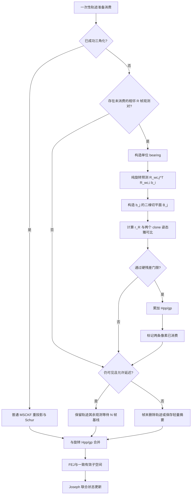

# 无深度纯旋转约束：从两视图模型到 Hybrid MSCKF 更新

本文专门解释默认 Hybrid MSCKF 中的无深度旋转约束，包括：

1. 为什么纯旋转期间普通三角化和结构无关 MSCKF 容易退化；
2. 点深度为什么会在纯旋转 bearing 模型中自然消失；
3. 非零小平移会引入什么近似误差；
4. 为什么使用单位球面的二维切平面残差；
5. 两个 clone 姿态雅可比、噪声、信息倍率和正规方程怎样得到；
6. 该因子怎样与普通 Schur 因子共同进入联合 EKF；
7. 如何保证一条像素量测最多进入一次视觉后验。

对应源码：

- `eskf/rdvio_constraints.cpp`：残差、雅可比、门控和 `Hpp/gp` 累加；
- `eskf/rdvio_scheduler.cpp`：R/N 运动分类；
- `eskf/schur_vins_visual.cpp`：低视差延迟、旋转轨迹分流和联合视觉更新；
- `eskf/schur_vins_triangulation.cpp`：低视差、病态和高不确定度三角化判定。

> 核心结论：这里并不是先建立 Landmark 深度再通过 Schur 把它消掉。纯旋转时，两帧单位
> bearing 的关系本身就与点深度无关；深度在向量归一化时自然约掉。因此该因子从一开始就只
> 含两个 clone 的相对姿态，不建立 `Hpl/Hll`。

## 1. 为什么需要这个约束

普通 MSCKF 轨迹需要多帧平移基线来恢复特征深度。两视图深度不确定度可粗略写成

$$
\operatorname{Var}(\lambda)
\propto
\frac{\sigma_{uv}^{2}}{\lVert\mathbf t\rVert^{2}}
\sim
\frac{1}{\sin^{2}\phi},
$$

其中：

- $\lambda$ 是沿首帧视线的点深度；
- $\mathbf t$ 是两相机之间的平移基线；
- $\phi$ 是经过旋转补偿后的视差角；
- $\sigma_{uv}^{2}$ 是归一化像平面观测方差。

纯旋转时 $\lVert\mathbf t\rVert\rightarrow0$、$\phi\rightarrow0$，所以深度方差发散。此时强行
三角化通常会得到以下结果之一：

```text
LowParallax
IllConditioned
ExcessiveUncertainty
```

但“深度不可观”不等于“视觉完全没有信息”。同一静态点在两帧中的射线方向仍然携带相对旋转
信息。无深度旋转约束的目的，就是在轨迹尚不能可靠三角化时，先取出这部分姿态信息，而把深度
估计留给后续真正出现平移基线的 N 帧。

## 2. 坐标系与符号

本文采用与源码一致的定义：

- $\mathbf R_{wc,i}$：第 $i$ 帧相机坐标系到世界坐标系的旋转；
- $\mathbf p_{wc,i}$：第 $i$ 帧相机中心在世界坐标系中的位置；
- $\mathbf b_i\in S^2$：第 $i$ 帧单位 bearing，满足 $\lVert\mathbf b_i\rVert=1$；
- $\lambda_i>0$：特征点在第 $i$ 帧 bearing 方向上的深度；
- $\mathbf R_{ji}=\mathbf R_{wc,j}^{\mathsf T}\mathbf R_{wc,i}$：从相机 $i$ 到相机 $j$ 的相对旋转；
- $\mathbf t_{ji}=\mathbf R_{wc,j}^{\mathsf T}(\mathbf p_{wc,i}-\mathbf p_{wc,j})$：相机 $i$ 原点在相机 $j$ 中的位置。

源码中

$$
\mathbf R_{wc}=\mathbf R_{wi}\mathbf R_{ic},
$$

即 IMU clone 姿态乘固定相机外参旋转。当前无深度旋转因子只对 clone 姿态建立雅可比；即使系统
配置为估计外参，也没有为该因子添加外参旋转雅可比，这是当前实现边界之一。

## 3. 从一般两视图模型到纯旋转模型

### 3.1 一般刚体运动下深度仍然存在

世界点可由第 $i$ 帧表示为

$$
\mathbf p_w
=
\mathbf p_{wc,i}
+
\mathbf R_{wc,i}(\lambda_i\mathbf b_i).
$$

变换到第 $j$ 帧相机坐标系：

$$
\mathbf p_{c_j}
=
\mathbf R_{wc,j}^{\mathsf T}
(\mathbf p_w-\mathbf p_{wc,j})
=
\lambda_i\mathbf R_{ji}\mathbf b_i+\mathbf t_{ji}.
$$

因此第 $j$ 帧预测 bearing 为

$$
\hat{\mathbf b}_j
=
\frac{
\lambda_i\mathbf R_{ji}\mathbf b_i+\mathbf t_{ji}
}{
\left\lVert
\lambda_i\mathbf R_{ji}\mathbf b_i+\mathbf t_{ji}
\right\rVert
}.
$$

只要 $\mathbf t_{ji}\neq\mathbf0$，预测通常仍依赖未知深度 $\lambda_i$，这就是普通多视图三角化
和重投影模型需要 Landmark 参数的原因。

### 3.2 纯旋转时深度自然约掉

当两帧相机中心没有平移，即 $\mathbf t_{ji}=\mathbf0$ 时：

$$
\hat{\mathbf b}_j
=
\frac{\lambda_i\mathbf R_{ji}\mathbf b_i}
{\lVert\lambda_i\mathbf R_{ji}\mathbf b_i\rVert}
=
\mathbf R_{ji}\mathbf b_i.
$$

因为旋转保持向量长度，并且 $\lambda_i>0$，归一化会把尺度 $\lambda_i$ 完全约掉。于是得到精确的
纯旋转 bearing 关系：

$$
\boxed{
\mathbf b_j
=
\mathbf R_{wc,j}^{\mathsf T}
\mathbf R_{wc,i}\mathbf b_i
}
$$

这一步没有 Landmark 线性化，也没有 Schur 消元。深度不是“估计后删除”，而是根本没有进入
纯旋转观测函数。

### 3.3 小平移时的近似误差

令

$$
\mathbf v=\mathbf R_{ji}\mathbf b_i,
\qquad
\boldsymbol\epsilon=\frac{\mathbf t_{ji}}{\lambda_i},
$$

则一般模型可写成

$$
\hat{\mathbf b}_j=\operatorname{normalize}(\mathbf v+\boldsymbol\epsilon).
$$

对单位向量 $\mathbf v$ 做一阶展开：

$$
\operatorname{normalize}(\mathbf v+\boldsymbol\epsilon)
\approx
\mathbf v+
(\mathbf I-\mathbf v\mathbf v^{\mathsf T})\boldsymbol\epsilon.
$$

所以忽略平移造成的切向 bearing 偏差近似为

$$
\boxed{
\delta\mathbf b_j
\approx
(\mathbf I-\mathbf v\mathbf v^{\mathsf T})
\frac{\mathbf t_{ji}}{\lambda_i}
}
$$

这说明该近似的风险由 $\lVert\mathbf t_{ji}\rVert/\lambda_i$ 决定：

- 平移越小，模型越接近精确纯旋转；
- 点越远，即 $\lambda_i$ 越大，平移造成的角度误差越小；
- 近处点、突然平移和 R/N 误分类会产生更明显的系统偏差；
- 仅根据旋转补偿后视线对齐程度进行 R/N 判定，无法彻底区分“远点加小平移”和“严格纯旋转”。

因此当前实现不把该因子当成与普通重投影同等可信的精确模型，而是使用硬残差门控和保守信息
倍率吸收剩余平移、分类误差、姿态预测误差及观测相关性。

## 4. 为什么投影到单位球面切平面

单位 bearing 位于二维流形 $S^2$，虽然用三维向量存储，但只有两个自由度。直接使用
$\mathbf b_j-\hat{\mathbf b}_j\in\mathbb R^3$ 会包含一个沿球面法向的冗余方向，其协方差在三维
表示中天然秩亏。

在观测 bearing $\mathbf b_j$ 处构造两个正交单位切向量：

$$
\mathbf B_j=
\begin{bmatrix}
\mathbf t_x & \mathbf t_y
\end{bmatrix}
\in\mathbb R^{3\times2},
$$

满足

$$
\mathbf B_j^{\mathsf T}\mathbf B_j=\mathbf I_2,
\qquad
\mathbf B_j^{\mathsf T}\mathbf b_j=\mathbf0.
$$

二维旋转残差定义为

$$
\boxed{
\mathbf r_R
=
\mathbf B_j^{\mathsf T}
\left(
\mathbf b_j-
\mathbf R_{wc,j}^{\mathsf T}
\mathbf R_{wc,i}\mathbf b_i
\right)
}
$$

切平面投影有三个作用：

1. 去掉单位球面的径向冗余，只保留两个真实角度自由度；
2. 避免把归一化约束产生的奇异三维协方差送入滤波器；
3. 使小角度下的残差可以直接解释为两个正交方向上的 bearing 角误差。

源码根据 $\mathbf b_j$ 选择不接近平行的 `UnitZ` 或 `UnitY` 作为 seed，再通过两次叉乘构造稳定
的 $\mathbf t_x/\mathbf t_y$。只要 seed 不与 $\mathbf b_j$ 平行，具体选择哪一组切平面基不会改变
残差携带的信息，只会对二维残差坐标做正交旋转。

将上一节的小平移展开投影到切平面，可得到更直观的模型偏差：

$$
\boxed{
\mathbf r_{R,\mathrm{bias}}
\approx
\mathbf B_j^{\mathsf T}
\frac{\mathbf t_{ji}}{\lambda_i}
}
$$

这正是默认路径必须保守降权，而不能把 R 帧简单等同于严格 $\mathbf t=0$ 的数学原因。

## 5. 两个 clone 的姿态雅可比

定义 FEJ 线性化点处的公共项

$$
\mathbf C
=
\mathbf B_j^{\mathsf T}
\mathbf R_{wc,j}^{\mathsf T}
\left[
\mathbf R_{wc,i}\mathbf b_i
\right]_{\times}.
$$

在项目当前的左乘姿态误差约定下，满足

$$
\delta(\mathbf R\mathbf d)
\approx
-[\mathbf R\mathbf d]_{\times}\delta\boldsymbol\theta.
$$

因此残差一阶展开为

$$
\delta\mathbf r_R
\approx
-\mathbf C\,\delta\boldsymbol\theta_i
+\mathbf C\,\delta\boldsymbol\theta_j,
$$

两个 6 自由度 clone 的雅可比是

$$
\boxed{
\mathbf J_i=
\begin{bmatrix}
-\mathbf C & \mathbf0_{2\times3}
\end{bmatrix},
\qquad
\mathbf J_j=
\begin{bmatrix}
\mathbf C & \mathbf0_{2\times3}
\end{bmatrix}
}
$$

所以该因子：

- 直接约束两个 clone 的相对姿态；
- 不直接写 clone 位置块；
- 不建立 Landmark 雅可比；
- 不直接写 IMU bias、速度或重力块；
- 仍可通过联合协方差中的交叉块间接修正当前 INS 姿态、陀螺 bias 等相关状态。

残差使用当前名义姿态计算，而启用可观性约束时，雅可比使用 clone 中冻结的 FEJ 姿态。这与普通
视觉因子的 FEJ 原则一致：保留当前残差精度，同时避免线性化点不断移动破坏 VIO 的 gauge 结构。

## 6. bearing 噪声与实现权重

### 6.1 更严格的噪声传播

设归一化像平面坐标为 $\mathbf u=[u,v]^{\mathsf T}$，齐次射线

$$
\bar{\mathbf b}=
\begin{bmatrix}u&v&1\end{bmatrix}^{\mathsf T},
\qquad
\mathbf b=\frac{\bar{\mathbf b}}{\lVert\bar{\mathbf b}\rVert}.
$$

从二维像平面噪声到单位 bearing 的雅可比为

$$
\mathbf J_b
=
\frac{1}{\lVert\bar{\mathbf b}\rVert}
(\mathbf I-\mathbf b\mathbf b^{\mathsf T})
\begin{bmatrix}
1&0\\
0&1\\
0&0
\end{bmatrix}.
$$

若两帧像平面噪声独立且均为 $\boldsymbol\Sigma_{uv}$，更严格的旋转残差协方差应为

$$
\mathbf R_R
\approx
\mathbf B_j^{\mathsf T}
\left(
\mathbf J_{b_j}\boldsymbol\Sigma_{uv}\mathbf J_{b_j}^{\mathsf T}
+
\mathbf R_{ji}
\mathbf J_{b_i}\boldsymbol\Sigma_{uv}\mathbf J_{b_i}^{\mathsf T}
\mathbf R_{ji}^{\mathsf T}
\right)
\mathbf B_j.
$$

这一般不是严格的常数对角阵，会随特征在图像中的位置变化。
该式把切平面基 $\mathbf B_j$ 视为当前线性化点上的常量；若进一步传播“用带噪 $\mathbf b_j$
构造切平面”产生的高阶影响，模型还会更复杂。

### 6.2 当前实现采用的近似

当前代码把每条 bearing 在切平面内的噪声近似为

$$
\operatorname{Cov}(\delta\mathbf b)\approx\sigma_{uv}^{2}\mathbf I_2,
$$

并假设两帧观测独立，因此

$$
\mathbf R_R\approx2\sigma_{uv}^{2}\mathbf I_2.
$$

对应理论信息倍率为 $1/2$。实现再乘工程缩放 $s_R$：

$$
w_R=\frac12s_R,
\qquad
s_R=\mathrm{scale}_R.
$$

整个视觉正规方程最终统一用 `visual_batch_variance` 解释，所以等效旋转残差协方差为

$$
\boxed{
\mathbf R_{R,\mathrm{effective}}
\approx
\frac{2\sigma_{uv}^{2}}{s_R}\mathbf I_2
}
$$

默认 Hybrid MSCKF 使用
`scale_R=depth_free_rotation_information_scale_=0.02`，等价于相对理想独立 bearing 模型把
协方差再放大 $1/0.02=50$ 倍。显式 `RDVIO` visual scheduler 则传入 $s_R=1$，保留理论基础
权重 $1/2$。默认路径保守降权不是因为理论纯旋转因子本身很弱，而是为了吸收以下未建模误差：

- R/N 误分类和非零平移；
- 当前姿态预测误差；
- 相邻帧 bearing 的时间相关性；
- 简化的常数各向同性 bearing 协方差；
- 当前没有加入外参旋转雅可比。

此外，代码要求

$$
\lVert\mathbf r_R\rVert
\le
\texttt{visual\_hard\_reprojection\_limit},
$$

超出硬门限的候选直接拒绝，不进入正规方程。

## 7. 怎样进入 MSCKF 正规方程

把两个 clone 的雅可比拼成稀疏行块 $\mathbf J_R$，旋转因子直接累加

$$
\mathbf H_{pp}
\mathrel{+}=
w_R\mathbf J_R^{\mathsf T}\mathbf J_R,
\qquad
\mathbf g_p
\mathrel{+}=
w_R\mathbf J_R^{\mathsf T}\mathbf r_R.
$$

展开后只写四个姿态相关块：

$$
\begin{aligned}
\mathbf H_{ii}&\mathrel{+}=w_R\mathbf J_i^{\mathsf T}\mathbf J_i,\\
\mathbf H_{jj}&\mathrel{+}=w_R\mathbf J_j^{\mathsf T}\mathbf J_j,\\
\mathbf H_{ij}&\mathrel{+}=w_R\mathbf J_i^{\mathsf T}\mathbf J_j,\\
\mathbf g_i&\mathrel{+}=w_R\mathbf J_i^{\mathsf T}\mathbf r_R,\\
\mathbf g_j&\mathrel{+}=w_R\mathbf J_j^{\mathsf T}\mathbf r_R.
\end{aligned}
$$

它与普通结构无关轨迹的区别是：

| 项目 | 普通 MSCKF 轨迹 | 无深度旋转轨迹 |
|---|---|---|
| 是否需要三角化 | 是 | 否 |
| 是否建立 Landmark 增量 | 临时建立 | 不建立 |
| 是否产生 `Hpl/Hll/gl` | 是 | 否 |
| 是否执行 Landmark Schur | 是 | 否 |
| 直接约束 | clone 姿态和位置 | 两个 clone 的相对姿态 |
| 能否恢复深度/平移 | 有基线时可以 | 不可以 |

旋转信息首先进入 `Hpp/gp`，随后与普通轨迹完成 Schur 后的 `Hpp/gp` 合并，再统一经过：

```text
FEJ gauge 处理
    -> 一致有效子空间投影
    -> 特征分解或 LDLT 对角化
    -> 一维伪量测 Joseph 更新
    -> 完整联合状态修正
```

因此虽然旋转因子的直接雅可比只落在 clone 姿态块上，Kalman 增益仍会利用 clone 与 INS、bias、
持久点之间的交叉协方差传播修正。但它不会凭空增加全局偏航可观性；全局偏航和平移 gauge 仍由
FEJ/一致子空间逻辑保护。

## 8. 轨迹调度与一次性量测生命周期

无深度旋转约束不是对所有 R 帧特征反复执行。当前实现只处理“普通一次性调度已经准备消费、
但三角化仍失败”的轨迹，并在轨迹中选择最近一对满足条件的相邻观测：

1. 后一帧被 R/N 分类器判定为 R 帧；
2. 两条 `Observation::visual_update_count` 都为 0；
3. 二维切平面残差通过硬门限；
4. 同一轨迹只采用时间上最后一个符合条件的相邻帧对。

成功加入正规方程后，两条观测都会执行：

```text
visual_update_count += 1
used_by_depth_free_rotation = true
```

之后分两种情况。

### 8.1 轨迹本帧最终删除

若轨迹已经丢失，或者不能继续延迟，则旋转信息作为这条 one-shot 轨迹的最后一次有效视觉更新，
整条轨迹在 `updateVisual()` 的 finalizer 中删除。

### 8.2 轨迹继续等待平移基线

若轨迹仍可见，并且三角化失败原因属于低视差、病态或高不确定度，则可以取消本次整轨迹删除。
此时只消费刚刚进入旋转残差的两条像素，其余未使用观测继续保留。未来 N 帧带来平移基线并成功
三角化后，普通深度 Schur 线性化会跳过 `visual_update_count>0` 的旧像素，只使用其余新观测。

集合关系可写成

$$
\mathcal Z^{R}\cap\mathcal Z^{M}=\varnothing,
$$

其中 $\mathcal Z^R$ 是已经进入旋转残差的像素集合，$\mathcal Z^M$ 是普通 MSCKF Schur 使用的
像素集合。这保证同一个像素不会先作为纯旋转量测使用，又在后续获得深度后被当作独立重投影
量测再次使用。

## 9. R/N 分类为什么只是启发式门控

分类器先用当前姿态估计补偿相邻帧旋转：

$$
\hat{\mathbf b}_{j,k}
=
\mathbf R_{wc,j}^{\mathsf T}
\mathbf R_{wc,i}\mathbf b_{i,k},
$$

再计算共同轨迹的角度失配：

$$
\alpha_k
=
\arccos
\left(
\operatorname{clamp}
(\mathbf b_{j,k}^{\mathsf T}\hat{\mathbf b}_{j,k},-1,1)
\right).
$$

当前实现取 $\alpha_k$ 的 70% 分位数；默认要求共同轨迹不少于 20，并且该分位数小于 $0.60^\circ$
时，把当前帧标记为 R。这个判据只能说明“大多数视线可由旋转解释”，不能严格证明
$\mathbf t=0$，原因包括：

- 远点即使存在小平移，$\lVert\mathbf t\rVert/\lambda$ 仍可能很小；
- 姿态预测误差会把真实纯旋转误判为 N；
- 动态点、错误匹配和滚动快门会污染分位数；
- 共同特征的深度分布未知。

所以默认 Hybrid MSCKF 只把 R/N 当作启用无深度因子的保守门控，不采用 RD-VIO 的 RR/NN/RN/NR
窗口转换、R 子窗压缩和零平移伪量测。完整 RD-VIO 调度边界见
[RDVIO_SCHEDULING.md](RDVIO_SCHEDULING.md)。

## 10. 该因子能观测什么、不能观测什么

### 可以提供的信息

- 两个 clone 之间的相对旋转；
- 通过协方差相关性间接修正当前 INS 姿态；
- 通过 IMU 传播形成的相关性间接约束陀螺 bias；
- 在纯旋转阶段避免低视差轨迹完全丢失视觉价值。

### 不能提供的信息

- Landmark 深度；
- 相机平移或绝对尺度；
- 全局位置；
- 全局偏航 gauge；
- 独立于系统相关性的直接 bias 观测；
- 完整 RD-VIO 中由 IMU 预积分、R 子窗和 BA 提供的信息。

因此它只能作为退化阶段的辅助姿态因子，不能替代普通多视图 MSCKF，更不能把纯旋转阶段误认为
同时获得了可靠位置约束。

## 11. 完整流程框图



## 12. 公式到源码的对应关系

| 数学步骤 | 源码位置 |
|---|---|
| 选择最近的未消费相邻 R 帧对 | `eskf/rdvio_constraints.cpp` 中遍历 `landmark->frm2fet` 的部分 |
| 单位 bearing | `bearing_from/bearing_to` |
| $\mathbf R_{wc}=\mathbf R_{wi}\mathbf R_{ic}$ | `Rwc_from/Rwc_to` |
| $\hat{\mathbf b}_j=\mathbf R_{wc,j}^{T}\mathbf R_{wc,i}\mathbf b_i$ | `predicted_to` |
| 构造 $\mathbf B_j$ | `tangent_x/tangent_y/tangent` |
| $\mathbf r_R=\mathbf B_j^T(\mathbf b_j-\hat{\mathbf b}_j)$ | `residual` |
| FEJ 公共雅可比 $\mathbf C$ | `common` |
| $\mathbf J_i=[-\mathbf C,0]$、$\mathbf J_j=[\mathbf C,0]$ | `J_from/J_to` |
| $w_R=0.5s_R$ | `weight` |
| 累加 $\mathbf H_{pp}/\mathbf g_p$ | 四个 Hessian 块和两个 gradient 块 |
| 标记像素已经使用 | `visual_update_count`、`used_by_depth_free_rotation` |
| 延迟轨迹与最终删除轨迹分流 | `SchurVINS::updateVisual()` 中两个 rotation track 容器 |

## 13. 必须保持的实现不变量

后续修改该因子时，应同时满足：

1. 旋转残差不建立 Landmark 状态或 `Hll`；
2. 两个 clone 的位置雅可比保持为零，除非显式引入含平移的模型；
3. 已用于旋转残差的像素不能再次进入普通深度 Schur；
4. 被延迟的轨迹可以保留，但已消费像素的标记必须随 Observation 保存；
5. 默认 MSCKF 不应因为 R 标签自动启用零平移伪量测；
6. FEJ 模式下残差与雅可比线性化点的差异必须保持明确；
7. 修改信息倍率、R/N 门限或硬门限后，需要单独检查 rotation/translation 场景和 NEES；
8. 不能根据位置 RMSE 改善就宣称纯旋转因子直接观测了平移，其位置收益只能来自状态相关性。

## 14. 当前近似与后续可改进方向

当前实现有意保持轻量，但仍存在可进一步研究的近似：

- 用完整 $\mathbf J_b\boldsymbol\Sigma_{uv}\mathbf J_b^T$ 替代常数各向同性 bearing 噪声；
- 对 $\lVert\mathbf t\rVert/\lambda$ 的风险建立显式近点抑制，而不只依赖 R/N 分位数；
- 在估计相机外参时补充旋转因子对外参旋转的雅可比；
- 将硬门限扩展为独立 NIS 门控，并记录旋转因子的实际创新统计；
- 对多条共享 clone 的旋转轨迹建模相关性，而不是只依赖统一信息缩放；
- 与完整 RD-VIO 的预积分拼接、R 子窗和局部 BA 做严格对照。

这些改进都必须继续遵守一次性像素生命周期，不能以增加旋转约束数量为由重复使用同一像素。
