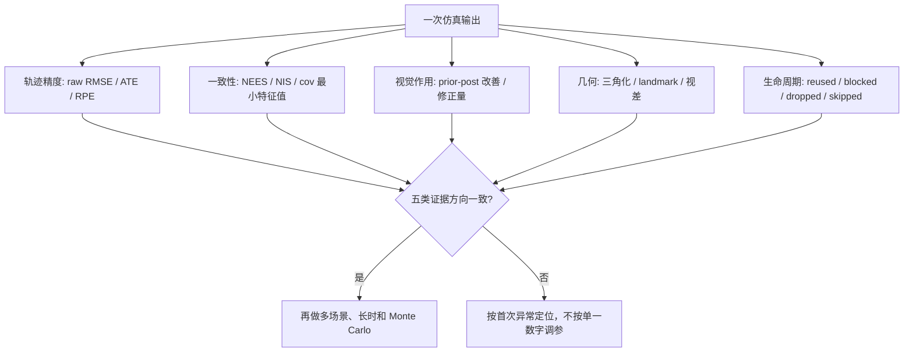

# 评估指标、Gauge 对齐与一致性统计

本文给出 `VinsAnalysis` 和 `report.html` 中各指标的**实现级数学定义**。重点不是堆更多
曲线，而是回答每个数字究竟消除了什么、保留了什么，以及哪些结论不能由它推出。

当前报告同时包含：原始状态误差、刚体对齐 ATE、1 秒 RPE、Q/P/V NEES、Schur 序贯
NIS、视觉前后验改善、三角化与持久点误差、协方差谱报警和运行统计。

## 1. 采样与真值时间

仿真真值按 200 Hz 生成，相机按 20 Hz 从同一时间网格抽样。分析循环对每个相机时间
\(t_k\)：

1. 处理所有 \(t_{imu}<t_k\) 的 IMU；
2. 由后端零阶保持预测到 \(t_k\)；
3. 执行视觉更新；
4. 与时间戳不小于 \(t_k\) 的真值样本比较。

当前三个仿真器的相机时间都来自真值网格，所以比较实际是同时间样本；若以后接入不同频率
或真实日志，必须增加真值插值，不能继续默认“第一个不早于相机的样本”就是精确同步。

## 2. 状态误差必须和 ESKF 切空间一致

滤波器使用左乘姿态误差：

\[
R^{true}=\operatorname{Exp}(\delta\theta)R^{nominal}.
\]

报告采用 `estimate - truth` 的符号，因此姿态估计误差应写成

\[
e_\theta
=\operatorname{Log}(R_{est}R_{gt}^{T})
\approx-\delta\theta,
\]

并与

\[
e_p=p_{est}-p_{gt},\qquad
e_v=v_{est}-v_{gt}
\]

组成同一个世界系左乘误差向量。

旧报告曾使用

\[
\operatorname{Log}(R_{gt}^{T}R_{est}),
\]

它是机体系右乘误差。两者旋转角范数相同，所以姿态 RMSE 几乎不变；但方向坐标不同，不能
直接与左乘 \(P_{\theta p},P_{\theta v}\) 交叉协方差组成联合 NEES。本轮已把分析实现改为
前一种定义。

轨迹 CSV 沿用历史列名 `eroll/epitch/eyaw`，但三列实际是旋转向量 \(e_\theta\) 在世界系
x/y/z 轴上的分量，不是三个欧拉角逐项相减。把这些列画成波形时也必须按“小角度切向量”
解释，尤其不能在接近欧拉角奇异位置时赋予 roll/pitch/yaw 的全局含义。

## 3. 原始 RMSE

位置、速度和姿态 RMSE 为

\[
\operatorname{RMSE}_p
=\sqrt{\frac1N\sum_{k=1}^{N}\|e_{p,k}\|^2},
\]

\[
\operatorname{RMSE}_v
=\sqrt{\frac1N\sum_{k=1}^{N}\|e_{v,k}\|^2},
\]

\[
\operatorname{RMSE}_R
=\sqrt{\frac1N\sum_{k=1}^{N}\|e_{\theta,k}\|^2}.
\]

`max_err_p` 是 \(\max_k\|e_{p,k}\|\)。原始位置误差保留全局原点、全局 yaw 和累计漂移。
当前仿真用首帧真值 Q/P/V 初始化，因此起始 gauge 已对齐；原始 RMSE 在这里尤其有价值，
但真实数据集若没有共同世界系则不能直接比较。

## 4. 不允许缩放的 SE(3) 对齐 ATE

报告另求一个固定尺度刚体变换：

\[
(R^*,t^*)=arg\min_{R\in SO(3),t}
\sum_k\|p_{gt,k}-(Rp_{est,k}+t)\|^2.
\]

令中心化互协方差为

\[
C=\sum_k(p_{est,k}-\bar p_{est})
(p_{gt,k}-\bar p_{gt})^T=U\Sigma V^T,
\]

则

\[
D=\operatorname{diag}(1,1,\det(VU^T)),
\]

\[
R^*=VDU^T,
\qquad
t^*=\bar p_{gt}-R^*\bar p_{est}.
\]

最终

\[
\operatorname{ATE}_{SE(3)}=
\sqrt{\frac1N\sum_k
\|R^*p_{est,k}+t^*-p_{gt,k}\|^2}.
\]

这里**不估计尺度**，所以 VIO 尺度误差仍保留。它允许任意 roll/pitch/yaw 旋转，适合观察
轨迹形状和局部里程计质量，但可能隐藏本应由惯性观测到的 roll/pitch 错误。因此必须与原始
RMSE、姿态 RMSE 和 RPE 一起读，不能把对齐 ATE 当唯一排名。

当位置轨迹近似直线或静止时，Kabsch 的某些旋转自由度不唯一；ATE 残差数值仍可计算，
但求出的 `alignment_rotation` 本身不应被解释为真实姿态偏差。

## 5. Landmark 使用四自由度 gauge 对齐

地图点误差不使用任意 SE(3) 点云对齐。完整 VIO 在已知重力下只有

\[
\mathcal G=\{\text{全局平移 3 维},\text{绕重力 yaw 1 维}\}
\]

不可观，因此报告只估计 yaw 和平移。

每个时刻先由

\[
R_{rel,k}=R_{gt,k}R_{est,k}^{T}
\]

提取 yaw \(\psi_k\)，用圆统计平均

\[
\psi^*=\operatorname{atan2}
\left(\sum_k\sin\psi_k,\sum_k\cos\psi_k\right),
\]

再令

\[
R_g=R_z(\psi^*),
\qquad
t_g=\bar p_{gt}-R_g\bar p_{est}.
\]

地图点对齐误差为

\[
e_{L,j}^{gauge}=R_gp_{L,j}^{est}+t_g-p_{L,j}^{gt}.
\]

这样不会用任意 roll/pitch 掩盖地图错误，在 Stop-go 等位置轨迹秩不足时也比纯位置 Kabsch
更稳定。该 yaw 是姿态对相对旋转的圆均值，是报告中的确定性 gauge 选择，并非对所有地图
点误差再做一次非线性最优 yaw 拟合；它刻意避免让待评估地图反过来决定自己的对齐。

## 6. 一秒相对位姿误差 RPE

对每个起点 \(i\)，找最接近 \(t_i+1\,\mathrm{s}\) 的样本 \(j\)，时间误差超过 0.1 s 则跳过。
相对旋转和局部平移为

\[
R_{ij}=R_i^TR_j,
\qquad
p_{ij}=R_i^T(p_j-p_i).
\]

报告计算

\[
\operatorname{RPE}_{p,1s}
=\sqrt{\frac1M\sum_{(i,j)}
\|p_{ij}^{est}-p_{ij}^{gt}\|^2},
\]

\[
\operatorname{RPE}_{R,1s}
=\sqrt{\frac1M\sum_{(i,j)}
\left\|\operatorname{Log}
\left(R_{ij}^{est}(R_{ij}^{gt})^T\right)\right\|^2}.
\]

固定全局刚体变换会在相对量中抵消，因此 RPE 更接近局部里程计质量。它仍依赖选择的 1 秒
尺度：短时抖动和百秒漂移需要分别看波形与 ATE。

## 7. `sigma_p/q/v` 的含义

轨迹 CSV 中

\[
\sigma_p^{trace}=\sqrt{\operatorname{tr}(P_{pp})},
\]

姿态和速度同理。它是三维误差椭球的总标准差半径，不是任一坐标轴的 \(1\sigma\)，也不能
直接画成每轴 \(\pm2\sigma\) 包络。

若某个 trace 为负，CSV 仍输出带负号的 \(\sqrt{|\operatorname{trace}|}\) 作为显眼报警；但 trace 为正不
能证明矩阵半正定，所以 `neg_cov` 已改用联合谱检查。

## 8. NEES 的当前定义

对误差 \(e\) 和匹配的协方差 \(P\)：

\[
\operatorname{NEES}=e^TP^{-1}e.
\]

实现使用对称化后的 LDLT，并要求所有主元大于相对阈值；分解失败或非正定时返回 `NaN`，
并没有在这里使用伪逆。分别记录：

\[
\operatorname{NEES}_p=e_p^TP_{pp}^{-1}e_p,
\]

\[
\operatorname{NEES}_q=e_\theta^TP_{\theta\theta}^{-1}e_\theta,
\]

\[
\operatorname{NEES}_v=e_v^TP_{vv}^{-1}e_v.
\]

联合 9 维误差和协方差必须保留交叉块：

\[
e_{qpv}=
\begin{bmatrix}e_\theta\\e_p\\e_v\end{bmatrix},
\qquad
P_{qpv}=
\begin{bmatrix}
P_{\theta\theta}&P_{\theta p}&P_{\theta v}\\
P_{p\theta}&P_{pp}&P_{pv}\\
P_{v\theta}&P_{vp}&P_{vv}
\end{bmatrix}.
\]

报告中的 `mean_nees` 实际是

\[
\overline{\operatorname{NEES}}_{norm}
=\frac1{N_{valid}}
\sum_k\frac{e_{qpv,k}^TP_{qpv,k}^{-1}e_{qpv,k}}{9}.
\]

理想统计期望接近 1，而不是 9。单条时间相关轨迹的时间平均并不等价于独立 Monte Carlo
均值，所以这里只把它当一致性诊断：远大于 1 通常表示过度自信或模型错误，长期远小于 1
通常表示协方差保守。

## 9. Schur NIS 的当前定义

Schur Hpp 经特征分解或 LDLT 变成若干一维序贯伪量测。第 (i) 个有效方向有

\[
z_i=\frac{rhs_i}{d_i},
\qquad
R_i=\frac{\sigma_{visual}^2}{d_i},
\]

\[
e_i=z_i-h_i^T\delta x_{i-1},
\qquad
S_i=h_i^TP_{i-1}h_i+R_i.
\]

一次视觉更新记录

\[
\operatorname{nis\_mean}_k
=\frac1{r_k}\sum_{i=1}^{r_k}\frac{e_i^2}{S_i},
\qquad
\operatorname{nis\_dof}_k=r_k.
\]

总表的 `mean_nis` 是各次更新 `nis_mean` 的**等权时间平均**：

\[
\operatorname{mean\_nis}
=\frac1{K}\sum_{k=1}^{K}\operatorname{nis\_mean}_k,
\]

并不是把全部方向按 \(\sum_k r_k\) 加权后的总体均值。因此一条只有少量有效方向的更新与一条
大批次更新权重相同。理想值仍约为 1，但解释时必须同时看 `nis_dof` 和更新次数。

此外，NIS 是经过硬重投影门控、Huber 降权和秩阈值后的条件样本；它不再严格服从未经筛选
的卡方分布。一次性模式还必须满足 `reused=0`、`blocked=0`，否则极小 NIS 可能来自重复
使用历史残差。

## 10. 视觉前后验改善率

每次视觉更新记录 prior/posterior 与同时间真值，位置改善定义为

\[
\Delta e_{p,k}
=\|p_{prior,k}-p_{gt,k}\|
-\|p_{post,k}-p_{gt,k}\|.
\]

`posterior_improve_rate` 是 \(\Delta e_{p,k}>0\) 的更新比例。它不应被要求达到 100%：有噪
量测可能在单次真值误差上变差，而 Kalman 更新优化的是条件均方误差和协方差。更可靠的
判断是改善率、长期 RMSE、RPE、NIS/NEES 和修正尖峰共同一致。

## 11. `neg_cov` 的加强定义

旧实现只检查

\[
\operatorname{tr}(P_{pp}),
\operatorname{tr}(P_{\theta\theta}),
\operatorname{tr}(P_{vv})
\]

是否为负，会漏掉“trace 为正但某个特征值为负”。现在每帧对对称化的 9×9
\(P_{qpv}\) 计算最小特征值，并按

\[
\lambda_{min}< -10^{-10}
\max\left(1,\max_i|P_{ii}|\right)
\]

判为显著非半正定。`traj_*.csv` 同时输出 `cov_qpv_min_eig`，`neg_cov` 统计触发帧数。

该检查比 trace 强，但仍不是完整动态联合协方差 \(P_\chi\) 的谱证明；它重点覆盖报告最关心
的 Q/P/V 主状态，避免对含空槽和确定性 clone 的大矩阵把结构零值误判为故障。

## 12. Landmark 与三角化指标

三角化报告区分：

- 初始/最终原始世界坐标误差；
- 只消除 VIO 四维 gauge 后的误差；
- 重投影代价下降；
- 三维 landmark NEES；
- 95% 置信椭球覆盖率。

三维卡方 95% 门限为

\[
\chi^2_{3,0.95}=7.8147.
\]

覆盖率接近 95% 需要大量近似独立重复实验；单次轨迹里的点共享 pose 误差，不能把每个点
视为完全独立样本。影子点协方差又不含完整 (P_{xL})，所以它的 NEES 主要用于比较策略，
不应包装成严格 SLAM 联合一致性证明。

## 13. 指标如何组合判断

| 现象 | 更可能的解释 | 下一步检查 |
|---|---|---|
| raw RMSE 大、对齐 ATE/RPE 小 | 全局 gauge 偏移或慢漂移 | FEJ 泄漏、初始世界系、yaw |
| raw 与对齐 ATE 都大，RPE 也大 | 局部视觉/惯性约束错误 | 三角化、噪声、时间同步、重复量测 |
| NIS 远小于 1，NEES 也很小 | 方差偏保守，或历史残差重复 | reused/blocked、R/Q、有效自由度 |
| NIS 合理、NEES 很大 | 状态传播、初始化或 gauge 不一致 | \(P_{IC}\)、左乘误差、FEJ、\(P_0\) |
| 点误差小、landmark NEES 很大 | 点协方差过度收缩 | 缺失 (P_{xL})、重复点更新 |
| `neg_cov>0` | Q/P/V 协方差显著不定或非有限 | 首次异常帧、Joseph、传播 alias |
| 后验改善率低但 RPE/RMSE 好 | 单次真值方向并非滤波目标 | 检查是否仅是含噪波动 |
| ATE 好但三角化成功率极低 | 可能靠少量点或退化因子支撑 | 长时视觉饥饿、track drop |

## 14. 严格统计还缺什么

当前固定随机种子的单轨迹 A/B 适合复现和定位回归，但若要声称统计一致性，还应：

1. 对不同噪声种子运行 \(M\) 次独立试验；
2. 对每个时刻或整段 ANEES/ANIS 计算卡方置信区间；
3. 保持算法配置不随种子调参；
4. 区分经过门控的条件 NIS 与门控前创新；
5. 对 gauge 状态使用一致的误差坐标和可观子空间；
6. 报告有效样本数、自由度和缺失值数量。

若每次试验有 \(n\) 维 NEES，独立试验均值的 95% 区间可写成

\[
\frac{\chi^2_{Mn,0.025}}{M}
\le \overline{\epsilon}
\le
\frac{\chi^2_{Mn,0.975}}{M}.
\]

当前 `mean_nees` 已除以 9；做严格区间时必须统一是否归一化，不能把 1 和 9 两种期望混用。

## 15. 公式到源码和报告

| 指标 | 实现位置 |
|---|---|
| 左乘姿态误差、RMSE、RPE、NEES、ATE、gauge 对齐 | `tools/analysis_main.cpp` |
| Schur 序贯 NIS | `eskf/schur_vins_visual.cpp` |
| CSV 读取与交互图表 | `tools/report_template.cpp` |
| 自包含 HTML 生成 | `tools/make_report.cpp` |
| 噪声、门控和自由度语义 | [VISUAL_RESIDUAL_NOISE_MODEL.md](VISUAL_RESIDUAL_NOISE_MODEL.md) |
| 多场景和严格消融 | [ABLATION_STUDY.md](ABLATION_STUDY.md) |

相关专题：

- [视觉后验分析报告说明](ANALYSIS_REPORT.md)
- [初始化与时间同步](INITIALIZATION_AND_TIME_SYNCHRONIZATION.md)
- [可观性约束](OBSERVABILITY_CONSTRAINT.md)
- [Landmark 一致性实验](CONSISTENT_SUBSPACE_AND_LANDMARK_COVARIANCE.md)
