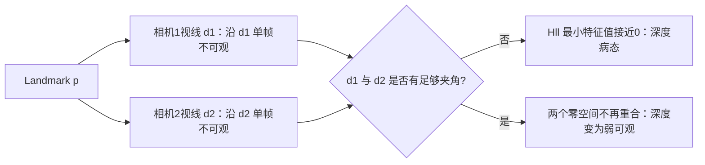

# `Hll` 的结构：为什么总有 1 个最弱的深度方向

以及：零空间过滤策略是否需要优化、`Hll` 换 LDLT 有多少收益。

> 本文涉及的 198 维 `Hpp` 耗时来自开启重力估计的历史基准；当前默认状态维数为 195。
> `Hll` 始终是每点 3×3，其深度弱方向分析不受核心状态是否包含重力影响。
>
> 当前默认一次性 MSCKF 的 Schur 消元为了显式构造带阈值 Moore–Penrose 伪逆，
> 固定使用 3×3 自伴特征分解。`USE_LDLT_FOR_HLL` 只控制保留的旧 Independent EKF
> 消融路径，不控制默认 Schur 消元；下文 LDLT 耗时是历史 landmark 后处理基准。

## 一、`Hll` 的最弱特征方向就是深度方向 —— 实测证实

猜测"和特征点深度（尺度）有关"是**正确的**。实测证据：



用单位平均视线 $\bar d$ 和任一单位横向方向 $t\perp\bar d$ 表示信息强弱，

$$
\lambda_{depth}\approx \bar d^TH_{ll}\bar d,
\qquad
\lambda_{lateral}\approx t^TH_{ll}t.
$$

小基线近似下，深度信息随三角视差 $\theta$ 二次增长：

$$
\frac{\lambda_{depth}}{\lambda_{lateral}}=O(\sin^2\theta).
$$

因此它不是“固定缺少一维”的代数秩亏，而是视差很小时的一维弱可观；多视图基线充分时
最小特征值会自然抬升。

对每个 landmark 的 3×3 `Hll` 块做特征分解，统计**最小特征向量与平均视线方向的夹角**
（若零方向就是深度方向，则 `|cos|` 应接近 1）：

```
--- Hll: |cos(v_min, line-of-sight)| ---
  0.9-1 : 650553          <- 全部样本，无一例外
```

**650,553 个样本 100 % 落在 `|cos| ∈ [0.9, 1.0]`。** 零方向就是视线/深度方向。

特征值的量级分布：

```
--- Hll: lambda_min/lambda_max ---     --- Hll: lambda_mid/lambda_max ---
  ~1e-0 :  33232                         ~1e-0 : 650553   <- 全部
  ~1e-1 : 276198
  ~1e-2 : 220321
  ~1e-3 :  97348
  ~1e-4 :  23454
```

即：**λ_mid/λ_max 恒为 O(1)（两个横向方向信息量相当），
而 λ_min/λ_max 分散在 1e-1 ~ 1e-4（深度方向弱一到四个数量级）。**

### 数学原因

单个观测的 landmark 雅可比（`schur_vins.cpp`）：

```cpp
Mat2_3 J;
J << inv_d, 0,     -x·inv_d²,
     0,     inv_d, -y·inv_d²;
J_lmk = J · Rwc^T
```

`Hll = Σ J_lmk^T · J_lmk`，是 2×3 矩阵的外积累加。关键在于：

> **单个 2×3 的 `J_lmk` 秩最多为 2**，它的零空间正是**该相机的视线方向**——
> 沿视线移动 landmark，投影到归一化平面上的位置不变（只是深度变了）。

所以单个观测对深度方向**零信息**。多个观测能恢复深度，靠的是**视差**：
不同相机的视线方向不同，各自的零空间不重合，叠加后深度方向才有信息。

但视差通常远小于横向基线的有效性：

- 横向（垂直视线）方向：`∂(u,v)/∂x ≈ 1/d`，直接、线性
- 深度方向：`∂(u,v)/∂z ≈ (x,y)/d²`，量级小 `|x|,|y| ~ O(0.1)` 倍，且需要视差才不为零

这就是 `λ_min/λ_max ~ 1e-1 ~ 1e-4` 的来源，也印证了代码开头开发日志第 4 条：

> "特征点若使用 Global Position 来参数化, Hll 的条件数会比较大，因为深度相比平移，更难估计"

### 注意：这与 `Hpp` 的零空间性质不同

| | 历史 `Hpp` 的 31 维零空间 | `Hll` 的深度方向 |
|---|---|---|
| 特征值量级 | `λ/λmax ~ 1e-15`（**真的是 0**） | `λ/λmax ~ 1e-1 ~ 1e-4`（**弱，但非零**） |
| 成因 | 结构性（gauge、状态不参与量测） | 几何性（视差有限） |
| 是否该跳过 | **是**，纯零空间无信息 | **通常不该**，见下节 |

## 二、跳过策略是否需要优化

### 2.1 `Hpp`：现有策略正确，实测有 11 个数量级的安全裕度

先回答"跳过的个数似乎大于 31，是否正常"——**你的观察准确**：

```
平均跳过数: 特征分解 68122/1996 = 34.13
            LDLT     70090/1996 = 35.12
理论零空间: 31
```

确实多出 3~4 个。（我此前采样的 6 帧恰好都是 `tiny=31` 的稳态帧，掩盖了这个差异。）

统计相对理论值 `18 + 6×空slot + 7` 的偏差分布：

```
excess=-1 :    3
excess= 0 :  519
excess= 1 : 1028
excess= 2 :  396
excess= 3 :   49
excess= 4 :    1
```

**这多出的 1~3 维是否是被误杀的有效信息？答案是否定的。** 测量切割边界两侧的量级：

```
--- 被切掉的方向里最大的那个 λ/λmax ---   --- 保留的方向里最小的那个 λ/λmax ---
  ~1e-12 :    1                             ~1e-2 :  946
  ~1e-13 :   15                             ~1e-3 : 1050
  ~1e-14 :  538
  ~1e-15 : 1285
  ~1e-16 :  154
  ~1e-17 :    3
```

**被切掉的最大值 ~1e-14，保留的最小值 ~1e-3，中间隔了 11 个数量级。**
阈值 `1e-6` 正落在这个巨大空隙的正中——上下都有 5~8 个数量级的余量。

结论：多出的 1~3 维**也是真正的零空间**（数值上就是 0），
只是理论公式没算进去的额外退化（例如某帧观测过少、或滑窗内两帧位姿几乎重合）。
现有策略**不需要优化**，阈值也不需要调。

上面的 31/34/35 都是旧的 18 维 INS、29/30 活跃 clone 日志。当前默认保留 20 个
clone，典型结构零空间应按

\[
n_0(k)=15+6(30-k)+7
\]

随活跃数 \(k\) 计算，而不是继续减固定的 31。完整更新见
[HPP_NULLSPACE.md](HPP_NULLSPACE.md)。

### 2.2 `Hll`：这里的过滤反而值得警惕

`Hll` 的最小特征值是 `1e-1 ~ 1e-4 · λmax`，**全都远大于阈值 `1e-6 · λmax`**。
所以实际上**几乎从不触发跳过**——深度方向的信息虽弱，但一直在被使用。

这是**对的**：弱信息不等于无信息，`R = σ²/λ` 会自动把它的权重降下来，
序贯更新会正确地少信任这个方向。强行跳过反而会丢掉深度的可观测性。

> ⚠️ 但要注意：若某个 landmark 的所有观测视差都极小（例如刚进入视野、
> 或相机几乎纯旋转），`λ_min` 可能真的掉到 `1e-6` 以下而被跳过。
> 此时深度完全不可观，跳过是正确的降级行为。当前实现能自动处理这种情况。

## 三、`Hll` 换 LDLT：历史后处理实验与当前边界

历史独立 landmark EKF 后处理已实现 `USE_LDLT_FOR_HLL` 开关（默认
`true`）。当时测得：

| 指标 | 特征分解 | LDLT |
|---|---|---|
| `eig+upd lmk` 阶段 | 0.285 ~ 0.301 s | **0.172 ~ 0.177 s（1.7×）** |
| 总耗时 `t_cost` | 9.17 ~ 9.31 s | 9.20 ~ 9.41 s |

分阶段计时稳定提升 1.7 倍，但总耗时看不出来，因为该阶段只占约 3%，
0.12 s 的收益被机器噪声（±0.2 s）淹没。

为什么提升幅度远小于 `Hpp`（7.5×）：
- `Hpp` 是 198×198，特征分解 O(n³) 的常数很大，LDLT 优势明显
- `Hll` 只有 3×3，Eigen 对小矩阵的特征分解有**闭式解特化**（直接解特征多项式），
  本来就很快，LDLT 的优势被压缩

### 精度

末帧 `POS EST`：

| | |
|---|---|
| 两者都用特征分解 | `2.04495 4.58319 0.986941` |
| `Hll` 也用 LDLT | `2.045 4.58328 0.986945` |

差约 0.1 mm，远小于 2 cm 的估计误差。

### 当前默认为什么仍用特征分解

默认一次性 MSCKF 不执行旧 Independent EKF 点更新；`USE_LDLT_FOR_HLL` 因而通常
不在主路径触发。普通 Schur 消元需要显式构造

\[
H_{ll}^{\dagger}=V\Lambda_{\tau}^{\dagger}V^T
\]

并统计被删除方向的梯度能量，所以当前固定使用 3×3 自伴特征分解。这里 3×3 闭式特化
本来很快，保留清晰的半正定秩判定比强行换 LDLT 更重要。

若以后要让 Schur Hll 也走 LDLT，不能只替换分解调用；必须证明：

- 小主元判定与当前特征值相对阈值给出同一有效子空间；
- Hll 伪逆和 gl 的投影严格同域；
- Schur 补仍半正定；
- 低视差、纯旋转和三种锚定参数化下长期结果一致。

因此当前建议是：保留宏用于历史独立点消融，默认 Schur Hll 继续用特征分解。

## 四、下一步该优化什么

下表是历史独立点后处理基准，不是当前 Hybrid MSCKF 的阶段占比：

| 阶段 | 耗时 | 占比 |
|---|---|---|
| build H | 2.95 s | 32 % |
| Schur 补 | 2.52 s | 27 % |
| `Hpp` 分解 + 序贯更新 | 3.69 s | 40 % |
| `Hll` 分解 + 更新 lmk | 0.15 s | 2 % |

历史 `Hpp` 那 3.69 s 里，分解本身只剩 0.39 s，其余主要是序贯协方差更新。
当前默认固定 195 维、只活跃 20–21 个 clone，更值得验证的是“紧凑活跃视觉坐标”，
而不是继续优化 3×3 Hll；详见 Hpp 专题的空槽讨论。

## 相关

- [HPP_NULLSPACE.md](HPP_NULLSPACE.md) — `Hpp` 当前与历史零空间
- [OPT_LDLT.md](OPT_LDLT.md) — `Hpp` 换 LDLT
- [README.md](README.md) — 总览
