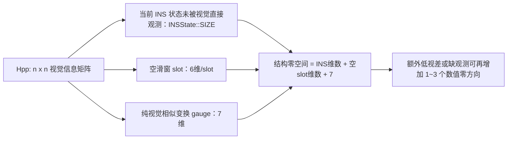

# 为什么 `Hpp` 总有固定数量的零特征值

回答两个问题：
1. 为什么 `Hpp` 总有接近 0 的特征值？
2. 为什么这个数量看起来是固定的？

**先说结论：这不是数值 bug。零空间的主体由状态和 gauge 结构决定，所以稳态数量稳定；
启动期空 slot 和局部几何退化会让总数小幅变化。**



若 $H_{pp}=U\Lambda U^T$，则有效秩按相对阈值定义为

$$
r=\#\{i:\lambda_i>\tau\lambda_{max}\},\qquad
\operatorname{nullity}(H_{pp})=n-r.
$$

这里必须用相对阈值，因为整体量测权重变化会同比缩放全部特征值；固定绝对阈值会让
“零方向数量”随 `uv_var` 和观测数量伪变化。

### 当前配置与历史日志的维数区别

本文最初的谱统计在 `ESTIMATE_GRAVITY=true` 下完成，因此

$$
n=18+30\times6=198,
\qquad
n_{null}=18+6+7=31.
$$

当前默认 `ESTIMATE_GRAVITY=false`，重力不再占误差状态，因而

$$
n=15+30\times6=195,
\qquad
n_{null}=15+6+7=28
$$

是一个空 slot 时的典型稳态结构值。若开启重力估计、外参估计，或改变窗口容量，绝对
数字会变化；“全部未被本批视觉直接观测的核心状态 + 空 slot + 纯视觉 7-DOF gauge”这一
分解方式不变。下面保留 198 维历史日志，因为它直接回答了最初观察到“固定 31 个”的原因。

## 一、实测数据

在 `Hpp` 特征分解后统计秩结构（阈值 `1e-6 · λmax`），每 300 次更新采样一次：

```
[DBG] win=29 nlmk=326 COV=198 | pos=167 tiny=31 neg=0 | dmax=818.566 dmin=-2.7e-12
[DBG] win=29 nlmk=322 COV=198 | pos=167 tiny=31 neg=0 | dmax=761.157 dmin=-1.4e-12
[DBG] win=29 nlmk=327 COV=198 | pos=167 tiny=31 neg=0 | dmax=739.721 dmin=-4.3e-13
[DBG] win=29 nlmk=311 COV=198 | pos=167 tiny=31 neg=0 | dmax=787.964 dmin=-1.2e-12
[DBG] win=29 nlmk=331 COV=198 | pos=167 tiny=31 neg=0 | dmax=785.042 dmin=-4.4e-13
[DBG] win=29 nlmk=306 COV=198 | pos=167 tiny=31 neg=0 | dmax=784.161 dmin=-5.4e-13
```

三个关键事实：

| 观察 | 数值 |
|---|---|
| 零特征值个数 | 稳态下 **31 ± 2**，与 landmark 数（306~331）无关 |
| 真正的负特征值 | **0 个**（`dmin ≈ -1e-12` vs `dmax ≈ 800`，是浮点舍入噪声） |
| 有效秩 | 约 167 = 198 − 31 |

> 上面 6 次采样都处于稳态并命中 `tiny=31`。全程平均是 34.1，因为启动阶段有更多
> 空滑窗 slot；扣除每一帧按实际空 slot 计算的理论值后，平均只多约 1 个数值零方向。
> 这些方向满足 `lambda/lambda_max ~ 1e-14`，不是被误杀的有效信息。

> 修正：此前 `docs/OPT_LDLT.md` 里根据计数器写的"有 6967~10957 个方向严格为负"
> 是**误导性的**。那个计数器把 `d < 0` 的都算作负，但实际量级是 `-1e-12`，
> 相对 `λmax ≈ 800` 就是 0。`Hpp` 是**半正定**的，不是不定的。
> 那条"遗留问题"（怀疑 `Hll` 病态、Schur 补不稳定）**不成立**，已在该文档中更正。

## 二、31 维零空间的完全拆解

该组历史实验中 `COV_SIZE = 198 = INS(18) + WIN_SIZE(30) × AUG(6)`。

再测零特征向量的"能量"落在哪些状态分量上（对所有零特征向量的分量平方求和）：

```
[DBG]   nullspace energy: Q=3 P=3 V=3 BG=3 BA=3 G=3 | poses=13
```

即：**历史配置中 INS 的全部 18 维 + poses 部分的 13 维 = 31**。完全对上；当前关闭
重力估计后，对应关系变为 `15 + 13 = 28`。

### 拆解 1：INS 的 18 维 —— 视觉量测根本不碰 INS 状态

看量测方程的构建（`schur_vins.cpp`，`USE_SCHUR` 分支）：

```cpp
const size_t frm_index = INSState::SIZE + AugState::SIZE * frm->ordering;
Hpp.block<6,6>(frm_index, frm_index) += J_pose.transpose() * J_pose;
gp.segment<6>(frm_index)             += J_pose.transpose() * err;
```

**所有写入都从 `INSState::SIZE` 之后开始**。历史配置该值为 18，当前默认值为 15；
`Hpp` 的这整个前导块自始至终是 0。

这在数学上是对的：视觉重投影残差

```
err = obs - π( Ric^T · ( Rwi^T · (p_lmk − p_wi) − t_ic ) )
```

只依赖**关键帧的位姿** `(Rwi, p_wi)` 和 landmark 位置，
与 IMU 的瞬时状态 `v, bg, ba, g` 以及当前 INS 的 `q, p` **没有任何函数关系**。
后者只通过 IMU 预积分与滑窗位姿耦合，而那部分信息在 `predict` 里进协方差，
不在视觉量测的 Jacobian 里。

所以 `Q=3 P=3 V=3 BG=3 BA=3 G=3` —— **INS 的 18 维全部在零空间**，这是结构性的。

> 注意 `Q`/`P` 也在零空间：INS 的当前位姿和滑窗最新帧的位姿是两份独立的状态副本
> （`pushFrame` 时拷贝），视觉只约束后者。

### 拆解 2：poses 的 13 维

`poses` 部分共 180 维，其中 13 维在零空间，由两部分组成：

**(a) 未使用的滑窗 slot：6 维**

实测 `win=29` 而 `WIN_SIZE=30`，有 1 个空 slot。
它对应的 6 维从没有任何观测写入，自然全零。

成因是执行顺序：`push → 视觉更新 → pop`，所以稳态下更新时窗口只有 29 帧
（上次 pop 留下的空位），只在关键帧的 push 到 pop 之间短暂满到 30。
非关键帧更新（占 75 %）全程都有这 1 个空 slot。

> **能否优化掉？试过，答案是不值得 —— 见 §七。**

**(b) 全局不可观方向（gauge freedom）：7 维**

这是 SLAM/VIO 的**基本性质**，与实现无关：

> 纯视觉的重投影误差在整体相似变换（similarity transform）下不变。

把所有关键帧位姿和所有 landmark 一起做同一个变换，重投影残差完全不变：

| 自由度 | 维数 | 说明 |
|---|---|---|
| 全局平移 | 3 | 整体平移世界系，所有相对关系不变 |
| 全局旋转 | 3 | 整体旋转世界系 |
| 全局尺度 | 1 | 单目视觉无法确定绝对尺度 |
| **合计** | **7** | |

6 + 7 = **13**。与实测的 `poses=13` 完全一致。

> **为什么这里是 7 维而不是被 IMU 压到 4 维？**
> 在完整的 VIO 系统里，重力方向会锁定 roll/pitch（2 维），IMU 的加速度计
> 会锁定尺度（1 维），最终不可观的只剩 4 维（平移 3 + 偏航 1）。
>
> 但**这里的 `Hpp` 只是视觉量测的信息矩阵**，不含 IMU 信息 —— IMU 的贡献在
> `predict` 中通过协方差传播进入 `cov_`，不在 `Hpp` 里。所以 `Hpp` 看到的是
> 纯视觉的 7 维 gauge。IMU 的约束是在序贯更新时通过 `cov_p`（先验协方差）
> 起作用的，那一步才把 7 维压到实际可观的范围。

### 历史 198 维配置的总账

```
零空间 31 维 = INS 18 维（视觉不观测）
             +  6 维（1 个空滑窗 slot）
             +  7 维（纯视觉 gauge: 平移3 + 旋转3 + 尺度1）
```

## 三、为什么数量"固定"

因为三部分**都与 landmark 数量无关**：

| 组成 | 由什么决定 | 是否随 landmark 变化 |
|---|---|---|
| INS 整块 | 状态定义（`INSState::SIZE`，当前 15、历史 18） | 否 |
| 空 slot 6 维 | 滑窗占用情况 | 否 |
| gauge 7 维 | 问题本身的对称性 | **否** |

第三条是关键，也是最反直觉的：**再多的 landmark 也消不掉 gauge 自由度**，
因为相似变换是同时作用在位姿和 landmark 上的，加观测不会破坏这个对称性。
这就是为什么 `nlmk` 从 306 变到 331，`tiny` 始终是 31。

数量会变化的情况只有：
- 滑窗未填满时（启动阶段），空 slot 更多 → 零空间更大
- 某个关键帧完全没有有效观测 → 又多 6 维
- 退化运动（纯旋转 → 尺度和平移都不可观；匀速直线 → 加速度计不激励）

## 四、实测的偏差分布：为什么平均是 34 而不是 31

全程统计跳过数相对理论值 `18 + 6×空slot + 7` 的偏差：

```
excess=-1 :    3
excess= 0 :  519
excess= 1 : 1028
excess= 2 :  396
excess= 3 :   49
excess= 4 :    1
```

全程平均跳过 34.1（特征分解）/ 35.1（LDLT）。这里不能直接减去稳态值 31：启动阶段
多个空 slot 会使逐帧理论值本身升高。按每帧实际空 slot 计算后，上述 `excess` 分布的
均值约为 0.99，即特征分解平均只比动态理论值多约 1 个方向。LDLT 的 `D` 主元位于
非正交、带置换的基中，“跳过主元数”也不严格等于特征值零空间维数，因此再多约 1 个
属于分解基差异，不应解释为新的物理不可观自由度。

**这些多出的方向也是真正的数值零**，不是被误杀的有效信息。证据是切割边界两侧的量级：

```
被切掉的方向里最大的 λ/λmax:  ~1e-14 ~ 1e-15  (集中在 1823/1996 次)
保留的方向里最小的 λ/λmax:    ~1e-2  ~ 1e-3
```

**中间隔了 11 个数量级**，阈值 `1e-6` 落在空隙正中，上下各有 5~8 个数量级的余量。

多出的部分来自理论公式没覆盖的额外退化，例如：
- 滑窗内某两帧位姿几乎重合（视差不足）
- 某关键帧的有效观测数过少，其 6 维位姿块信息不满秩

**结论：现有的跳过策略正确，阈值也不需要调整。**

## 五、当前处理方式是否正确

代码的做法（`schur_vins.cpp`）：

```cpp
const TYPE d_thresh = TYPE(1e-6) * H_BASIS_diag.maxCoeff();
for (size_t i = 0; i < COV_SIZE; ++i) {
    const auto d = H_BASIS_diag(i);
    if (d <= d_thresh) continue;   // 零空间方向，不提供信息
    ...
}
```

**这是正确的做法。** 理由：

零空间方向上 `λ ≈ 0` 意味着量测噪声 `R = σ²/λ → ∞`，
即"这个方向上的观测毫无信息量"。跳过它等价于不用这条量测，
状态在该方向上保持先验（由 IMU 预积分和历史信息决定）——这正是我们想要的。

如果**不**跳过，`R` 会是天文数字，`K = PhT/(hT·PhT + R) → 0`，
数学上结果一样，但在历史配置中会浪费约 31 次 198×198 的协方差更新；当前配置对应
约 28 次 195×195 更新。两者都会增加无效计算和数值风险。

阈值 `1e-6 · λmax` 也合理：实测 `dmin/dmax ≈ 1e-15`，
而最小的有效特征值远大于 `1e-6 · λmax`，两者之间有巨大间隔（gap），
阈值落在间隔里，不会误杀有效方向。

## 六、这对 LDLT 的选择意味着什么

历史日志中的 `Hpp` 半正定且秩亏约 31（当前默认配置约 28）—— 对 LDLT 是**良性**的：

- 秩亏的对称半正定矩阵，LDLT 会在 `D` 中给出相应数量的近零主元，
  与特征分解给出近零特征值描述的是同一个低秩事实
- 实测两者跳过的方向数（70090 vs 68122，即每次约 35 vs 34）基本一致，
  差异来自不同基下"能量"如何分摊，不代表数值质量差异
- Eigen 的 LDLT 带主元置换，对半正定矩阵是数值稳定的

> 若 `Hpp` 真的**不定**（有量级显著的负特征值），LDLT 会更脆弱
> （可能出现极小的负 pivot 导致放大误差）。但实测表明不是这种情况。

## 七、试过：消除那个空滑窗 slot（无收益，已回退）

**动机**：稳态下有 1 个空 slot，其 6 维在 `Hpp` 中恒为 0，
看起来在白白参与 LDLT 分解 / Schur 补 / `setZero` 的运算。

**改动**：把 `popFrame` 从"视觉更新之后"移到"`pushFrame` 之前"，
即 `pop → push → 更新`，使滑窗全程保持 30 帧。

**空 slot 确实被消除了**，实测跳过数：

```
改前: 70090/1996 = 35.12
改后: 61657/1996 = 30.89
减少: 4.22  (理论 6 × 1417 次非关键帧更新 / 1996 = 4.26，精确吻合)
```

**但性能完全没有提升**，交错 A/B 三轮：

| | t_cost |
|---|---|
| 原顺序 (pop 在后) | 9.404 / 9.423 / 9.415 s |
| 新顺序 (pop 在前) | 9.419 / 9.426 / 9.472 s |

### 为什么没有收益 —— 一个我事先估算错了的点

我原本估算能省约 0.36 s（3.9 %），**前提是错的**。

空 slot 只是让那 6 维的**数值**恒为 0，但矩阵维度仍由编译期最大窗口固定。历史配置为
198，当前默认配置为 195：

```cpp
MatXX Hpp(COV_SIZE, COV_SIZE);   // 当前 COV_SIZE = 15 + 30×6 = 195
```

LDLT 分解、Schur 补、`setZero` 全都按固定的 `COV_SIZE × COV_SIZE` 跑，
**与那 6 维是不是 0 完全无关**。序贯更新里跳过它们只是 `continue`，
成本可忽略。所以"消除空 slot"并不会减少任何一次浮点运算。

要真正拿到这 3.9 %，必须把矩阵**动态收缩到 192**（按实际占用的帧数分配），
那是完全不同的改动：需要把 `Hpp`/`Hpl`/`cov_` 的布局改成动态尺寸、
维护 slot 到列号的映射。考虑到上限只有 3.9 %，且会让协方差布局复杂化、
与 `pushFrame` 的增广逻辑纠缠，**不建议做**。

### 为什么回退

该改动还**改变了滤波器行为**（最老帧多存活一个关键帧周期，
被中间的非关键帧更新用到）。精度实测相当（末帧误差都在 2 cm 量级，
Y 方向略好、Z 方向略差），但既然没有性能收益，
**没有理由为零收益引入行为变化**，故回退。

## 相关

- [OPT_LDLT.md](OPT_LDLT.md) — LDLT 的性能与实现
- [OPT_SCHUR_PATH.md](OPT_SCHUR_PATH.md) — Schur 路径优化
- [README.md](README.md) — 总览
