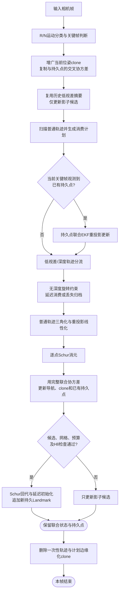
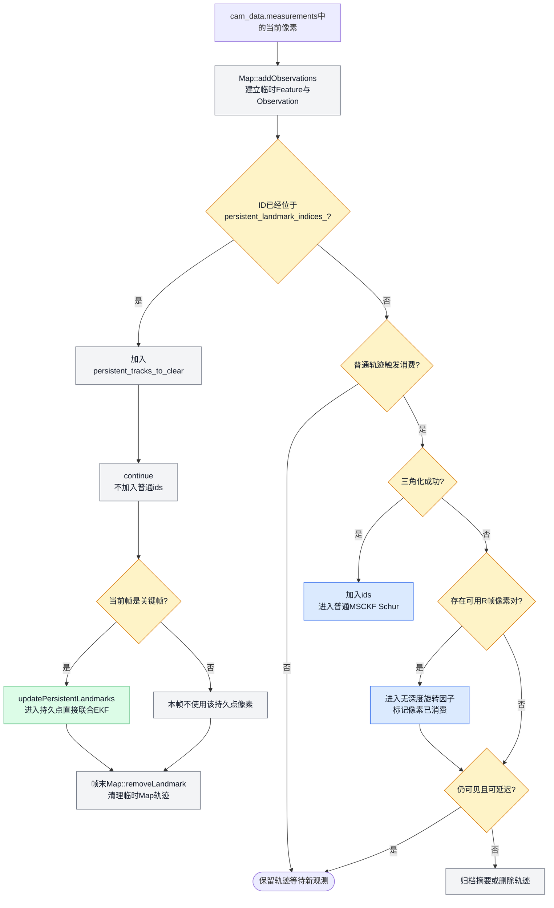
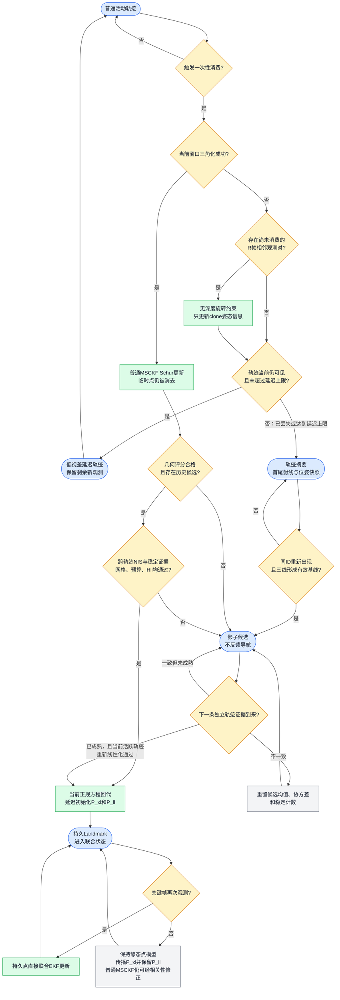

# 混合 MSCKF：状态扩维、轨迹调度与持久点联合更新

本文完整说明当前默认后端为什么仍称为 **MSCKF**，又为什么可以让少量持久 Landmark
直接反向约束导航。重点回答以下问题：

1. 原始 MSCKF 只有 IMU 状态和历史位姿 clone，持久点加入后状态与协方差怎样扩维；
2. 普通特征如何继续执行一次性 Schur 消元，而不会退化成“所有点都进状态”的 EKF-SLAM；
3. 持久点如何从普通轨迹、影子候选和图像网格中筛选出来；
4. 晋升时如何由当前 MSCKF 正规方程建立 `P_xl/P_ll`，而不是把独立三角化协方差直接复制进来；
5. 晋升后，普通 MSCKF 因子和持久点直接观测如何共同更新同一联合状态；
6. 低视差延迟消费、无深度旋转约束和丢失轨迹摘要分别解决什么问题。

实现入口主要位于：

- `eskf/schur_vins_visual.cpp`：一帧内的调度、普通 MSCKF Schur 更新和晋升时机；
- `eskf/schur_vins_persistent.cpp`：几何评分、候选一致性、延迟初始化和持久点联合 EKF；
- `eskf/schur_vins_track_archive.cpp`：丢失低视差轨迹的首尾射线摘要；
- `eskf/rdvio_constraints.cpp`：无深度旋转残差；
- `eskf/schur_vins_imu.cpp`：扩维状态下的交叉协方差传播。

本文对关键等式同时给出纯文本和 LaTeX。GitHub、支持 MathJax/KaTeX 的 Markdown 阅读器会直接
渲染 `$$...$$`；不支持数学渲染的终端仍可阅读相邻的 `text` 公式块。

## 1. 为什么采用混合结构

标准 MSCKF 的优点是特征点不进入滤波状态。每条轨迹在生命周期结束时只使用一次，点变量通过
零空间投影或 Schur 补消去，因此状态维数主要由 IMU 状态和有限数量的 clone 决定。

它的缺点是：

- 一条轨迹被消费后，对应点的长期身份和几何信息也随之消失；
- 停走、短基线、纯旋转到平移切换等情况下，很多轨迹在真正形成好几何前就触及窗口边界；
- 普通 MSCKF 只能利用“当前这一次轨迹”提供的相对约束，不能直接复用少量长期稳定点。

把所有点都加入状态会变成 EKF-SLAM：协方差规模增长快、前端错误关联影响时间更长，而且长期
线性化和相关性处理更敏感。因此当前实现只让极少数、经过多阶段筛选的点进入状态：

```text
绝大多数轨迹：一次性 MSCKF Schur 消元
少量稳定轨迹：影子候选筛选 -> 当前窗口延迟初始化 -> 持久 EKF-SLAM 点
低视差轨迹：旋转信息先用，深度信息延迟或归档
```

这就是“混合 MSCKF”：**信息处理主体仍是一次性 MSCKF，仅在固定预算内附加少量联合点状态。**

## 2. 状态和协方差怎样扩维

### 2.1 原始 MSCKF 状态

把 IMU 导航误差状态记为 `delta x_I`，窗口内第 i 个位姿 clone 误差记为：

```text
delta x_Ci = [delta theta_i, delta p_i]
```

原始 MSCKF 误差状态为：

```text
delta x_M = [delta x_I,
             delta x_C1, ..., delta x_Cm]
```

对应的 LaTeX 写法为：

$$
\delta\mathbf{x}_M =
\begin{bmatrix}
\delta\mathbf{x}_I^\mathsf{T} &
\delta\mathbf{x}_{C_1}^\mathsf{T} & \cdots &
\delta\mathbf{x}_{C_m}^\mathsf{T}
\end{bmatrix}^\mathsf{T}.
$$

对应协方差为 `P_MM`。工程中这部分固定占据协方差矩阵前 `COV_SIZE` 维。

### 2.2 加入少量持久点后的联合状态

若已有 L 个持久点，每个点使用世界坐标 XYZ 三维误差，则联合误差状态扩展为：

```text
delta chi = [delta x_M,
             delta p_L1, ..., delta p_LL]
```

$$
\delta\boldsymbol{\chi} =
\begin{bmatrix}
\delta\mathbf{x}_M^\mathsf{T} &
\delta\mathbf{p}_{L_1}^\mathsf{T} & \cdots &
\delta\mathbf{p}_{L_L}^\mathsf{T}
\end{bmatrix}^\mathsf{T}.
$$

联合协方差为：

```text
P = [P_MM  P_ML]
    [P_LM  P_LL]
```

$$
\mathbf{P} =
\begin{bmatrix}
\mathbf{P}_{MM} & \mathbf{P}_{ML}\\
\mathbf{P}_{LM} & \mathbf{P}_{LL}
\end{bmatrix},
\qquad
\mathbf{P}_{LM}=\mathbf{P}_{ML}^{\mathsf T}.
$$

其中：

- `P_MM`：IMU 与 clone 的原始 MSCKF 协方差；
- `P_ML/P_LM`：导航、clone 与持久点的交叉协方差；
- `P_LL`：持久点自身以及不同持久点之间的协方差。

普通临时特征仍然不在 `delta chi` 中。只有完成晋升的点才按 3 维一组追加在 `COV_SIZE` 后面，
且总数受 `persistent_landmark_budget_=20` 限制。

## 3. 一帧视觉更新的真实执行顺序

默认 MSCKF 一帧内按照以下顺序执行：

```text
1. 判定关键帧，并用相邻 bearing 的旋转补偿误差判定 R/N 运动类型
2. 增广当前位姿 clone，复制它与已有持久点的交叉协方差
3. 用当前观测尝试复用历史低视差轨迹摘要，只更新影子候选
4. 找出本帧准备消费的普通轨迹
5. 对当前关键帧直接观测到的已有持久点执行联合 EKF 更新
6. 对未三角化轨迹决定：旋转约束、延迟消费、丢失归档或直接丢弃
7. 对成功三角化的普通轨迹建立 Hpp/Hpl/Hll/gp/gl
8. 对临时点做 Schur 消元，使用完整联合协方差更新导航、clone 和已有持久点
9. 对满足候选、网格和预算条件的当前轨迹执行延迟初始化，追加新持久点
10. 其余合格轨迹只更新影子候选
11. 删除本次消费的普通轨迹，再删除计划边缘化的 clone
```

对应的单帧处理框图如下。矩形表示处理步骤，菱形表示条件分支，圆角框表示本帧结束时仍保留的
长期状态：



这个顺序有两个重要含义：

1. 已有持久点在本帧可能先接受自己的直接重投影更新，随后还会通过 `P_LM` 接收普通 MSCKF
   因子带来的相关修正；
2. 新持久点只在本次普通 MSCKF 状态后验完成后追加，因此可以使用同一批正规方程做严格回代和
   延迟初始化。

### 3.1 当前帧视觉观测被分成哪些集合

为了判断是否重复使用，不能只看“都是视觉观测”，而要看**具体像素样本进入了哪个量测集合**。
令第 k 帧可用的视觉数据分成：

$$
\mathcal Z_k=
\mathcal Z_k^{P}\cup
\mathcal Z_k^{M}\cup
\mathcal Z_k^{R}\cup
\mathcal Z_k^{A},
$$

其中：

- `Z^P`：ID 已经位于 `persistent_landmark_indices_` 中的当前关键帧像素，进入持久点直接联合 EKF；
- `Z^M`：普通临时轨迹中尚未消费的像素，进入 MSCKF 重投影和 Schur 消元；
- `Z^R`：低视差轨迹中被选中的一对像素，进入无深度旋转残差；
- `Z^A`：历史轨迹摘要和当前 bearing，只用于影子候选筛选，不进入导航滤波似然。

实现保持以下不变量：

$$
\mathcal Z_k^{P}\cap\mathcal Z_k^{M}=\varnothing,
\qquad
\mathcal Z_k^{R}\cap\mathcal Z_k^{M}=\varnothing
\quad\text{（按具体像素样本计）},
$$

并且：

$$
\mathcal Z_k^{A}\not\subset\text{导航量测集合}.
$$

因此，“持久点先更新、普通 MSCKF 后更新”是对两组不相交的像素集合做序贯条件化，不是把同一
像素重复写入两次滤波器。

### 3.2 源码中的观测分流顺序

下面的伪代码保持了 `SchurVINS::updateVisual()` 中的真实顺序和关键变量名：

```cpp
pushFrame(cam_data, is_keyframe);
map_.addObservations(current_frame, cam_data);

for (const auto &[id, landmark] : map_.lmk_map) {
    if (isPersistentLandmark(id)) {
        // 当前像素只允许进入持久点直接 EKF。
        persistent_tracks_to_clear.push_back(id);
        continue;  // 不加入普通 MSCKF 的 ids。
    }

    if (ordinaryTrackShouldBeConsumed(*landmark)) {
        triangulateOrDeferOrArchive(*landmark);
    }

    if (landmark->is_triangulated) {
        ids.emplace_back(id, landmark);  // 普通 MSCKF 集合 Z^M。
    }
}

// 只遍历 cam_data 中已经是持久 ID 的关键帧像素 Z^P。
updatePersistentLandmarks(cam_data, current_frame, is_keyframe);

// 这里只遍历 ids，因此不包含任何已有持久 ID。
buildOrdinaryMsckfNormalEquation(ids);
schurEliminateTemporaryLandmarks();
applyJointStateCorrection(dx_joint);

// 对 ids 中少量成熟候选做条件初始化，不再进行第二次导航量测更新。
promotePersistentLandmark(...);

// 帧末删除持久 ID 在 Map::lmk_map 中临时创建的 Feature/Observation，
// 避免它在下一帧累积成普通 MSCKF 轨迹。
for (LandmarkID id : persistent_tracks_to_clear) {
    map_.removeLandmark(id);
}
```

对应的当前像素分流框图为：



对应源码位置为：

| 步骤 | 源码入口 |
|---|---|
| 所有当前图像观测先临时加入 `Map` | `Map::addObservations()` |
| 已有持久 ID 被识别并 `continue` | `SchurVINS::updateVisual()` 中的 `isPersistentLandmark(id)` 分支 |
| 持久点直接联合 EKF | `SchurVINS::updatePersistentLandmarks()` |
| 普通轨迹 Schur 与完整联合状态修正 | `SchurVINS::updateVisual()` 中的 `ids/Hpp/Hpl/Hll` 和 `applyJointStateCorrection(dx_joint)` |
| 晋升时条件初始化 | `SchurVINS::promotePersistentLandmark()` |
| 清理持久 ID 的临时 Map 轨迹 | `persistent_tracks_to_clear` 与 `Map::removeLandmark()` |

### 3.3 为什么先持久点 EKF、再普通 MSCKF 不算重复

设帧开始时联合状态先验为：

```text
p(chi)
```

已有持久点像素集合为 `Z^P`，普通临时轨迹像素集合为 `Z^M`。若两组量测噪声在模型中独立，则：

$$
p(\boldsymbol\chi\mid\mathcal Z^P,\mathcal Z^M)
\propto
p(\mathcal Z^M\mid\boldsymbol\chi)
p(\mathcal Z^P\mid\boldsymbol\chi)
p(\boldsymbol\chi).
$$

代码执行的是：

$$
p_1(\boldsymbol\chi)=
p(\boldsymbol\chi\mid\mathcal Z^P),
$$

$$
p_2(\boldsymbol\chi)=
p_1(\boldsymbol\chi\mid\mathcal Z^M)
=p(\boldsymbol\chi\mid\mathcal Z^P,\mathcal Z^M).
$$

在线性模型、固定线性化点和独立噪声假设下，这与把两组雅可比堆叠后做一次批量 EKF 更新等价。
当前系统是非线性的，所以先后顺序会带来高阶线性化差异，但这属于序贯 EKF 的线性化顺序问题，
不是量测重复计数。

两种雅可比的非零位置也不同：

```text
持久点直接因子：H_P = [0 ... H_clone ... 0 | 0 ... H_L ... 0]
普通 MSCKF 因子：H_M = [      H_s             |         0_L       ]
```

普通 MSCKF 因子虽然在持久点列上为零，但它使用更新后的完整协方差：

$$
\mathbf K_L^M=
\mathbf P_{LM}\mathbf H_s^{\mathsf T}
\left(
\mathbf H_s\mathbf P_{MM}\mathbf H_s^{\mathsf T}+\mathbf R_M
\right)^{-1}.
$$

所以已有持久点可能在同一帧发生两次均值变化：

1. 由自己的新像素 `Z^P` 直接修正；
2. 由其他普通特征 `Z^M` 通过 `P_LM` 间接修正。

第二项没有再次使用该持久点的像素，它只是联合高斯状态在获得其他传感信息后必须执行的相关性
传播。

### 3.4 已有持久点像素为什么不会进入普通 MSCKF

`map_.addObservations()` 会先为当前图像的所有 ID 创建临时 `Landmark/Feature/Observation`，包括
已经晋升的持久 ID。这一步只是统一前端数据结构，还没有构造量测方程。

轨迹扫描时首先执行：

```cpp
if (isPersistentLandmark(id)) {
    if (cam_data.measurements.find(id) != cam_data.measurements.end()) {
        persistent_tracks_to_clear.push_back(id);
    }
    continue;
}
```

因此该 ID：

- 不会进入普通轨迹数组 `ids`；
- 不会分配自己的 `Hpl/Hll/gl` 临时点块；
- 不会参与普通重投影线性化或 Schur 消元；
- 帧末通过 `Map::removeLandmark(id)` 删除在 `Map` 中临时创建的轨迹对象。

持久点直接更新则从 `cam_data.measurements` 读取当前二维像素，并通过
`persistent_landmark_indices_` 找到联合状态中的三维点块。也就是说，`Map::lmk_map` 中的同 ID
对象只是暂存当前帧前端引用，真正的持久点均值保存在 `persistent_landmarks_`。

### 3.5 晋升帧为什么允许同一条轨迹既做 Schur 又初始化点

晋升帧与“已有持久点直接更新”是不同情况。准备晋升的点此时仍是普通临时点，它的轨迹像素
确实先用于普通 MSCKF Schur 更新，随后同一组 `Hll/Hpl/gl` 又用于生成新点均值和协方差。

这看起来像重复使用，实际上是在恢复同一个联合后验的两个部分。对当前轨迹量测 `Z_f`：

$$
p(\delta\mathbf x,\delta\mathbf l\mid\mathcal Z_f)
=
p(\delta\mathbf l\mid\delta\mathbf x,\mathcal Z_f)
p(\delta\mathbf x\mid\mathcal Z_f).
$$

Schur 补计算的是边缘状态后验：

$$
p(\delta\mathbf x\mid\mathcal Z_f),
$$

而 `promotePersistentLandmark()` 计算的是在该状态条件下的新点分布：

$$
p(\delta\mathbf l\mid\delta\mathbf x,\mathcal Z_f).
$$

具体顺序为：

```text
1. H_s/g_s 对导航和已有持久点执行一次卡尔曼更新；
2. 保存更新后的 P，不再用这条轨迹执行第二次 K=P H^T S^-1；
3. 用 delta_l=Hll^-1(gl-Hlx delta_x) 回代点均值；
4. 用 J_x=-T Hll^-1 Hlx 建立新点与旧状态的交叉协方差；
5. 扩维 P，追加条件点协方差。
```

关键证据是：`promotePersistentLandmark()` 不会再次缩小原有 `P_old`。扩维时：

$$
\mathbf P_{\mathrm{aug}}=
\begin{bmatrix}
\mathbf P_{\mathrm{old}} & \mathbf P_{\mathrm{old},L}\\
\mathbf P_{L,\mathrm{old}} & \mathbf P_{LL}
\end{bmatrix},
$$

左上角 `P_old` 原样复制；新增的只有交叉块和新点块。因此同一轨迹量测只对旧状态执行了一次
信息更新，后续步骤是联合后验的条件补全，而不是第二个视觉因子。

### 3.6 同一持久点跨关键帧重复观测是否合理

合理。第 k 个关键帧和第 k+1 个关键帧看到的是两个不同时间、不同相机位姿下的新像素样本：

$$
\mathbf z_k^L\neq\mathbf z_{k+1}^L.
$$

它们可以依次更新同一个持久点，类似 EKF-SLAM 持续观测地图点。与错误做法的区别是：

- 持久点始终保留在联合状态中；
- `P_ML/P_LL` 始终随 IMU 传播、clone 增广和视觉后验维护；
- 旧观测不会重新从历史 Feature 列表中进入 Schur；
- 长期观测方差默认放大 64 倍，保守吸收时间相关性和线性化误差。

所以“重复观测同一物理点”是允许的，“重复使用同一个历史像素样本”是不允许的。

### 3.7 非关键帧上的持久点观测

`updatePersistentLandmarks()` 当前明确要求 `is_keyframe=true`。若某种帧策略保存了非关键帧 clone，
该帧中的持久 ID 仍会被排除出普通 MSCKF，并在帧末清理，但不会执行持久点直接更新。

默认 `MSCKF + AUTO/KeyframeOnly` 路径只为关键帧保存对应视觉 clone，因此正常默认运行不会因为
这一规则丢失已存帧中的持久点量测。若以后让默认后端对每张图像都增广 clone，需要明确决定：

1. 继续只在关键帧使用持久点，以降低时间相关性和计算量；或
2. 允许非关键帧直接更新，并重新标定长期噪声倍率和 NIS 门限。

### 3.8 一次性使用审计表

| 情况 | 当前像素进入持久 EKF | 进入普通 MSCKF | 进入旋转因子 | 是否反馈导航 |
|---|---:|---:|---:|---:|
| 已有持久 ID 的关键帧新像素 | 是 | 否 | 否 | 是 |
| 已有持久 ID 的非关键帧新像素 | 否 | 否 | 否 | 否 |
| 普通成功三角化轨迹的未消费像素 | 否 | 是 | 否 | 是 |
| 低视差轨迹被选择的一对 R 帧像素 | 否 | 后续 Schur 主动跳过 | 是 | 是 |
| 丢失轨迹摘要中的历史 bearing | 否 | 否 | 否 | 否，只筛选候选 |
| 晋升轨迹像素 | 不执行第二次直接 EKF | 是一次；已被旋转因子消费的样本会跳过 | 可能已有部分历史样本进入 | 是，并条件初始化新点 |

运行回归时，普通一次性像素的核心审计量仍必须满足：

```text
reused_observations = 0
duplicate_observations_blocked = 0
```

这两个计数器审计的是普通一次性 `Observation`。持久点直接更新从 `cam_data.measurements` 读取，
不依赖 `visual_update_count` 防重；它依靠“持久 ID 不进入 `ids`”这一结构分流保证不与普通 Schur
重复。

### 3.9 按代码阶段观察状态和协方差变化

下表可用于单步调试 `updateVisual()`。`P_old` 表示进入该阶段前已有的完整联合协方差。

| 阶段 | 主要变量/函数 | 使用的视觉数据 | 状态均值变化 | 协方差变化 |
|---|---|---|---|---|
| 1. 当前帧入图 | `pushFrame()`、`Map::addObservations()` | 当前图像全部 ID | clone 名义位姿由当前 INS 复制 | clone 增广，并复制与持久点的交叉块 |
| 2. 轨迹分流 | `isPersistentLandmark()`、`ids`、`persistent_tracks_to_clear` | 只分类，不建因子 | 无 | 无 |
| 3. 已有持久点直接更新 | `updatePersistentLandmarks()` | `Z^P` | 导航、clone、全部相关持久点都可能变化 | 对 `P_old` 做联合 Joseph 更新 |
| 4. 普通轨迹 Schur 更新 | `Hpp/Hpl/Hll/gp/gl`、`applyJointStateCorrection(dx_joint)` | `Z^M` 和可选 `Z^R` | 导航、clone、已有持久点都可能变化 | 再对当前完整 `P` 做序贯 Joseph 更新 |
| 5. 新点晋升 | `promotePersistentLandmark()` | 复用阶段 4 已建立的正规方程块，不新增因子 | 只创建新点均值 | `P_old` 左上角不变，只追加交叉块和新点块 |
| 6. 生命周期清理 | `Map::removeLandmark()`、`popFrame()` | 不使用量测 | 无 | 删除 clone 时由固定 slot/ordering 管理窗口；持久点块保留 |

因此同一帧可能观察到持久点均值发生两类变化：阶段 3 是自己的新像素直接更新，阶段 4 是其他
普通视觉约束通过交叉协方差带来的间接变化。阶段 5 只扩维，不会第三次更新旧状态。

### 3.10 当前非线性实现的精确顺序

为了理解数值细节，还要注意“选择/三角化”和“真正构造普通 Schur 方程”不是紧挨着执行的：

```text
普通轨迹消费判断与三角化
        ↓
记录 ids、track_qualities 和当前三角化点位置
        ↓
已有持久点直接联合 EKF，clone 名义位姿和协方差可能变化
        ↓
使用更新后的 clone 位姿构造普通轨迹重投影 H/g
        ↓
使用此前得到的三角化点初值完成 Schur 更新
```

也就是说：

- 普通轨迹的三角化初值和几何评分在持久点直接更新之前计算；
- 普通轨迹的重投影残差、FEJ 雅可比和 `Hpp/Hpl/Hll` 在持久点直接更新之后构造；
- 点初值不会因为前面的持久点直接更新立即重新三角化；
- 晋升回代使用的是后续真正构造出的 `Hll/Hpl/gl`，所以交叉协方差仍对应当前 Schur 线性化。

这是当前序贯非线性实现的工程折中，不是重复量测问题。若以后进一步追求严格的同一线性化点，
可以比较三种改法：

1. 在轨迹三角化前先完成已有持久点更新；
2. 持久点更新后只对准备消费/晋升的轨迹重新三角化；
3. 将持久点直接因子和普通 Schur 因子统一装入同一个批量线性系统。

其中第 3 种最接近固定线性化点的批量更新，但会显著增加视觉更新上下文和矩阵装配复杂度；任何
调整都必须重新检查 ATE、NIS/NEES、负协方差和一次性观测计数。

## 4. 普通轨迹仍然怎样执行 MSCKF

### 4.1 临时点线性化

对普通临时特征 `p_f` 的第 i 条归一化像平面观测：

```text
z_i = pi(R_ic^T (R_wi^T (p_f-p_i)-t_ic)) + n_i
r_i = z_i-z_hat_i
```

$$
\hat{\mathbf z}_i =
\pi\!\left(
\mathbf R_{ic}^{\mathsf T}
\left[
\mathbf R_{wi}^{\mathsf T}(\mathbf p_f-\mathbf p_i)-\mathbf t_{ic}
\right]
\right),
\qquad
\mathbf r_i=\mathbf z_i-\hat{\mathbf z}_i.
$$

线性化后：

```text
r_i ≈ H_x,i delta x_M + H_f,i delta p_f + n_i
```

$$
\mathbf r_i \simeq
\mathbf H_{x,i}\,\delta\mathbf x_M+
\mathbf H_{f,i}\,\delta\mathbf p_f+
\mathbf n_i.
$$

把同一轨迹的全部有效观测堆叠，并按 Huber 权重累加正规方程：

```text
[Hxx Hxl] [delta x_M] = [gx]
[Hlx Hll] [delta p_f]   [gl]
```

其中：

```text
Hxx = H_x^T W H_x
Hxl = H_x^T W H_f
Hll = H_f^T W H_f
gx  = H_x^T W r
gl  = H_f^T W r
```

$$
\begin{bmatrix}
\mathbf H_{xx} & \mathbf H_{xl}\\
\mathbf H_{lx} & \mathbf H_{ll}
\end{bmatrix}
\begin{bmatrix}
\delta\mathbf x_M\\
\delta\mathbf p_f
\end{bmatrix}
=
\begin{bmatrix}
\mathbf g_x\\
\mathbf g_l
\end{bmatrix},
$$

$$
\mathbf H_{xx}=\mathbf H_x^{\mathsf T}\mathbf W\mathbf H_x,
\quad
\mathbf H_{xl}=\mathbf H_x^{\mathsf T}\mathbf W\mathbf H_f,
\quad
\mathbf H_{ll}=\mathbf H_f^{\mathsf T}\mathbf W\mathbf H_f,
$$

$$
\mathbf g_x=\mathbf H_x^{\mathsf T}\mathbf W\mathbf r,
\qquad
\mathbf g_l=\mathbf H_f^{\mathsf T}\mathbf W\mathbf r.
$$

### 4.2 Schur 消去临时点

临时点不加入持久状态，而是被消去：

```text
H_s = Hxx-Hxl Hll^-1 Hlx
g_s = gx -Hxl Hll^-1 gl
```

$$
\mathbf H_s=
\mathbf H_{xx}-
\mathbf H_{xl}\mathbf H_{ll}^{\dagger}\mathbf H_{lx},
\qquad
\mathbf g_s=
\mathbf g_x-
\mathbf H_{xl}\mathbf H_{ll}^{\dagger}\mathbf g_l.
$$

若 `Hll` 存在数值零空间，则只在通过相对特征值门限的有效子空间中使用伪逆。最终 `H_s/g_s`
只包含原始 MSCKF 状态 `delta x_M`。

### 4.3 为什么普通 MSCKF 因子也会修正已有持久点

虽然普通轨迹的直接雅可比不包含持久点块，但联合状态中的等价量测雅可比是：

```text
H_joint = [H_s_direction, 0_L]
```

$$
\mathbf h_{\mathrm{joint}}=
\begin{bmatrix}
\mathbf h_s & \mathbf 0_L
\end{bmatrix}.
$$

对完整联合协方差计算卡尔曼增益：

```text
K = P H_joint^T (H_joint P H_joint^T+R)^-1
```

$$
\mathbf K=
\mathbf P\mathbf h_{\mathrm{joint}}^{\mathsf T}
\left(
\mathbf h_{\mathrm{joint}}\mathbf P
\mathbf h_{\mathrm{joint}}^{\mathsf T}+R
\right)^{-1}.
$$

展开可见：

```text
K_M ∝ P_MM H_s_direction^T
K_L ∝ P_LM H_s_direction^T
```

$$
\mathbf K_M\propto
\mathbf P_{MM}\mathbf h_s^{\mathsf T},
\qquad
\mathbf K_L\propto
\mathbf P_{LM}\mathbf h_s^{\mathsf T}.
$$

因此普通 MSCKF 因子虽然没有直接观测某个持久点，但只要 `P_LM` 非零，它仍会按相关性同步修正
已有持久点。代码会把 Schur 信息方向补零到完整联合维数，再对整个 `P` 做 Joseph 序贯更新，
并把联合增量同时注入导航、clone 和持久点。

这不是重复使用点观测，而是联合高斯状态在条件化时必须执行的相关修正。

## 5. 低视差轨迹为什么延迟消费

### 5.1 普通 MSCKF 的消费触发条件

一次性轨迹满足任一条件时准备消费：

- 当前图像已经看不到该点，即 `lost=true`；
- 轨迹包含即将被删除的 clone；
- 轨迹长度达到当前 clone 保留上限。

随后尝试三角化。若几何足够，轨迹进入普通 Schur 更新并在帧末删除。

### 5.2 延迟条件

当三角化状态为下列之一时：

```text
LowParallax
IllConditioned
ExcessiveUncertainty
```

若轨迹仍在当前图像可见，且延迟计数没有达到 `deferred_track_max_frames_=80`，则取消本次整轨迹
消费：

```text
consume_track = false
保留尚未随旧 clone 删除的观测
等待后续平移产生新基线
```

这里没有冻结窗口。该删除的 clone 仍照常删除，对应旧观测也随 clone 清理；只是 Landmark 轨迹
对象继续保留剩余观测和后续新观测。

若轨迹已经丢失，则不能继续延迟，因为它不会再直接获得新观测，而且相关 clone 即将被删除。
此时进入第 7 节的轻量摘要归档。

## 6. 无深度旋转约束

### 6.1 R/N 运动分类

对相邻两帧共同观测的每个特征，先用当前 IMU 姿态估计补偿相机旋转：

```text
b_j,pred = R_wc,j^T R_wc,i b_i
alpha_k  = acos(clamp(b_j^T b_j,pred, -1, 1))
```

$$
\hat{\mathbf b}_j=
\mathbf R_{wc,j}^{\mathsf T}\mathbf R_{wc,i}\mathbf b_i,
\qquad
\alpha_k=
\arccos\!\left(
\operatorname{clamp}(\mathbf b_j^{\mathsf T}\hat{\mathbf b}_j,-1,1)
\right).
$$

取全部 `alpha_k` 的 70% 分位数作为 `misalignment_deg`。共同轨迹不少于 20，且该分位数小于
`rdvio_rotation_threshold_deg=0.60°` 时，将当前帧标记为旋转主导帧 R；否则为普通帧 N。

默认 MSCKF 只复用这个 R/N 标签，不采用 RD-VIO 的 RR/NN/RN/NR 关键帧转换、R 子窗压缩或
零平移伪量测。

### 6.2 深度为何可以被消掉

对同一静态点的两个单位 bearing：

```text
d_w       = R_wc,i b_i
b_j,pred  = R_wc,j^T d_w
```

$$
\mathbf d_w=\mathbf R_{wc,i}\mathbf b_i,
\qquad
\hat{\mathbf b}_j=\mathbf R_{wc,j}^{\mathsf T}\mathbf d_w.
$$

纯旋转或平移影响很小时，预测只依赖两帧姿态，不依赖点深度。令：

```text
B_j = [t_x, t_y]
```

其中 `t_x/t_y` 是与 `b_j` 正交的单位切平面基，则二维残差为：

```text
r_R = B_j^T (b_j-b_j,pred)
```

$$
\mathbf B_j=
\begin{bmatrix}\mathbf t_x & \mathbf t_y\end{bmatrix},
\qquad
\mathbf B_j^{\mathsf T}\mathbf b_j=\mathbf 0,
$$

$$
\mathbf r_R=
\mathbf B_j^{\mathsf T}
\left(
\mathbf b_j-
\mathbf R_{wc,j}^{\mathsf T}\mathbf R_{wc,i}\mathbf b_i
\right).
$$

切平面投影去掉了单位球面的法向分量，所以残差维数为 2。

### 6.3 姿态雅可比

当前误差定义下，FEJ 姿态处的公共项为：

```text
C = B_j^T R_wc,j^T hat(R_wc,i b_i)
```

$$
\mathbf C=
\mathbf B_j^{\mathsf T}
\mathbf R_{wc,j}^{\mathsf T}
\left[\mathbf R_{wc,i}\mathbf b_i\right]_{\times}.
$$

两帧 clone 的雅可比为：

```text
J_i = [-C, 0_2x3]
J_j = [ C, 0_2x3]
```

$$
\mathbf J_i=
\begin{bmatrix}-\mathbf C & \mathbf 0_{2\times3}\end{bmatrix},
\qquad
\mathbf J_j=
\begin{bmatrix}\mathbf C & \mathbf 0_{2\times3}\end{bmatrix}.
$$

该约束只写入两帧 clone 的姿态块，不写位置块，也不引入 Landmark 变量。

两条 bearing 都含图像噪声，差分残差的基础方差近似为 `2 sigma_uv^2`，因此理论基础信息倍率为
`1/2`。实现再乘工程缩放：

```text
weight = 0.5 * depth_free_rotation_information_scale
```

$$
w_R=\frac{1}{2}\,s_R,
\qquad
s_R=\texttt{depth\_free\_rotation\_information\_scale}.
$$

默认 `depth_free_rotation_information_scale_=0.02`，用于保守吸收 R/N 误分类、IMU 旋转补偿误差、
相邻观测相关性和非零微小平移。

### 6.4 一次性观测生命周期

旋转约束只选择轨迹中最近一对满足下列条件的相邻观测：

- 终点帧被判定为 R 帧；
- 两条像素观测的 `visual_update_count` 都为 0；
- 残差通过硬门限。

成功使用后：

```text
visual_update_count += 1
used_by_depth_free_rotation = true
```

若整条轨迹随后删除，这两条观测作为本次一次性消费的一部分；若轨迹被延迟，未来获得平移基线
并成功三角化时，深度 Schur 线性化会跳过这两条已消费观测，只使用轨迹中的其他新观测。

因此同一个像素不会先进入旋转残差，又进入后续深度残差。

## 7. 丢失低视差轨迹摘要

### 7.1 为什么不能保留完整旧轨迹继续更新导航

旧 clone 被边缘化后，其误差与当前状态仍有关联。若只保存一个历史位姿数值，未来把它当作无误差
常量构造导航量测，就等价于丢弃：

```text
P_old,current
P_old,landmark
```

这会制造虚假信息。因此归档数据严格禁止直接写入导航正规方程。

### 7.2 归档内容和用途

丢失且三角化失败的轨迹只保存：

```text
首帧 bearing、末帧 bearing
两帧相机中心和相机朝向快照
观测数量、失败状态、归档时间、最近重试时间
```

同一外部特征 ID 再次出现时，用历史首尾射线和当前射线做三线求交：

```text
min_p sum_i ||(I-d_i d_i^T)(p-c_i)||^2

A = sum_i (I-d_i d_i^T)
b = sum_i (I-d_i d_i^T)c_i
p = A^-1 b
```

$$
\mathbf p^*=\arg\min_{\mathbf p}
\sum_i
\left\|
(\mathbf I-\mathbf d_i\mathbf d_i^{\mathsf T})
(\mathbf p-\mathbf c_i)
\right\|_2^2,
$$

$$
\mathbf A=\sum_i
(\mathbf I-\mathbf d_i\mathbf d_i^{\mathsf T}),
\qquad
\mathbf b=\sum_i
(\mathbf I-\mathbf d_i\mathbf d_i^{\mathsf T})\mathbf c_i,
\qquad
\mathbf p^*=\mathbf A^{-1}\mathbf b.
$$

候选必须通过视差、矩阵秩、条件数、正深度、重投影误差和位置协方差检查。成功结果只送入影子
候选池，不产生导航残差，也不能直接晋升。

默认归档池容量为 400，有效期 15 s；失败重试间隔为 0.25 s。

## 8. 持久点怎样筛选出来

筛选分为四层，任何一层失败都继续作为普通 MSCKF 轨迹处理。

### 8.1 第一层：当前轨迹几何质量

成功三角化后计算：

```text
s_parallax = clamp((alpha_max-alpha_min)/max(8°, alpha_min), 0, 1)
s_views    = clamp((N_obs-2)/8, 0, 1)
s_cond     = 1/(1+max(0, log10(max(kappa,1)))/4)
s_reproj   = exp(-e_rmse/max(3 sigma_uv, 1e-8))
s_uncert   = 1/(1+sigma_position)

s_geometry = 0.30 s_parallax
           + 0.20 s_views
           + 0.15 s_cond
           + 0.20 s_reproj
           + 0.15 s_uncert
```

$$
s_{\alpha}=\operatorname{clamp}\!\left(
\frac{\alpha_{\max}-\alpha_{\mathrm{thr}}}
{\max(8^{\circ},\alpha_{\mathrm{thr}})},0,1
\right),
$$

$$
s_N=\operatorname{clamp}\!\left(\frac{N_{\mathrm{obs}}-2}{8},0,1\right),
\quad
s_{\kappa}=\frac{1}{1+\max(0,\log_{10}(\max(\kappa,1)))/4},
$$

$$
s_e=\exp\!\left(
-\frac{e_{\mathrm{rmse}}}{\max(3\sigma_{uv},10^{-8})}
\right),
\qquad
s_{\sigma}=\frac{1}{1+\sigma_{\mathrm{position}}},
$$

$$
s_{\mathrm{geometry}}=
0.30s_{\alpha}+0.20s_N+0.15s_{\kappa}+0.20s_e+0.15s_{\sigma}.
$$

这里 `alpha_min` 表示当前三角化最小视差门限，不是轨迹的最小两两视差；
`sigma_position=sqrt(trace(P_triangulation)/3)`。

默认可晋升几何条件为：

```text
N_obs >= 4
alpha_max >= triangulation_min_parallax_deg + 0.5°
kappa <= 1e6
e_rmse <= triangulation_max_reprojection_rmse = 0.03
sigma_position <= 3 m
s_geometry >= 0.68
```

评分只用于调度，不直接乘入重投影 `H` 或量测协方差 `R`。

### 8.2 第二层：跨独立轨迹的影子候选一致性

第一次合格轨迹只创建候选：

```text
candidate = {p_c, P_c, quality_ema, nis_ema, stable_updates}
```

同一 ID 的下一次独立三角化结果 `(p_m, P_m)` 到来时：

```text
r_c = p_m-p_c
S_c = P_c+P_m
NIS_c = r_c^T S_c^-1 r_c
```

$$
\mathbf r_c=\mathbf p_m-\mathbf p_c,
\qquad
\mathbf S_c=\mathbf P_c+\mathbf P_m,
\qquad
\operatorname{NIS}_c=
\mathbf r_c^{\mathsf T}\mathbf S_c^{-1}\mathbf r_c.
$$

若 `NIS_c > 11.34`，即超过 3 自由度 99% 卡方门限，则候选重置到最新三角化结果，稳定计数重新
开始；否则执行独立 3D Joseph 更新，并用 `alpha=0.25` 更新质量和 NIS 指数滑动平均。

候选池最多 200 个。满时优先淘汰质量最低；质量相同时淘汰最久未见者。

### 8.3 第三层：候选成熟条件

进入当前帧晋升排序前必须满足：

```text
当前轨迹仍在当前图像可见
当前轨迹本身 promotable
候选稳定证据数 >= 2
候选 quality_ema >= 0.68
候选 nis_ema <= 11.34
当前持久点总数 < 20
```

“稳定证据数 >= 2”表示至少存在一次历史候选证据和当前这次独立轨迹证据，避免单次三角化偶然
良好就直接进入联合状态。

### 8.4 第四层：图像网格和预算

成熟候选按当前轨迹几何评分从高到低排序。当前归一化像平面近似划分为：

```text
[-1, 1] x [-0.75, 0.75]
4 列 x 3 行
```

已有且当前可见的持久点先占用对应网格，每格最多晋升 2 个。这样可以避免 20 个预算全部集中在
单一纹理区域，使持久点在视场内提供更互补的方向约束。

网格通过只代表“允许尝试晋升”；最终还要通过当前正规方程的有效观测数和 `Hll` 满秩检查。

## 9. 为什么候选不能直接复制成持久点

影子候选的 `(p_c, P_c)` 由多次独立三角化和历史位姿快照得到，但它没有保存与当前导航状态的
交叉协方差。若直接追加：

```text
P_ML = 0
P_LL = P_c
```

$$
\mathbf P_{ML}=\mathbf 0,
\qquad
\mathbf P_{LL}=\mathbf P_c
$$

就会错误地宣称“候选点与估计它的历史位姿独立”。以后再用该点约束导航会重复计算历史信息。

所以候选只给出晋升许可。正式点均值和协方差必须由**当前仍在滑窗内的活跃轨迹**重新线性化，
通过下一节的延迟初始化建立相关性。

## 10. 当前 MSCKF 正规方程怎样完成持久点晋升

### 10.1 先完成普通 MSCKF 状态更新

对准备晋升的当前轨迹，仍先像普通轨迹一样建立：

```text
[Hxx Hxl] [delta x_M] = [gx]
[Hlx Hll] [delta l  ]   [gl]
```

对点做 Schur 消元后，普通 MSCKF 后验得到 `delta x_M`。由于此时联合状态可能已经含有旧持久点，
实际求得的是完整 `delta chi`，但临时点回代只需要前 `COV_SIZE` 维的 `delta x_M`。

### 10.2 回代新点均值

由第二行正规方程：

```text
delta l_parameter = Hll^-1 (gl-Hlx delta x_M)
```

$$
\delta\boldsymbol\ell=
\mathbf H_{ll}^{\dagger}
\left(
\mathbf g_l-\mathbf H_{lx}\delta\mathbf x_M
\right).
$$

若当前采用的 Landmark 参数化不是世界 XYZ，令：

```text
delta p_world = T delta l_parameter
```

$$
\delta\mathbf p_L=\mathbf T\,\delta\boldsymbol\ell.
$$

则晋升后的世界点均值为：

```text
p_L = p_triangulation + T Hll^-1 (gl-Hlx delta x_M)
```

$$
\mathbf p_L^+=\mathbf p_{\mathrm{tri}}+
\mathbf T\mathbf H_{ll}^{\dagger}
\left(
\mathbf g_l-\mathbf H_{lx}\delta\mathbf x_M
\right).
$$

实现还会检查 `Hll` 的最小特征值相对门限和回代增量有限性，防止退化点进入状态。

### 10.3 延迟初始化雅可比

把新点误差写成导航误差与条件噪声的线性函数：

```text
delta p_L = J_x delta x_M + v_L

J_x = -T Hll^-1 Hlx
Cov(v_L) = T (sigma_visual^2 Hll^-1) T^T
```

$$
\delta\mathbf p_L=\mathbf J_x\delta\mathbf x_M+\mathbf v_L,
\qquad
\mathbf J_x=-\mathbf T\mathbf H_{ll}^{\dagger}\mathbf H_{lx},
$$

$$
\operatorname{Cov}(\mathbf v_L)=
\mathbf T
\left(
\sigma_{\mathrm{visual}}^2\mathbf H_{ll}^{\dagger}
\right)
\mathbf T^{\mathsf T}.
$$

这里 `Hll` 在实现中由鲁棒权重累加但没有除以像素方差，因此条件协方差需要显式乘本批次视觉
方差 `sigma_visual^2`。

### 10.4 新点与全部旧状态的交叉协方差

若晋升前的联合状态已经包含旧持久点，记其全部状态为 `chi_old`，则：

```text
P_L,old = J_x P_M,old
P_old,L = P_L,old^T
P_L,L   = J_x P_MM J_x^T + Cov(v_L)
```

$$
\mathbf P_{L,\mathrm{old}}=
\mathbf J_x\mathbf P_{M,\mathrm{old}},
\qquad
\mathbf P_{\mathrm{old},L}=\mathbf P_{L,\mathrm{old}}^{\mathsf T},
$$

$$
\mathbf P_{LL}^{\mathrm{new}}=
\mathbf J_x\mathbf P_{MM}\mathbf J_x^{\mathsf T}+
\operatorname{Cov}(\mathbf v_L).
$$

注意 `P_M,old` 不只包含 `P_MM`，还包含原始 MSCKF 状态到已有持久点的交叉块。因此新点会通过
公共导航状态自动获得与旧持久点的相关性，而不是只建立 `P_ML`、忽略点间相关性。

最终协方差扩维为：

```text
P_aug = [P_old    P_old,L]
        [P_L,old  P_L,L  ]
```

$$
\mathbf P_{\mathrm{aug}}=
\begin{bmatrix}
\mathbf P_{\mathrm{old}} & \mathbf P_{\mathrm{old},L}\\
\mathbf P_{L,\mathrm{old}} & \mathbf P_{LL}^{\mathrm{new}}
\end{bmatrix}.
$$

这一步才把点正式追加到 `persistent_landmarks_`，并删除对应影子候选。

## 11. 晋升后的持久点怎样直接更新 MSCKF 联合状态

### 11.1 重投影模型

当前关键帧 clone 位姿为 `(R_wi, p_i)`，持久世界点为 `p_L`：

```text
d_w = p_L-p_i
d_c = R_ic^T (R_wi^T d_w-t_ic)
z_hat = pi(d_c)
r = z-z_hat
```

$$
\mathbf d_w=\mathbf p_L-\mathbf p_i,
\qquad
\mathbf d_c=
\mathbf R_{ic}^{\mathsf T}
\left(
\mathbf R_{wi}^{\mathsf T}\mathbf d_w-\mathbf t_{ic}
\right),
$$

$$
\hat{\mathbf z}=\pi(\mathbf d_c),
\qquad
\mathbf r=\mathbf z-\hat{\mathbf z}.
$$

透视投影雅可比为：

```text
J_pi = [1/z   0   -x/z^2]
       [ 0   1/z  -y/z^2]
```

$$
\mathbf J_{\pi}=\frac{\partial\pi}{\partial\mathbf d_c}=
\begin{bmatrix}
1/z & 0 & -x/z^2\\
0 & 1/z & -y/z^2
\end{bmatrix}.
$$

在 FEJ clone 位姿和持久点 FEJ 位置处构造：

```text
H_L     = J_pi R_ic^T R_wi^T
H_theta = H_L hat(p_L-p_i)
H_p     = -H_L
H_clone = [H_theta, H_p]
```

$$
\mathbf H_L=\mathbf J_{\pi}\mathbf R_{ic}^{\mathsf T}\mathbf R_{wi}^{\mathsf T},
\qquad
\mathbf H_{\theta}=\mathbf H_L[\mathbf p_L-\mathbf p_i]_{\times},
\qquad
\mathbf H_p=-\mathbf H_L,
$$

$$
\mathbf H_{\mathrm{clone}}=
\begin{bmatrix}\mathbf H_{\theta} & \mathbf H_p\end{bmatrix}.
$$

联合雅可比只有当前 clone 和该持久点的块非零：

```text
H = [0 ... H_clone ... 0 | 0 ... H_L ... 0]
```

$$
\mathbf H=
\left[
\begin{array}{ccccc|ccccc}
\mathbf 0 & \cdots & \mathbf H_{\mathrm{clone}} & \cdots & \mathbf 0 &
\mathbf 0 & \cdots & \mathbf H_L & \cdots & \mathbf 0
\end{array}
\right].
$$

残差仍在当前名义状态计算，雅可比冻结在 FEJ 参考点，避免长期重复观测不断改变不可观方向。

### 11.2 联合 EKF 更新

使用完整联合协方差：

```text
S = H P H^T+R
K = P H^T S^-1
delta chi = K r
```

$$
\mathbf S=\mathbf H\mathbf P\mathbf H^{\mathsf T}+\mathbf R,
\qquad
\mathbf K=\mathbf P\mathbf H^{\mathsf T}\mathbf S^{-1},
\qquad
\delta\boldsymbol\chi=\mathbf K\mathbf r.
$$

协方差采用 Joseph 形式的低秩等价展开：

```text
P+ = (I-KH)P(I-KH)^T+K R K^T
```

$$
\mathbf P^+=
(\mathbf I-\mathbf K\mathbf H)
\mathbf P
(\mathbf I-\mathbf K\mathbf H)^{\mathsf T}
+\mathbf K\mathbf R\mathbf K^{\mathsf T}.
$$

`delta chi` 同时注入：

- 当前 IMU 导航状态；
- 窗口内所有通过相关性获得非零增量的 clone；
- 所有通过 `P_LM/P_LL` 获得非零增量的持久点。

因此持久点不是在 MSCKF 外部独立修正后再“硬塞回去”，而是联合状态中的标准 EKF-SLAM
量测块。

### 11.3 门控与长期噪声

持久点直接更新只在关键帧执行，并依次检查：

```text
正深度：z > 0.05
硬重投影门限：||r|| <= 0.1
Huber 权重：delta = 3 sigma_uv
二维 NIS 门限：r^T S^-1 r <= 9.21
```

默认量测方差为：

```text
R_persistent = 64 sigma_uv^2 / robust_weight
```

$$
\mathbf R_{\mathrm{persistent}}=
\frac{64\,\sigma_{uv}^2}{w_{\mathrm{robust}}}\mathbf I_2.
$$

64 倍不是延迟初始化协方差的替代，而是对长期重复观测额外保守：它吸收 FEJ 长期线性化误差、
前端时间相关性、未建模地图过程噪声和偶发错误关联，避免少量持久点压过大量一次性 MSCKF 信息。

### 11.4 避免与普通轨迹重复建图

当前帧若观测到已存在的持久 ID，量测由 `updatePersistentLandmarks()` 直接读取。该 ID 在普通
`Map::lmk_map` 中产生的临时轨迹会在帧末清理，不再进入普通 MSCKF 三角化和 Schur 消元。

## 12. IMU 传播和 clone 增广怎样维护点相关性

### 12.1 IMU 传播

持久点在世界系中按静态模型传播：

```text
delta p_L+ = delta p_L
```

联合转移可概念性写成：

```text
F_joint = [F_M  0]
          [ 0   I]
```

$$
\mathbf F_{\mathrm{joint}}=
\begin{bmatrix}
\mathbf F_M & \mathbf 0\\
\mathbf 0 & \mathbf I
\end{bmatrix}.
$$

因此：

```text
P_MM+ = F_M P_MM F_M^T+Q
P_ML+ = F_M P_ML
P_LL+ = P_LL
```

$$
\mathbf P_{MM}^+=
\mathbf F_M\mathbf P_{MM}\mathbf F_M^{\mathsf T}+\mathbf Q,
\qquad
\mathbf P_{ML}^+=\mathbf F_M\mathbf P_{ML},
\qquad
\mathbf P_{LL}^+=\mathbf P_{LL}.
$$

代码只对实际随 IMU 演化的 INS 顶部块应用局部转移矩阵，同时左乘其到 clone/持久点的全部交叉
列，避免构造完整大矩阵。

### 12.2 clone 增广

新 clone 误差由当前 INS 姿态/位置误差线性复制：

```text
delta x_Cnew = J_clone delta x_I
```

$$
\delta\mathbf x_{C_{\mathrm{new}}}=
\mathbf J_{\mathrm{clone}}\delta\mathbf x_I.
$$

对当前全部联合状态 `chi`：

```text
P_Cnew,chi = J_clone P_I,chi
P_Cnew,Cnew = J_clone P_II J_clone^T
```

$$
\mathbf P_{C_{\mathrm{new}},\chi}=
\mathbf J_{\mathrm{clone}}\mathbf P_{I,\chi},
\qquad
\mathbf P_{C_{\mathrm{new}},C_{\mathrm{new}}}=
\mathbf J_{\mathrm{clone}}\mathbf P_{II}\mathbf J_{\mathrm{clone}}^{\mathsf T}.
$$

因此新 clone 与持久点的交叉协方差必须同步复制：

```text
P_Cnew,L = J_clone P_I,L
```

$$
\mathbf P_{C_{\mathrm{new}},L}=
\mathbf J_{\mathrm{clone}}\mathbf P_{I,L}.
$$

缺少这一步会导致新关键帧观测持久点时错误地假设二者相关性更弱。

## 13. 三类“点”不要混淆

| 类型 | 是否进入联合状态 | 是否保存 `P_xl` | 能否反馈导航 | 主要用途 |
|---|---:|---:|---:|---|
| 普通 MSCKF 临时点 | 否 | 否 | 通过一次性 Schur 因子 | 主体视觉约束 |
| 独立影子点/影子候选 | 否 | 否 | 否 | 后处理诊断或晋升筛选 |
| 持久 Landmark | 是 | 是 | 是 | 少量长期直接重投影约束 |

历史低视差轨迹摘要甚至不是完整点状态，只是用于检查未来是否出现足够平移基线的射线数据。

## 14. 完整状态机

下面的框图按“轨迹或点当前所处状态”组织。蓝色圆角框是会保留到下一帧的状态，黄色菱形是
条件判定，绿色矩形会产生导航信息，灰色矩形只做筛选而不反馈导航。



## 15. 关键参数

| 参数 | 默认值 | 含义 |
|---|---:|---|
| `enable_hybrid_persistent_landmarks_` | `true` | 启用候选池、归档和持久点 |
| `persistent_landmark_budget_` | 20 | 联合状态中的最大持久点数 |
| `shadow_candidate_capacity_` | 200 | 影子候选池容量 |
| `shadow_candidate_min_stable_updates_` | 2 | 晋升所需稳定证据数 |
| `persistent_min_geometry_score_` | 0.68 | 候选和晋升几何评分门限 |
| `persistent_max_position_std_` | 3 m | 晋升最大平均位置标准差 |
| `persistent_grid_columns_/rows_` | 4 / 3 | 晋升空间网格 |
| `persistent_grid_cell_quota_` | 2 | 单网格持久点上限 |
| `persistent_update_chi2_threshold_` | 9.21 | 持久点二维 NIS 门限 |
| `persistent_measurement_noise_scale_` | 64 | 持久点重复观测方差倍率 |
| `enable_depth_free_rotation_constraints_` | `true` | 启用无深度旋转约束 |
| `depth_free_rotation_information_scale_` | 0.02 | 默认 MSCKF 旋转因子信息缩放 |
| `deferred_track_max_frames_` | 80 | 低视差轨迹最大延迟计数 |
| `deferred_track_archive_capacity_` | 400 | 丢失轨迹摘要容量 |
| `deferred_track_archive_max_age_us_` | 15 s | 摘要有效期 |
| `deferred_track_archive_retry_interval_us_` | 0.25 s | 摘要候选重试间隔 |

分析程序可通过额外命令行参数关闭混合持久点、修改持久点预算、关闭旋转因子，以及扫描旋转信息
尺度和持久点噪声倍率。

## 16. 必须保持的审计不变量

混合后端不是“精度提高就算成功”。至少必须同时满足：

```text
reused_observations == 0
duplicate_observations_blocked == 0
negative_covariance_count == 0
```

还应检查：

- `deferred_tracks` 是否异常增长；
- `track_archives_reused/rejected` 是否符合场景运动；
- `persistent_promoted/updates/rejections` 是否与预算和视场覆盖一致；
- NIS/NEES 是否因持久点长期重复观测而明显过小；
- Rotation/translation 等退化场景是否只改善姿态却恶化位置。

## 17. 当前边界

当前混合后端仍不是 VINS-Mono 或完整 RD-VIO：

- 没有局部 BA、全局 BA 或回环闭合；
- 默认 MSCKF 不采用 RD-VIO 的 RR/NN/RN/NR 压窗策略和零平移伪量测；
- 历史轨迹摘要不参与导航更新；
- 持久点预算固定，当前没有基于寿命和视场离开的在线替换策略；
- 旋转约束依赖 IMU 姿态补偿和 R/N 启发式分类，只能作为保守退化约束。

因此该实现的目标不是把 MSCKF 伪装成 BA，而是在不破坏一次性观测语义和联合协方差一致性的
前提下，补回少量长期几何记忆，并让低视差轨迹在被删除前尽可能贡献真实可观信息。
