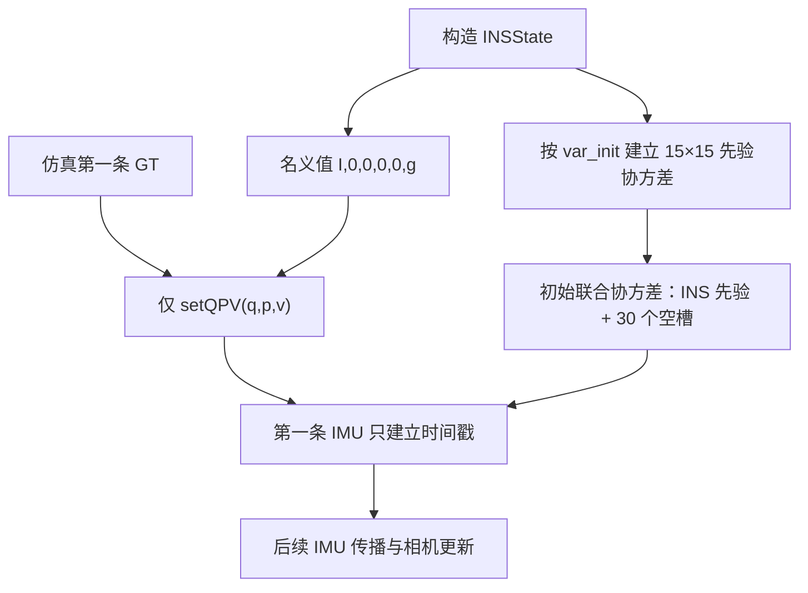
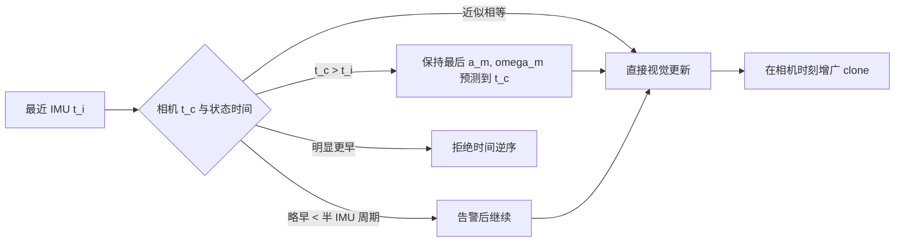
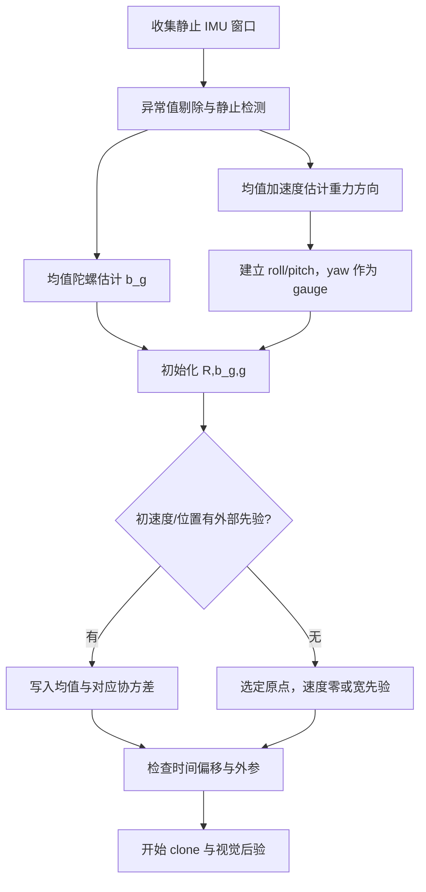

# ESKF 初始化、先验协方差与时间同步

当前仿真报告主要验证视觉后验、调度和数值稳定性，并**不验证真实设备上的 VIO 初始化**。
分析程序直接用第一帧真值设置 \(R,p,v\)，而 bias 仍从零开始、重力固定为已知值。若不把
这个边界写清楚，很容易把“后端长期不发散”误解为“系统已经具备生产级初始化”。

## 1. 当前启动状态

默认名义状态为

\[
x_I=(R_{wi},p_{wi},v_w,b_g,b_a),
\]

构造时取

\[
R_{wi}=I,\quad p_{wi}=0,\quad v_w=0,\quad
b_g=0,\quad b_a=0,\quad g=[0,0,9.81]^T.
\]

分析程序生成仿真数据后调用

\[
(R_{wi},p_{wi},v_w)
\leftarrow
(R_{gt,0},p_{gt,0},v_{gt,0}),
\]

只替换名义 Q/P/V，不改变初始协方差，也不把后续 landmark 真值交给在线算法。仿真 bias
随机游走从零开始，但第一条真值样本已经可能含一个很小的随机游走增量；估计 bias 保持零，
由先验和后续量测估计。

这个“半 oracle”启动是有意的控制变量：它把初始化误差从视觉后验实验中隔离出去，但不能
用于证明真实系统冷启动能力。

## 2. 初始协方差的准确数值

误差状态排列为

\[
\delta x_I=
[\delta\theta,\delta p,\delta v,\delta b_g,\delta b_a].
\]

初始协方差是对角阵

\[
P_{II,0}=\operatorname{diag}(\sigma_0^2).
\]

`common.h` 中的标准差为：

| 误差块 | 初始标准差 | 方差 |
|---|---:|---:|
| 姿态 \(\delta\theta\) | 0.003 rad | \(9\times10^{-6}\) |
| 位置 \(\delta p\) | 0.1 m | \(10^{-2}\) |
| 速度 \(\delta v\) | 0.01 m/s | \(10^{-4}\) |
| 陀螺 bias \(\delta b_g\) | 0.005 rad/s | \(2.5\times10^{-5}\) |
| 加计 bias \(\delta b_a\) | 0.05 m/s² | \(2.5\times10^{-3}\) |
| 重力 \(\delta g\)，仅启用估计时 | 0.001 m/s² | \(10^{-6}\) |

`setQPV()` 只改名义值而不把 Q/P/V 方差清零是正确的：真值赋值是仿真初始化手段，不应让
滤波器宣称这些量绝对无误差。反过来，若真实初始化误差明显大于表中标准差，NEES 会偏高、
视觉门控可能过早拒绝，必须按初始化算法的实际精度调整先验。

## 3. 初始完整协方差为何是半正定而非正定

构造器先建立固定主状态

\[
x_M=[x_I,c_0,\ldots,c_{29}]
\]

的 195×195 协方差，只把左上 INS 块设为 \(P_{II,0}\)，30 个尚未创建的 clone 槽全部为
零。这些槽不是“零方差的已知随机变量”，而是尚未加入逻辑状态的存储空间。

所以初始完整矩阵必然奇异。检查正定性时应区分：

- 活跃随机变量的协方差是否有效；
- 固定容量中的空槽是否只是结构零块；
- 是否出现超过相对容差的真实负特征值。

第一个 clone 创建后，它又是当前 INS 位姿的确定性拷贝，联合协方差仍可能因精确线性相关
而奇异。这不是数值故障，详见
[Clone 删除与槽位复用](CLONE_REMOVAL_AND_SLOT_REUSE.md)。

## 4. 第一条 IMU 为什么不传播

`processIMU()` 需要两个时间点才能得到采样间隔。第一次调用只执行

\[
t_{state}\leftarrow t_{imu,0}
\]

并保存样本，不积分姿态、速度或位置。第二条及后续样本才按

\[
\Delta t=(t_{imu,k}-t_{state})\times10^{-6}
\]

调用预测。

要求包括：

- IMU 时间戳严格递增；
- 状态时间不能领先待处理 IMU；
- 首条相机到达前至少应有一条 IMU 建立状态时间。

若传感器日志从相机开始、IMU 稍后才到，当前实现会跳过尚未初始化时间戳的相机帧。这是
确定的调度语义，不是视觉更新失败。

还要注意一个实现边界：当前用 `timestamp==0` 同时表示“尚未初始化”。三个内置仿真器的
首样本时间均非零，所以不会触发歧义；若真实日志把第一条 IMU 或相机时间归一化为精确的
0，下一条样本可能仍被当作初始化样本。接入这类日志时应保留一个非零时间原点，或把源码
改成独立的 `has_imu_time/has_camera_time` 布尔标志，不能仅靠时间戳数值兼任状态标志。

## 5. 相机时刻的零阶保持传播

视觉残差必须在线性化于相机曝光时刻。设最后一条 IMU 时间为 \(t_i\)，相机时间为 \(t_c\)。
当 \(t_c>t_i\) 时，当前实现用最后一条去 bias 前的原始 IMU 量测做零阶保持：

\[
a_m(t)=a_m(t_i),\qquad
\omega_m(t)=\omega_m(t_i),\qquad t\in(t_i,t_c],
\]

再预测 \(\Delta t=t_c-t_i\)。这样 clone 与相机观测同时间，但仍是近似；高速运动、长曝光或
IMU/相机时钟偏移较大时，应使用插值、预积分或硬件同步。

当相机时间略早于状态时间且误差小于半个 IMU 周期时，代码告警后继续；更大的逆序直接
报错。这可以暴露时间戳错配，不能靠增大量测噪声掩盖。

## 6. 初始先验、过程噪声和量测噪声不是一回事

三者分别控制不同阶段：

\[
P_0=\operatorname{diag}(\sigma_0^2),
\]

\[
P^-_{k+1}=F_kP_k^+F_k^T+Q_{d,k},
\]

\[
K=P^-H^T(HP^-H^T+R)^{-1}.
\]

- \(P_0\) 表示启动时对状态误差的认识；
- \(Q_d\) 表示两次更新之间模型新增的不确定度；
- \(R\) 表示本次视觉量测的不确定度。

用大 \(Q\) 补偿错误 \(P_0\)，或用大 \(R\) 掩盖时间同步错误，都可能让短轨迹看似稳定，
但会破坏 NIS/NEES 和长期增益。当前过程噪声还是状态空间对角密度近似，完整语义见
[ESKF 状态传播](ESKF_STATE_PROPAGATION_AND_AUGMENTATION.md)。

## 7. 为什么仿真默认关闭重力估计

仿真器和滤波器统一使用

\[
g=[0,0,9.81]^T,
\]

并直接给定第一帧真值姿态。此时在线估计重力只会额外引入它与 roll/pitch、加速度计 bias
之间的弱可观耦合，所以默认 `ESTIMATE_GRAVITY=false`。

这个结论依赖“重力方向和初始姿态已知”。真实设备若只知道重力模长、不知道方向，应通过
静止段估计

\[
\bar a_m\approx R_{wi}^T(-g)+b_a,
\qquad
\bar\omega_m\approx b_g,
\]

恢复 roll/pitch 和陀螺 bias；若仍有显著不确定度，则应恢复重力状态或把误差反映到姿态、
bias 的 \(P_0\) 中。

## 8. 固定外参的初始化边界

当前

\[
R_{ic}=I,\qquad t_{ic}=0
\]

且 `ESTIMATE_EXTRINSIC=false`。外参雅可比源码保留，但它没有状态列、先验协方差、过程模型
或误差注入，因此只打开一处计算开关不能完成在线标定。

若未来估计外参，至少要同时定义：

1. 误差状态 \([\delta\theta_{ic},\delta t_{ic}]\) 的左右乘约定；
2. 初始外参均值和 6×6 先验；
3. 随机常量或随机游走过程模型；
4. clone 增广、重投影雅可比和状态注入；
5. 外参与时延、运动退化之间的可观性实验。

## 9. 真实设备推荐的初始化流程

下面是当前工程尚未实现、但迁移到真实数据前应补齐的最小流程：

静止初始化不能可靠给出全局 yaw 和绝对位置；它们应明确选 gauge，而不是把协方差伪装为
零。若设备启动时正在运动，则需要视觉—惯性批量初始化，同时估计尺度、速度、重力方向和
bias，不能直接照搬当前仿真的 `setQPV()`。

## 10. 回归检查

初始化或时间同步改动后至少验证：

1. 第一条 IMU 只设时间戳，第二条才传播；
2. 相机 clone 的时间与相机量测一致；
3. 仿真在线算法仍不读取 landmark 真值；
4. 关闭/开启 oracle QPV 时，报告明确区分实验目的；
5. 初始误差落在配置的 \(P_0\) 尺度内；
6. Q/P/V 联合 NEES 使用与左乘误差同一坐标系；
7. 更改 IMU 频率不改变连续噪声密度的物理意义；
8. 重力固定时不输出“重力已被视觉估计正确”的结论；
9. 时间戳逆序能被显式发现；
10. 时间从 0 开始的日志不会因哨兵歧义多丢一帧；
11. 至少运行 Circle-out、Circle-in、Helix-3D、Stop-go 和长时回归。

## 11. 公式到源码

| 职责 | 实现位置 |
|---|---|
| 名义初值、`var_init`、`var_proc`、重力/外参开关 | `common.h` |
| 联合协方差构造 | `eskf/schur_vins.cpp::SchurVINS()` |
| 仿真 Q/P/V 真值初始化 | `tools/analysis_main.cpp::setQPV()` 调用处 |
| 第一条 IMU、时间戳检查和预测 | `eskf/schur_vins_imu.cpp::processIMU()` |
| 相机时刻零阶保持传播 | `eskf/schur_vins.cpp::processFrame()` |
| 仿真 bias、IMU 和相机时钟 | 三个 `vio_*simulator*.cpp` |

相关专题：

- [仿真场景与噪声](SIMULATION_SCENARIOS.md)
- [ESKF 状态传播、协方差与 clone 增广](ESKF_STATE_PROPAGATION_AND_AUGMENTATION.md)
- [视觉残差与噪声语义](VISUAL_RESIDUAL_NOISE_MODEL.md)
