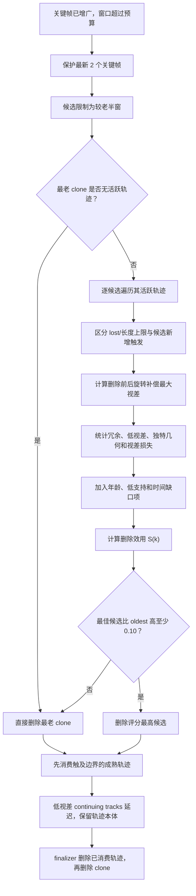

# 冗余感知关键帧删除策略

本文说明实验性 `FrameSelectionPolicy::KeyframeRedundancy` 的设计动机、数学定义、
一次性 MSCKF 量测生命周期约束、代码流程和消融方法。该策略当前**不会替换默认配置**：
`MSCKF + AUTO` 仍解析为已经通过五场景回归的 `KeyframeOnly`。

## 1. 为什么不直接删除“共视最少”的关键帧

对普通 BA/SLAM 后端，关键帧删除常被描述为“删掉最冗余的关键帧”。但在当前
one-shot MSCKF 中，删帧还有额外语义：若轨迹包含待删除 clone，则

```cpp
touches_marginalized_clone = true;
consume_track = true;
```

也就是说，帧删除计划会直接决定轨迹何时结算。单独使用共视数量有两个相反风险：

1. 共视少可能表示该帧已经没有活跃引用，删除它最安全；也可能表示它提供唯一视角或最长基线。
2. 共视多可能表示观测高度冗余；也可能意味着删除它会同时迫使大量新生轨迹提前结算。

因此策略不能只回答“该帧和多少帧共视”，还必须回答：

- 哪些轨迹本来就会因为 `lost` 或长度上限结算；
- 哪些轨迹只因为候选 clone 被删除才触发结算；
- 这些额外触发的轨迹是否已经有足够平移视差；
- 若低视差轨迹被延迟消费，删除该观测会损失多少未来三角化几何。

## 2. 与默认 KeyframeOnly 相同和不同的部分

两种策略都只为关键帧增广 clone：

```text
图像到达
  ├─ 非关键帧：不增广 clone
  └─ 关键帧：增广 clone、保存观测
```

区别只出现在窗口超过预算时：

- `KeyframeOnly`：始终删除时间下标 `0`，即最老关键帧；
- `KeyframeRedundancy`：在受保护范围之外计算候选评分，必要时删除较老半窗中的中间帧。

默认预算仍为 20 个保留 clone。最新两个关键帧被硬保护，候选只取未保护帧中较老的
50%，防止重现 VINS-Mono 风格频繁删除次新帧所造成的轨迹饥饿。

## 3. 旋转补偿视差

设第 `i` 个 clone 的 IMU 世界姿态为 \(\mathbf R_{wi}\)，相机外参旋转为
\(\mathbf R_{ic}\)，归一化相机 bearing 为 \(\bar{\mathbf b}_i^c\)。将 bearing
旋转到世界系：

\[
\mathbf b_i^w
=
\mathbf R_{wi}\mathbf R_{ic}\bar{\mathbf b}_i^c,
\qquad
\|\mathbf b_i^w\|=1.
\]

轨迹观测集合 \(\mathcal T\) 的最大旋转补偿视差定义为

\[
\theta(\mathcal T)
=
\max_{i,j\in\mathcal T}
\arccos\!\left(
\operatorname{clamp}
\left((\mathbf b_i^w)^\top\mathbf b_j^w,-1,1\right)
\right).
\]

若相机只有纯旋转，不同帧的世界 bearing 近似重合，\(\theta\approx0\)；有平移基线时，
同一空间点的 bearing 产生夹角。因此该量与三角化使用的几何门限具有一致物理意义。

对候选关键帧 `k`，删除前后分别计算

\[
\theta_{\mathrm{before}}=\theta(\mathcal T),
\qquad
\theta_{\mathrm{after}}=\theta(\mathcal T\setminus\{k\}).
\]

归一化视差损失为

\[
L_k
=
\operatorname{clamp}
\left(
\frac{\theta_{\mathrm{before}}-\theta_{\mathrm{after}}}
{\theta_{\min}},0,1
\right),
\]

其中默认 \(\theta_{\min}=2^\circ\)，并直接复用当前三角化门限。

## 4. 哪些轨迹是候选删帧新增的风险

设轨迹当前有效观测数为 \(n\)，保留 clone 预算为 \(N\)。轨迹在当前图像仍可见记为
`continues=true`。候选帧会额外触发该轨迹结算，当且仅当

\[
\text{triggeredByCandidate}
=
\text{continues}\land(n<N).
\]

原因是：

- `continues=false` 时，轨迹本来就会因为 `lost` 结算；
- \(n\ge N\) 时，轨迹本来就会因为长度上限结算；
- 只有其余 continuing tracks 才由 `touches_marginalized_clone` 新增触发。

### 4.1 低视差风险轨迹

若轨迹尚未三角化，并满足

\[
\text{triggeredByCandidate}
\land
\theta_{\mathrm{before}}<\theta_{\min},
\]

则计入 `low_parallax_tracks`。它大概率无法形成普通 MSCKF 深度因子，只能走低视差
延迟消费；候选帧观测仍会随 clone 删除，因此该项在评分中使用最大惩罚权重。

### 4.2 独特几何轨迹

低视差风险轨迹还满足任一条件时，计入 `unique_geometry_tracks`：

\[
n_{\mathrm{after}}<2,
\]

或

\[
L_k\ge0.25.
\]

第一项表示删除后连两视图都不足；第二项表示候选帧贡献了至少四分之一三角化门限的
最大视差，不能因为其共视数量较少就简单删除。

### 4.3 冗余轨迹

满足以下任一条件的候选观测计为冗余：

1. 轨迹本来就会因丢失或长度上限结算；
2. 轨迹已经三角化；
3. 删除前视差已经达到三角化门限；
4. 删除后仍有至少两个观测，且归一化视差损失不超过 0.10。

这一定义不是传统“共享特征数量”，而是**结合一次性消费语义后的安全冗余率**。

## 5. 删除评分

每个候选关键帧 `k` 的删除效用为

\[
\begin{aligned}
S(k)=\;&
1.20R_k
+0.50W_k
+0.35A_k\\
&-4.00D_k
-2.00U_k
-1.50G_k
-0.25T_k.
\end{aligned}
\]

各项均归一化到 \([0,1]\)：

- \(R_k\)：安全冗余轨迹比例；
- \(W_k\)：低活跃支持奖励，候选活跃轨迹越少越接近 1；
- \(A_k\)：年龄比例，越老越接近 1；
- \(D_k\)：低视差风险轨迹比例；
- \(U_k\)：独特几何轨迹比例；
- \(G_k\)：候选触发的未三角化轨迹平均视差损失；
- \(T_k\)：删除内部帧后形成异常大时间间隔的惩罚。

选择 \(S(k)\) 最大的候选删除。低视差风险权重 4.00 明显大于所有奖励项之和，体现
“宁可退回最老帧，也不要为了形式上的共视冗余破坏未成熟轨迹”的设计原则。

## 6. 保守回退和快速路径

若最佳候选不是最老帧，它必须满足

\[
S(k_{\mathrm{best}})
\ge
S(k_{\mathrm{oldest}})+0.10,
\]

否则仍删除最老关键帧。完全同分时也优先删除时间更早的帧，使结果保持确定性。

若最老 clone 已经没有任何活跃轨迹引用，则直接删除最老帧，不再计算其他候选：

```text
oldest.lmk2fet 中无有效活跃轨迹
    => 该 clone 不可能进入未来视觉因子
    => 删除 oldest 严格优于删除仍有轨迹的中间帧
```

该快速路径把常见情况从
\(O(N_{candidate}N_{track}N_{obs}^2)\) 降为一次帧特征遍历。

## 7. 状态框图



## 8. 与一次性观测和低视差延迟的关系

评分只决定 `frames_to_remove`，不会改变后续 MSCKF 语义：

1. 在真正删除 clone 前，将候选 `FrameID` 写入删除计划；
2. 包含该 `FrameID` 的轨迹触发 `touches_marginalized_clone`；
3. 成功三角化的轨迹使用删除前的完整观测集合执行一次普通 MSCKF 更新；
4. 低视差且仍可见的轨迹可撤销 `consume_track`，但被删 clone 的观测会消失；
5. 已被无深度旋转因子使用的像素不会再次进入后续普通 Schur；
6. finalizer 先删除已消费轨迹，再按逆序删除 clone。

因此本策略不引入历史观测复用，回归仍必须满足

\[
N_{\mathrm{reused}}=0,
\qquad
N_{\mathrm{blocked}}=0.
\]

## 9. 配置与消融

显式启用：

```powershell
cmake -S . -B cmake-build-release `
  -DSCHUR_VIO_VISUAL_SCHEDULER=MSCKF `
  -DSCHUR_VIO_FRAME_POLICY=KEYFRAME_REDUNDANCY `
  -DSCHUR_VIO_FRAME_WINDOW_SIZE=20
```

固定 MSCKF 后端的完整策略对比：

```powershell
tools/run_frame_policy_analysis.ps1 -Duration 100 -Features 600 -RetainedClones 20
```

脚本现在同时运行 `KEYFRAME_ONLY` 和 `KEYFRAME_REDUNDANCY`。CSV 新增：

- `redundancy_removals`：评分策略实际执行次数；
- `redundancy_nonoldest_removals`：最终删除非最老候选的次数；
- `redundancy_oldest_fallbacks`：最佳非最老候选优势不足而回退次数；
- `redundancy_selected_low_parallax_tracks`：被选帧累计触及的低视差风险轨迹数；
- `redundancy_selected_unique_tracks`：被选帧累计触及的独特几何轨迹数；
- `redundancy_score_mean`：被选候选平均删除效用；
- `redundancy_ratio_mean`：被选候选平均安全冗余率；
- `redundancy_parallax_loss_mean`：被选候选平均归一化视差损失。

## 10. 完整消融结论

固定 MSCKF、100 s、600 点、20 clones、2° 门限的五场景严格 A/B 结果如下。表中
`消费/丢弃`、Mean NIS 和 RMSE 在两个策略之间均逐项相同：

| 场景 | Keyframe-only RMSE / m | Redundancy RMSE / m | Mean NIS | 消费/丢弃轨迹 | 评分删帧次数 | 非最老删除 |
|---|---:|---:|---:|---:|---:|---:|
| Circle-out | 0.326150 | 0.326150 | 0.981730 | 3359 / 137 | 480 | 0 |
| Circle-in | 0.312407 | 0.312407 | 0.955021 | 13911 / 24 | 480 | 0 |
| Helix-3D | 0.086675 | 0.086675 | 0.921101 | 14557 / 15 | 480 | 0 |
| Stop-go | 0.060370 | 0.060370 | 0.602168 | 14543 / 0 | 480 | 0 |
| Rotation-translation | 7.398386 | 7.398386 | 0.567318 | 5904 / 302 | 480 | 0 |

所有场景还同时满足

\[
N_{\mathrm{reused}}=0,
\qquad
N_{\mathrm{blocked}}=0.
\]

每个场景的 480 次窗口压缩都进入“最老 clone 无活跃轨迹”的快速路径。因此在当前
仿真前端和 one-shot 生命周期下，最老帧删除不是粗糙近似，而是每次都成为严格占优选择：
保留一个已无任何轨迹引用的旧 clone 不会为未来视觉因子提供额外信息。

据此得到当前工程结论：

- 默认 `AUTO` 继续使用更简单、已经充分验证的 `KeyframeOnly`；
- `KeyframeRedundancy` 保留为实验策略和诊断工具，不提升为默认；
- 它真正可能发挥作用的场景是更长寿命的真实前端轨迹、不同关键帧频率，或未来允许轨迹
  跨窗口保留引用的实现；届时可直接复用现有评分和 CSV 判断是否出现非最老删除收益。

## 11. 代码位置

- `eskf/frame_selection_policy.h`：策略枚举、参数和诊断结构；
- `eskf/frame_selection_policy.cpp`：旋转补偿视差、轨迹分类和评分实现；
- `eskf/schur_vins_visual.cpp`：调用规划器、生成 `frames_to_remove` 和累计统计；
- `tools/analysis_main.cpp`：CSV 与终端诊断；
- `tools/run_frame_policy_analysis.ps1`：固定 MSCKF 后端的统一预算消融。
