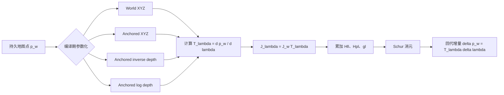
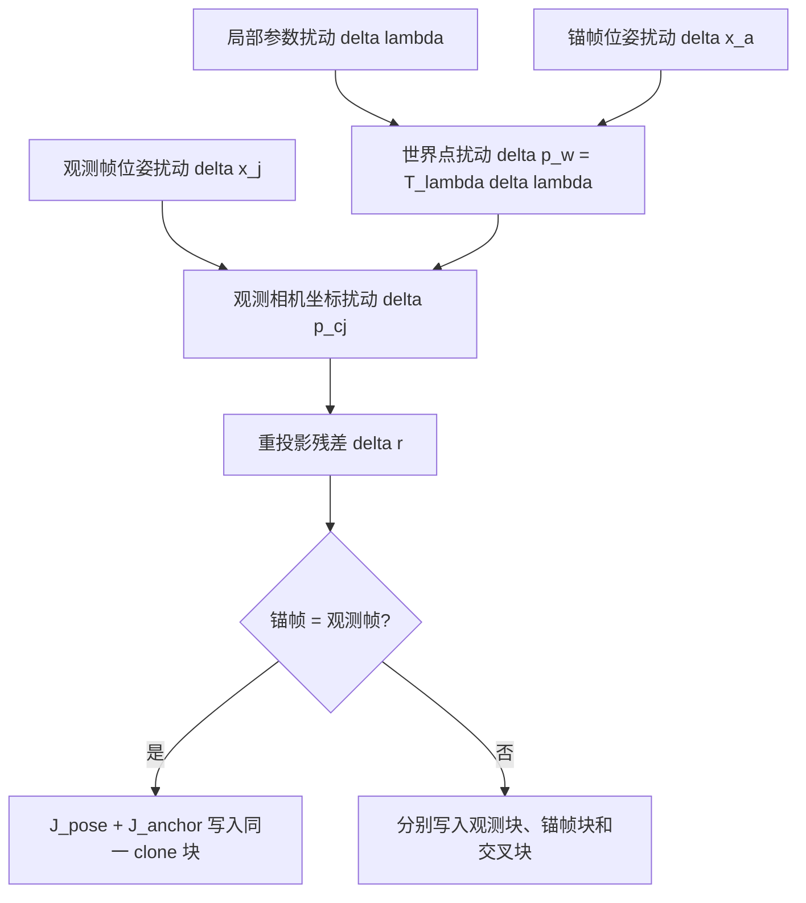

# 三自由度 Landmark 参数化：定义、雅可比与 Schur 等价性

## 1. 结论

当前生产默认仍是 `WORLD_XYZ`。三自由度锚定逆深度显著改善了单点信息矩阵 `Hll` 的数值条件，但严格同变量实验没有观察到确定的轨迹精度提升。参数化改变的是数值坐标和线性化尺度，不会凭空增加几何信息。

5 s、150 点、Circle-out、MSCKF-Schur 快速消融如下：

| 参数化 | 对齐 ATE / m | 1 s RPE / m | `Hll` 平均有效条件数 | `Hll` 最大有效条件数 | 后验耗时 / s |
|---|---:|---:|---:|---:|---:|
| World XYZ | 0.241925 | 0.200313 | 3693.3 | 12881 | 0.024 |
| Anchored XYZ | 0.242036 | 0.200478 | 3693.1 | 12882 | 0.025 |
| Anchored `(alpha,beta,rho)` | 0.242427 | 0.200753 | **47.9** | **83.0** | 0.027 |
| Anchored `(alpha,beta,log z)` | 0.242573 | 0.200859 | 1017.8 | 2671 | 0.022 |

## 2. 坐标系和统一观测模型

采用以下坐标系：

- `W`：世界坐标系；
- `I_i`：第 `i` 帧 IMU 坐标系；
- `C_i`：第 `i` 帧相机坐标系；
- `a`：Landmark 的锚帧；
- `R_wi`：从 IMU 系旋转到世界系；
- `R_ic,t_ic`：从相机系到 IMU 系的固定外参。

世界点 `p_w` 在观测帧 `j` 的相机坐标为

\[
p_{c_j}=
R_{ic}^{T}\left[
R_{wi_j}^{T}(p_w-p_{wi_j})-t_{ic}
\right]
=
\begin{bmatrix}X_j&Y_j&Z_j\end{bmatrix}^{T}.
\]

归一化针孔投影和残差为

\[
\pi(p_{c_j})=
\begin{bmatrix}X_j/Z_j\\Y_j/Z_j\end{bmatrix},
\qquad
r_{jk}=z_{jk}-\pi(p_{c_j}).
\]

投影雅可比为

\[
J_\pi=
\frac{\partial\pi}{\partial p_c}
=
\begin{bmatrix}
1/Z&0&-X/Z^2\\
0&1/Z&-Y/Z^2
\end{bmatrix}.
\]

对世界点的投影雅可比写成

\[
J_w=J_\pi R_{ic}^{T}R_{wi_j}^{T}.
\]

代码中残差采用“观测减预测”，更新方程吸收了整体符号；本文重点讨论参数坐标变换，因此统一使用 `J_w` 表示投影对世界点的导数。

## 3. 四种 3-DOF 参数化

地图中始终保存世界坐标 `p_w`。编译宏只改变本次 Schur 线性化所使用的局部参数 `lambda`。四种参数都具有三个自由度，不包括“固定首帧 bearing、仅优化一个逆深度”的 1-DOF 模型。



### 3.1 World XYZ

定义

\[
\lambda_w=
\begin{bmatrix}p_x&p_y&p_z\end{bmatrix}^{T}=p_w,
\qquad
p_w(\lambda_w)=\lambda_w.
\]

因此

\[
T_w=\frac{\partial p_w}{\partial\lambda_w}=I_3,
\qquad
J_{\lambda_w}=J_w.
\]

优点是定义最直接、无需锚帧；缺点是远点的深度方向导数随 `1/Z^2` 变小，`Hll` 容易出现很大的尺度差异。

### 3.2 Anchored XYZ

锚帧相机坐标定义为

\[
\lambda_a=p_{c_a}=
\begin{bmatrix}x&y&z\end{bmatrix}^{T}.
\]

从锚帧相机坐标恢复世界点：

\[
p_w(\lambda_a)
=p_{wi_a}+R_{wi_a}\left(t_{ic}+R_{ic}\lambda_a\right).
\]

记 `R_wca=R_wia R_ic`，则

\[
T_a=\frac{\partial p_w}{\partial\lambda_a}=R_{wca},
\qquad
J_{\lambda_a}=J_wR_{wca}.
\]

旋转矩阵不改变奇异值，因此 Anchored XYZ 与 World XYZ 的 `Hll` 条件数理论上接近；实验结果也验证了这一点。

### 3.3 Anchored inverse depth 3D

定义

\[
\lambda_\rho=
\begin{bmatrix}\alpha&\beta&\rho\end{bmatrix}^{T},
\qquad
\alpha=\frac{x}{z},\quad
\beta=\frac{y}{z},\quad
\rho=\frac{1}{z}.
\]

逆变换为

\[
p_{c_a}(\lambda_\rho)
=\frac{1}{\rho}
\begin{bmatrix}\alpha\\\beta\\1\end{bmatrix}
=\begin{bmatrix}x\\y\\z\end{bmatrix}.
\]

对局部参数求导：

\[
\frac{\partial p_{c_a}}{\partial\lambda_\rho}
=
\begin{bmatrix}
1/\rho&0&-\alpha/\rho^2\\
0&1/\rho&-\beta/\rho^2\\
0&0&-1/\rho^2
\end{bmatrix}
=
\begin{bmatrix}
z&0&-xz\\
0&z&-yz\\
0&0&-z^2
\end{bmatrix}.
\]

所以

\[
T_\rho=R_{wca}
\begin{bmatrix}
z&0&-xz\\
0&z&-yz\\
0&0&-z^2
\end{bmatrix},
\qquad
J_{\lambda_\rho}=J_wT_\rho.
\]

世界 XYZ 中远点深度方向的图像导数约为 `O(1/Z^2)`；使用 `rho=1/Z` 后，局部深度变量直接描述视差尺度，使有效方向的数值量级更均衡。这解释了条件数显著下降，但它并没有改变真实可观测秩。

### 3.4 Anchored log depth 3D

定义

\[
\lambda_\eta=
\begin{bmatrix}\alpha&\beta&\eta\end{bmatrix}^{T},
\qquad
\eta=\log z,
\qquad z=e^\eta.
\]

逆变换为

\[
p_{c_a}(\lambda_\eta)
=e^\eta
\begin{bmatrix}\alpha\\\beta\\1\end{bmatrix}
=\begin{bmatrix}x\\y\\z\end{bmatrix}.
\]

因此

\[
\frac{\partial p_{c_a}}{\partial\lambda_\eta}
=
\begin{bmatrix}
z&0&x\\
0&z&y\\
0&0&z
\end{bmatrix},
\]

\[
T_\eta=R_{wca}
\begin{bmatrix}
z&0&x\\
0&z&y\\
0&0&z
\end{bmatrix},
\qquad
J_{\lambda_\eta}=J_wT_\eta.
\]

`eta` 无界且始终对应正深度，优化时不容易直接跨到负深度；但其深度尺度改善弱于逆深度，本次实验的条件数也处于 World XYZ 与 inverse-depth 之间。

## 4. 为什么必须加入锚帧位姿雅可比

锚定参数不是一个固定世界点，而是“锚帧位姿 + 锚帧局部坐标”的组合：

\[
p_w=p_{wi_a}+R_{wi_a}(t_{ic}+R_{ic}p_{c_a}).
\]

保持 `p_ca` 不变时，锚帧位姿扰动仍会移动世界点。采用左乘小角度误差、状态排列 `[delta theta, delta p]`，代码中的锚帧贡献为

\[
J_{anchor}=
\begin{bmatrix}
-J_w[p_w-p_{wi_a}]_\times & J_w
\end{bmatrix}.
\]

观测帧自身的位姿雅可比为

\[
J_{pose,j}=
\begin{bmatrix}
J_w[p_w-p_{wi_j}]_\times & -J_w
\end{bmatrix}.
\]

当观测帧就是锚帧时，两部分要加到同一个 clone 块：

\[
J_{same}=J_{pose,a}+J_{anchor}.
\]

共同移动相机和其锚定点时，局部相机坐标不应变化，因此对应刚体自由度会严格抵消。遗漏 `J_anchor` 等价于偷偷把锚帧固定在世界系，会破坏全局平移/偏航 gauge 和 FEJ 可观性结构。



## 5. 正规方程如何随参数化变化

令世界坐标增量与局部参数增量满足

\[
\delta p_w=T\delta\lambda.
\]

若世界坐标下单点正规方程为

\[
\begin{bmatrix}
H_{pp}&H_{pl}\\
H_{lp}&H_{ll}
\end{bmatrix}
\begin{bmatrix}\delta x\\\delta p_w\end{bmatrix}
=
\begin{bmatrix}g_p\\g_l\end{bmatrix},
\]

则局部参数下

\[
H'_{ll}=T^TH_{ll}T,
\qquad
H'_{pl}=H_{pl}T,
\qquad
g'_l=T^Tg_l.
\]

在 `T` 可逆且所有秩阈值选择同一有效子空间时，Schur 补保持不变：

\[
H'_{pl}(H'_{ll})^{-1}H'_{lp}
=H_{pl}H_{ll}^{-1}H_{lp},
\]

\[
H^s_{pp}=H_{pp}-H_{pl}H_{ll}^{\dagger}H_{lp},
\qquad
g^s_p=g_p-H_{pl}H_{ll}^{\dagger}g_l.
\]

实际差异来自浮点舍入、鲁棒权重、深度门控、秩阈值和伪逆方向选择。也就是说，参数化改善的是“同一个问题怎样被数值求解”，而不是改变问题本身。

## 6. 增量和协方差如何变回世界坐标

Schur 回代先得到局部参数增量

\[
\delta\lambda=H_{ll}^{\dagger}
\left(g_l-H_{lp}\delta x\right),
\]

再转换为地图中的世界坐标增量

\[
\delta p_w=T\delta\lambda.
\]

若保存的是局部参数协方差，则一阶变换为

\[
P_w=TP_\lambda T^T.
\]

本项目的持久 `Landmark::cov_position` 始终在世界 XYZ 中。独立 Landmark 实验若接收到局部正规方程，需要先变换回世界坐标：

\[
H_{ww}=T^{-T}H_{\lambda\lambda}T^{-1},
\qquad
g_w=T^{-T}g_\lambda.
\]

当 `T` 不可逆、锚点缺失、锚帧深度小于 `0.05` m 或出现非有限值时，本次点线性化直接跳过，不把病态变换送入 Schur 系统。

## 7. 参数化选择建议

| 情况 | 建议 | 原因 |
|---|---|---|
| 一般仿真与回归基线 | `WORLD_XYZ` | 最简单，便于解释和对照 |
| 低视差、远点较多 | `ANCHORED_INV_DEPTH` | `Hll` 有效条件数最好 |
| 希望显式保证正深度 | `ANCHORED_LOG_DEPTH` | `z=exp(eta)>0` |
| 只想消除全局旋转尺度差异 | 不必改为 Anchored XYZ | 纯旋转坐标变换不会改善条件数 |

编译方式：

```powershell
cmake -S . -B cmake-build-release `
  -DSCHUR_VIO_LANDMARK_PARAMETERIZATION=ANCHORED_INV_DEPTH
```

运行四种参数化回归：

```powershell
powershell -ExecutionPolicy Bypass `
  -File tools/run_landmark_parameterization_analysis.ps1 -Quick
```

结果写入 `out/parameterization_summary.csv`，并显示在 HTML 报告的参数化对比章节。

## 8. 对应实现

- `eskf/landmark_parameterization.cpp`：四种 `T_lambda`、锚帧雅可比和正规方程坐标变换；
- `eskf/schur_vins_visual.cpp`：重投影线性化、Schur 消元与世界坐标回代；
- `eskf/landmark_parameterization.h`：参数化宏和公共接口；
- [Hll 的秩与深度方向](HLL_STRUCTURE.md)；
- [一致有效子空间](CONSISTENT_SUBSPACE_AND_LANDMARK_COVARIANCE.md)。
