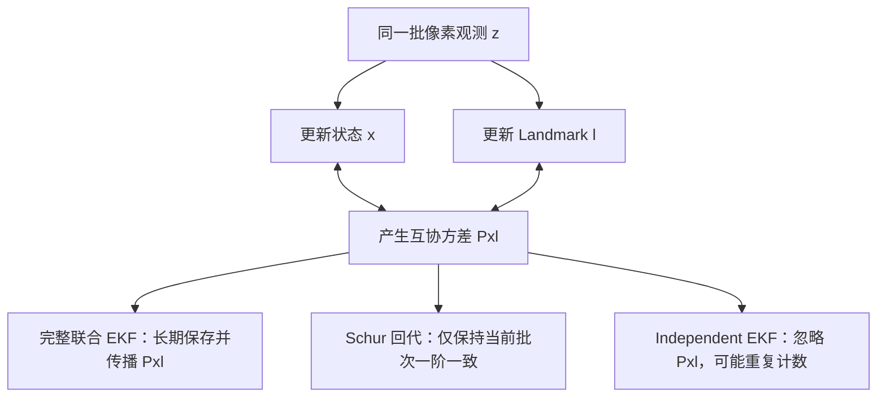

# Landmark 后续修正策略与严格对比

> 适用边界：本文主体记录一次性 MSCKF 引入前，普通滑窗 landmark 的历史后处理消融。
> 当前默认一次性 MSCKF 会消费普通轨迹并强制使用 `Fixed`，不再对同一观测做第二次点更新；
> 需要长期修正的少量高质量点进入 Hybrid 持久子状态，在完整 (P_{xL}) 下联合更新。参见
> [Hybrid MSCKF](HYBRID_MSCKF.md)。

## 1. 问题定义

滑窗视觉残差在线性化后写成

$$
r \simeq J_p\delta x_p+J_l\delta x_l+n,
$$

对应联合正规方程

$$
\begin{bmatrix}
H_{pp}&H_{pl}\\
H_{lp}&H_{ll}
\end{bmatrix}
\begin{bmatrix}\delta x_p\\\delta x_l\end{bmatrix}
=
\begin{bmatrix}g_p\\g_l\end{bmatrix}.
$$

Schur 状态更新先消去 landmark：

$$
H_s=H_{pp}-H_{pl}H_{ll}^{+}H_{lp},\qquad
g_s=g_p-H_{pl}H_{ll}^{+}g_l.
$$

得到状态增量 $\delta x_p$ 后，同一联合线性系统内与之匹配的 landmark 条件增量为

$$
\delta x_l=H_{ll}^{+}(g_l-H_{lp}\delta x_p).
$$

这就是本文的 Schur 回代。它保证**当前批次的一阶联合方程**内部一致，但不等价于长期维护完整的状态—landmark 互协方差 $P_{xl}$。

## 2. 为什么旧的独立 EKF 修正有一致性风险

旧路径为每个地图点保存 $P_{ll}$，却不保存联合协方差

$$
P=\begin{bmatrix}P_{xx}&P_{xl}\\P_{lx}&P_{ll}\end{bmatrix}.
$$

状态和地图点由同一批像素观测更新后，通常 $P_{xl}\neq0$。若后续把该点当成与状态独立，再用同一滑窗观测更新 $P_{ll}$，等价于遗漏交叉项并重复吸收相关信息，常见结果是 landmark 协方差过度收缩。该路径仍保留为 `IndependentEkf`，用于历史结果复现，不作为一致性基准。

真正的“完整相关”方案需要把 $P_{xl}$ 纳入状态、在增广和边缘化时同步维护；其存储和更新开销随地图点数增长，会改变当前 MSCKF/Schur 架构。因此本轮采用 Schur 回代作为工程边界明确的替代方案，并在文档和代码中显式说明这一限制。



三种 landmark 修正方式的概率边界可概括为

$$
\begin{aligned}
\text{联合 EKF: }&p(x,l\mid z_{1:k}),\\
\text{Schur 回代: }&\arg\min_{\delta x,\delta l}\|r-J_x\delta x-J_l\delta l\|_W^2
\quad\text{（当前批次）},\\
\text{独立 EKF: }&p(x\mid z_{1:k})\,p(l\mid z_{1:k})
\quad\text{（近似假设 }P_{xl}=0\text{）}.
\end{aligned}
$$

## 3. 三组候选策略

| 策略 | 做法 | 优点 | 局限 |
|---|---|---|---|
| `Fixed` | 三角化成功后固定世界点 | 不重复使用相关量测，开销最低 | 初值误差不会被修正 |
| `Retriangulate` | 新关键帧观测到该点时，从当前全部原始关键帧观测重新三角化 | 非线性重求解，能恢复较差深度 | 开销较高；仍受当前位姿 gauge/误差影响 |
| `SchurBackSubstitution` | 对当前联合 Schur 方程回代，并用鲁棒重投影代价线搜索 | 与本批状态增量一阶一致，复用已有 $H_{ll},g_l$ | 不是持久 $P_{xl}$；FEJ/鲁棒权重下仅为局部近似 |

实现还保留第四条 `IndependentEkf` 历史参考线。三组候选与历史参考均使用相同仿真输入、FEJ、噪声、三角化和 Schur 状态更新配置。

## 4. 后续修正的防重复设计

关键帧之间，Schur 路径的持久量测集合没有新增观测。若每个普通相机帧都对整窗旧点回代，会对几乎相同的方程反复迭代，并产生大量无意义计算。因此新实现满足两个条件才修正一个点：

1. 当前帧是关键帧；
2. 该 landmark 在当前关键帧中确实新增了一条观测。

候选位置还必须通过有限值、步长和鲁棒重投影代价检查。Schur 回代使用 $1,1/2,1/4,1/8,1/16$ 回溯线搜索；若没有任何一步降低当前关键帧集合上的代价，则保持原位置不变。`Retriangulate` 失败时同样保留旧点。

重投影代价采用 Huber 核：

$$
\rho(s)=
\begin{cases}
\frac12s^2,&s\le\delta,\\
\delta(s-\frac12\delta),&s>\delta.
\end{cases}
$$

这里的代价下降只表示图像几何更一致，不等价于世界坐标系下 landmark 真值误差必然下降。VIO 的全局平移和全局 yaw 不可观，因此报告同时给出原始误差和四自由度 gauge 对齐后的 landmark 误差。对齐旋转只允许绕重力轴的 yaw，并由 GT/EST 姿态对估计；平移由轨迹质心确定。这里不使用任意 SE(3) 点云对齐，否则 Stop-go 等退化轨迹会产生任意 roll/pitch，并掩盖本应可观的误差。

## 5. 实验方法

本节表格是**历史重复窗口消融**：四个确定性场景、30 s、600 个特征、
`uv_var=0.01`、过程噪声倍率 1、密度型 IMU 白噪声、偏置随机游走开启、FEJ 开启、
硬投影关闭、三角化最小视差 8°。当前默认一次性 MSCKF 不读取 `uv_var`，门限为 2°，
而且会强制关闭旧 Independent EKF 后处理；因此这些结果只用于解释为什么要淘汰假独立更新，
不能作为当前 Hybrid MSCKF 的参数推荐。

```powershell
.\tools\run_landmark_strategy_analysis.ps1 -Duration 30 -Features 600
```

开发时可先运行 8 s/250 点的快速筛选：

```powershell
.\tools\run_landmark_strategy_analysis.ps1 -Quick
```

逐行原始结果写入 `out/landmark_strategy_summary.csv`。需要同时检查轨迹 RMSE、对齐 ATE、1 s RPE、landmark 原始/对齐误差、更新接受率、负协方差帧数与耗时，不能只按单一指标选择策略。

## 6. 结论与架构边界

本轮的最终数值结果见第 7 节。无论哪种候选获胜，都不能把 Schur 回代描述成“已经实现完整状态—地图联合 EKF”。若未来需要长期地图及严格一致的 landmark 协方差，应实现显式 $P_{xl}$ 或采用带一致边缘化先验的优化器；当前地图点更适合作为滑窗视觉约束的临时几何变量。

## 7. 正式实验结果

表内每格依次为“原始位置 RMSE / 刚体对齐 ATE / 1 s 位置 RPE / 最终 gauge 对齐 landmark 平均误差”，单位均为 m。

| 场景 | Fixed | Retriangulate | Schur 回代 | 旧 Independent EKF（参考） |
|---|---:|---:|---:|---:|
| Circle-out | .256 / .231 / .0683 / .451 | **.202 / .164 / .0569 / .329** | **.201 / .160 / .0559 / .323** | .218 / .183 / .0603 / .375 |
| Circle-in | **.088 / .078** / .0391 / .347 | .111 / .091 / .0362 / .123 | .118 / .096 / .0362 / .128 | .100 / .085 / .0363 / .067 |
| Helix-3D | **.044 / .034** / .0276 / .223 | .075 / .051 / .0238 / .052 | .076 / .052 / .0238 / .053 | .069 / .047 / .0237 / .030 |
| Stop-go | **.106 / .062 / .0494** / .436 | .121 / .071 / .0515 / .228 | .124 / .073 / .0516 / .261 | .117 / .070 / .0513 / .050 |

结果说明不同指标之间存在真实取舍：

- 固定点在三个场景的绝对轨迹误差最低，但完全不修正三角化初值；四场景 gauge 对齐初始点平均误差为 0.22–0.45 m。
- 重三角化把四场景 gauge 对齐 landmark 平均误差分别从 0.350、0.351、0.225、0.440 m 降至 0.329、0.123、0.052、0.228 m，平均相对下降约 49%。Circle-out 的原始 RMSE、对齐 ATE 和 RPE 相对固定点分别改善约 21%、29% 和 17%。
- Schur 回代与重三角化非常接近，Circle-out 的轨迹和点误差略好；重三角化则在 Circle-in、Helix-3D 和 Stop-go 得到更低的最终点误差。Schur 只需 3×3 回代而重三角化需要多次重投影迭代，前者理论开销更低；本机单次 `clock()` 计时存在较大抖动，因此不再给出虚假的微小百分比加速结论。
- 旧独立 EKF 的三个场景地图点误差最低，但它进行了约 9.56 万至 34.86 万次相关量测更新，又没有维护 $P_{xl}$，因此该数值不能证明其协方差一致。新策略只在新增关键帧观测时修正，尝试次数降至约 1.12 万至 8.71 万。
- 所有正式实验的负协方差帧数均为 0。

在这组历史重复窗口架构中，综合“需要可用地图点位置”、非线性鲁棒性和架构一致性边界，
当时把 `Retriangulate` 设为默认；`SchurBackSubstitution` 是偏重速度和局部 RPE 的可选项，
`Fixed` 用于严格消融，`IndependentEkf` 仅用于历史复现。当前 Hybrid MSCKF 已用“一次性
普通轨迹 + 少量完整联合持久点”取代该默认关系，但保留这些模式用于复现实验。

## 8. Circle-out 视差门限

30 s Circle-out 扫描的 3°/5°/7°/8°/10° 原始轨迹 RMSE 分别为 0.2015/0.2037/0.2040/0.2022/0.2012 m，最终 gauge 对齐地图点误差分别为 0.3333/0.3364/0.3332/0.3291/0.3302 m。门限从 3° 提至 10° 时，初始点误差从 0.4925 m 持续降至 0.3345 m，但成功点数从 609 降至 585；10° 的 1 s RPE 也是五组中最高。

8°在该历史重复窗口实验的初始几何质量、最终地图点误差和保留约束数量之间最好，因此曾
作为兼容模式默认值。对其他三个场景的 5°/8°交叉检查中，Circle-in 和 Stop-go 的 ATE
分别改善约 3.7% 和 0.6%，Helix-3D 仅退化约 0.6%，RPE 基本持平。一次性 MSCKF 的
轨迹寿命更短，不能直接继承该结论；当前通过延迟消费和 2° 门限在几何质量与可用约束数量间
折中。若未来加入 inverse-depth 延迟初始化，可让 2°–8° 的弱点先作为未成熟 track 存活，
而不是立即作为欧氏点进入后验。

## 9. 验证耗时

没有引入仿真数据缓存：当前主要工作流更适合先减少实验规模，避免增加序列化格式和缓存失效逻辑。脚本的 `-Quick` 模式把 30 s/600 点降为最多 8 s/250 点，用于编译后的四场景筛选；只有候选通过后才运行完整 30 s 严格实验。这显著缩短日常验证闭环，同时最终结论仍来自完整配置。

## 10. 协方差膨胀、NEES 与影子地图

新增 `IndependentEkfInflated`、`IndependentEkfAdaptive` 和不反馈 ESKF 的影子地图后处理器，
同时逐点输出最终 NEES 与 95% 卡方覆盖率。30 s/600 点实验确认：旧独立 EKF 在部分场景虽有
较低点误差，但 Circle-out 的平均 NEES 达 76.8、覆盖率仅 16.9%；固定过程噪声只能缓解，
NIS 自适应不能可靠发现缺失的 `Pxl`。影子地图在四场景都降低了点误差且不改变导航轨迹，
但仍不是严格联合滤波。完整公式和表格见
[一致有效子空间与 Landmark 协方差实验](CONSISTENT_SUBSPACE_AND_LANDMARK_COVARIANCE.md)。
