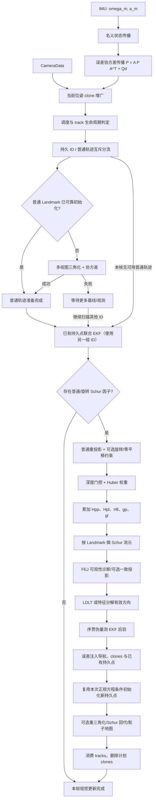
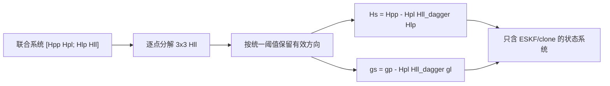

# SchurVIO 数学总流程

本文把分散在预测、增广、三角化、Schur 消元、可观性约束和 Landmark 修正中的公式串成一条完整数据流。具体专题仍以各自文档为准。

## 1. 状态、误差状态与协方差

当前默认关闭在线重力估计，因此 IMU 误差状态为

\[
\delta x_I=
\begin{bmatrix}
\delta\theta^T&
\delta p^T&
\delta v^T&
\delta b_g^T&
\delta b_a^T
\end{bmatrix}^{T}\in\mathbb R^{15}.
\]

每个相机 clone 只保存姿态和位置误差：

\[
\delta x_{C_i}=
\begin{bmatrix}\delta\theta_i^T&\delta p_i^T\end{bmatrix}^{T}
\in\mathbb R^6.
\]

固定主误差状态与协方差为

\[
\delta x=
\begin{bmatrix}
\delta x_I^T&\delta x_{C_0}^T&\cdots&\delta x_{C_{N-1}}^T
\end{bmatrix}^{T},
\qquad
P=E[\delta x\delta x^T].
\]

默认 Hybrid MSCKF 还会在固定主状态之后按需追加最多 20 个持久点：

\[
\delta\chi=
\begin{bmatrix}
\delta x^T&
\delta p_{L_0}^T&\cdots&\delta p_{L_{m-1}}^T
\end{bmatrix}^{T},
\qquad
P_\chi=
\begin{bmatrix}
P_{xx}&P_{xL}\\
P_{Lx}&P_{LL}
\end{bmatrix}.
\]

普通临时点仍不进入状态；只有完成条件初始化的少量持久点才动态扩维。固定主状态容量是
\(15+30\times6=195\)，默认 20-clone 预算不会自动缩小该物理矩阵。

`Frame::ordering` 保存 clone 对应的物理协方差块位置，`SlidingWindow::active_idx` 保存时间顺序。两者解耦后可以删除任意时间位置的 clone，而不搬动整块协方差。

## 2. 端到端流程

## 3. IMU 名义状态传播

去偏后的角速度和比力为

\[
\hat\omega=\omega_m-b_g,
\qquad
\hat a=a_m-b_a.
\]

名义状态连续模型为

\[
\dot R_{wi}=R_{wi}[\hat\omega]_\times,
\qquad
\dot p=v,
\qquad
\dot v=R_{wi}\hat a+g,
\]

\[
\dot b_g=n_{wg},
\qquad
\dot b_a=n_{wa}.
\]

线性误差模型写成

\[
\delta\dot x_I=F\delta x_I+Gn,
\]

当前协方差使用一阶稀疏离散转移 \(A\)，并按

\[
P^- = A P^+A^T+Q_d
\]

传播。工程中的

\[
Q_d=\operatorname{diag}(\mathrm{var\_proc})\Delta t\,s_{proc}
\]

是直接作用于误差状态的对角连续密度近似，不是完整
\(\int\Phi GQ_cG^T\Phi^Tdt\) 的精确离散结果。它与仿真器的 gyro/accel 白噪声和 bias
random walk 数量级相关，但不是逐项相同的变量。精确坐标、转移块和当前积分近似见
[ESKF 状态传播与增广](ESKF_STATE_PROPAGATION_AND_AUGMENTATION.md)。

## 4. 位姿增广

相机时刻到达后，把最新 IMU 位姿复制为 clone。若增广雅可比为 `J_a`，则

\[
P_{new,old}=J_aP,
\qquad
P_{new,new}=J_aPJ_a^T,
\]

\[
P_{aug}=
\begin{bmatrix}
P&PJ_a^T\\
J_aP&J_aPJ_a^T
\end{bmatrix}.
\]

当前是固定物理槽位布局，实际写入满足

\[
P_{C,\chi}=J_aP_{I,\chi},
\]

其中 \(\chi\) 包含 INS、其他 clone 和已有持久点。视觉后验需要同时修正多个历史 clone，
因此不能只复制名义位姿或 6×6 自协方差而忽略全部交叉协方差。当前图像的残差也依赖当前
clone，所以默认仍是“先增广、再视觉后验”；仅交换调用顺序会改变状态图，而不是无损提速。

## 5. 单个重投影残差

世界点在第 `j` 帧相机坐标为

\[
p_{c_j}=R_{ic}^{T}
\left(R_{wi_j}^{T}(p_w-p_{wi_j})-t_{ic}\right).
\]

残差线性化为

\[
r_{jk}\approx
J_{p,jk}\delta x_j+
J_{a,jk}\delta x_a+
J_{l,jk}\delta\lambda_k+n_{jk}.
\]

`J_a` 只在锚定 Landmark 参数化中出现；`delta lambda_k` 可以是世界 XYZ、锚定 XYZ、三自由度逆深度或 log-depth。

对残差范数 `s=||r||` 使用 Huber 权重

\[
w(s)=
\begin{cases}
1,&s\le\delta,\\
\delta/s,&s>\delta,
\end{cases}
\]

并在进入正规方程前执行正深度、有限值和硬重投影门控。Huber 权重是信息权重，公共像素
方差在信息方向转换成伪量测时加入；默认一次性 MSCKF 使用
\(\mathrm{triangulation\_uv\_std}^2\)，而不是历史 \(\mathrm{uv\_var}/dt\)。三种调度
语义见 [视觉残差与噪声模型](VISUAL_RESIDUAL_NOISE_MODEL.md)。

## 6. 联合正规方程与 Landmark 分块

把所有有效观测堆叠为

\[
r=H_p\delta x+H_l\delta l+n.
\]

白化后正规方程为

\[
\begin{bmatrix}
H_{pp}&H_{pl}\\
H_{lp}&H_{ll}
\end{bmatrix}
\begin{bmatrix}\delta x\\\delta l\end{bmatrix}
=
\begin{bmatrix}g_p\\g_l\end{bmatrix},
\]

其中

\[
H_{pp}=H_p^TWH_p,
\quad H_{pl}=H_p^TWH_l,
\quad H_{ll}=H_l^TWH_l,
\]

\[
g_p=H_p^TWr,
\qquad g_l=H_l^TWr.
\]

不同 Landmark 之间没有共同残差，因此

\[
H_{ll}=\operatorname{blkdiag}
(H_{l_1l_1},\ldots,H_{l_ml_m}),
\]

每个块仅为 `3x3`。代码只保存这些对角块，不构造巨大的稠密 Landmark 矩阵。

## 7. Schur 消元

对每个点使用带相对阈值的伪逆，统一保留其有效子空间：

\[
H_{ll}^{\dagger}=V
\operatorname{diag}
\left(
\mathbf 1_{\lambda_i>\tau\lambda_{max}}/\lambda_i
\right)V^T.
\]

消去 Landmark 增量后：

\[
H_s=H_{pp}-H_{pl}H_{ll}^{\dagger}H_{lp},
\]

\[
g_s=g_p-H_{pl}H_{ll}^{\dagger}g_l.
\]

## 8. 可观性约束

单目 VIO 的理想四维 gauge 是全局平移三维和绕重力方向的全局偏航一维。FEJ 使用 clone 第一次估计处的姿态/位置构造雅可比，避免反复重线性化人为获得 gauge 信息。

令 `N` 是先验白化后的四维不可观基，则可选硬投影为

\[
\Pi=I-N(N^TN)^{-1}N^T,
\]

\[
H_s\leftarrow\Pi^TH_s\Pi,
\qquad
g_s\leftarrow\Pi^Tg_s.
\]

该投影必须与 `Hll` 伪逆和 `Hs` 秩截断共享同一有效子空间；只投影梯度或只投影 pose 块会破坏 Schur 后系统的一致性。当前默认只启用 FEJ，不启用硬投影。

## 9. 从信息矩阵到序贯 EKF 伪量测

对 Schur 状态信息矩阵分解

\[
H_s=BDB^T.
\]

`B` 可以来自特征分解，也可以来自 LDLT 的三角基。先把梯度变换到同一基：

\[
\tilde g=B^{-1}g_s.
\]

对每个保留方向 `b_i,d_i`，构造标量伪量测：

\[
y_i=\frac{\tilde g_i}{d_i},
\qquad
h_i=b_i,
\qquad
R_i=\frac{\sigma_v^2}{d_i}.
\]

特征分解时 $B=V$ 为正交矩阵，所以 $B^{-1}g_s=V^Tg_s$；LDLT 的三角基通常不正交，
必须通过置换和三角回代求 $B^{-1}g_s$，不能错误替换成 $B^Tg_s$。

序贯更新为

\[
s_i=h_i^TPh_i+R_i,
\qquad
K_i=\frac{Ph_i}{s_i},
\]

\[
\delta x\leftarrow\delta x+K_i(y_i-h_i^T\delta x).
\]

协方差采用等价 Joseph/稳定低秩形式：

\[
P\leftarrow
(I-K_ih_i^T)P(I-K_ih_i^T)^T+K_iR_iK_i^T.
\]

实现只更新上三角，循环结束后统一恢复一次下三角；循环内所有读取都通过上三角自伴视图，
所以不需要每个方向都复制完整下三角。LDLT 默认开启，因为它比完整特征分解更快；近零或
负方向仍由相对阈值跳过，而不是盲目求逆。

## 10. 误差注入与地图后处理

姿态采用小角度左乘注入：

\[
q^+\leftarrow\delta q(\delta\theta)\otimes q^-,
\]

其余状态采用加法注入：

\[
p^+=p^-+\delta p,
\quad
v^+=v^-+\delta v,
\quad
b_g^+=b_g^-+\delta b_g,
\quad
b_a^+=b_a^-+\delta b_a.
\]

已有持久点的增量也在同一个联合修正中加到世界 XYZ。新持久点不是再做一次 Kalman
量测，而是用本次普通轨迹的 \(H_{ll},H_{lx},g_l\) 条件初始化并追加
\(P_{xL}/P_{LL}\)。Landmark 后续还可以固定、重三角化、Schur 回代，或进入不反馈导航
状态的影子地图处理器。一次性 MSCKF 调度下，轨迹完成后立即删除，以确保同一像素观测
不会再次作为独立量测。

严格 ESKF 在姿态注入后还应使用 reset Jacobian 把协方差映射到新切空间。当前实现采用
小修正下 \(G_{reset}\approx I\) 的近似，尚未显式执行该合同变换；这是一项已知实现边界，
不是已经完成的功能。详细推导见 ESKF 专题。

## 11. 专题索引

- [Landmark 参数化](LANDMARK_PARAMETERIZATION.md)
- [RD-VIO 调度](RDVIO_SCHEDULING.md)
- [通用视觉调度](VISUAL_UPDATE_SCHEDULING.md)
- [三角化](TRIANGULATION.md)
- [可观性约束](OBSERVABILITY_CONSTRAINT.md)
- [Hpp 零空间](HPP_NULLSPACE.md)
- [Hll 结构](HLL_STRUCTURE.md)
- [QR 与 Schur](QR_VS_SCHUR.md)
- [Landmark 后续修正](LANDMARK_UPDATE_STRATEGIES.md)
- [ESKF 状态传播、协方差与增广](ESKF_STATE_PROPAGATION_AND_AUGMENTATION.md)
- [视觉残差、鲁棒权重与噪声语义](VISUAL_RESIDUAL_NOISE_MODEL.md)
- [从 137bfea 重实现当前版本](REIMPLEMENTATION_GUIDE_137BFEA_TO_HEAD.md)

## 12. 公式来源与实现关系

- Schur 分块消元和状态/landmark 两阶段更新参考 SchurVINS 论文的联合残差模型；
- R/N 分帧、纯旋转延迟三角化和 R-subframe 管理参考 RD-VIO 论文；
- 本文中的 FEJ、一次性 track 生命周期、LDLT 伪量测和影子地图还包含当前工程的适配，
  不能全部归因于上述论文。
