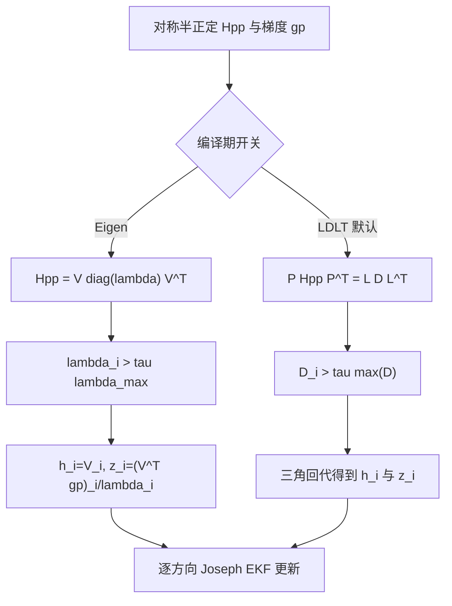

# `Hpp` 分解: 特征分解 → LDLT

对应分支：`ldlt_experiment`（从 `optimized` 切出）

> 本文的 `198 = INS(18) + 30×6`、29 个活跃 clone 和 31 个结构零方向都是历史
> 性能配置。当前默认矩阵为 `195 = 15 + 30×6`，通常只活跃 20–21 个 clone，
> 因此接近零方向显著更多；LDLT 的数学等价性不变，但绝对计数不能沿用 31。

## 结论

**可用，建议采纳。** 分解本身快 7 倍，总耗时降 20 %，精度无实质变化，
且没有引入新的数值风险。

| 指标 | 特征分解 | LDLT |
|---|---|---|
| `Hpp` 分解耗时 | 2.92 s | **0.39 s**（7.5×） |
| `eig+seq state` | 6.02 s | **3.47 s** |
| 总耗时 `t_cost` | 12.03 s | **9.67 s**（1.25×） |
| 最终 `POS EST` | `2.04503 4.58435 0.986966` | `2.04495 4.58319 0.986941` |
| 与 GT 的误差 | ~2 cm | ~2 cm |

交错 A/B 三轮：12.07 / 12.09 / 12.02 s vs 9.63 / 9.69 / 9.68 s。

## 一、为什么 LDLT 可以替换特征分解

序贯更新要求各标量量测互不相关，即把 `Cov[e] = σ²·Hpp` 对角化。
**这一点特征分解和 LDLT 都能做到**，区别只在用哪组基：

```
特征分解  Hpp = V·λ·V^T   =>  Cov[V^T·e]  = σ²·V^T·Hpp·V   = σ²·λ   (对角)
LDLT      Hpp = L·D·L^T   =>  Cov[L^-1·e] = σ²·L^-1·Hpp·L^-T = σ²·D   (对角)
```

于是两者都给出 `COV_SIZE` 个独立的标量量测：

| | 量测方向 `h_i` | 量测值 `z_i` | 量测噪声 `R_i` |
|---|---|---|---|
| 特征分解 | `V.col(i)` | `(V^T·gp)_i / λ_i` | `σ²/λ_i` |
| LDLT | `M.col(i)` | `(M^-1·gp)_i / D_i` | `σ²/D_i` |

其中 `M = P^T·L`——**注意 Eigen 的 LDLT 带主元置换**，`A = P^T·L·D·L^T·P`，
直接用 `matrixL()` 是错的。

`M^-1·gp` 用三角回代求，不显式求逆：

```cpp
Eigen::LDLT<MatXX> ldlt(Hpp);
H_BASIS = ldlt.transpositionsP().transpose() * MatXX(ldlt.matrixL());
H_BASIS_diag = ldlt.vectorD();

// M·rhs = gp  =>  P^T·L·rhs = gp  =>  L·rhs = P·gp
rhs = ldlt.transpositionsP() * ep;
ldlt.matrixL().solveInPlace(rhs);
```

**两者不逐位等价**（用的是不同的基），但都是同一个信息矩阵的合法分解，
最终后验在数值误差内一致。实测末帧位置差约 1.2 mm，
而估计本身与 GT 的误差是 2 cm 量级——差异被淹没在估计误差里。



特征分解显式给出正交主方向，最便于诊断谱结构；LDLT 不计算特征向量，利用三角结构完成
同样的信息白化，因此默认更快。保留双路径宏的价值是让性能路径可以随时用谱分解做回归
验证，而不是把两种输出要求为逐位相同。

## 二、退化处理

我原先的担心是：特征分解靠特征值阈值（`> 1e-6·λ_max`）过滤零空间，
换成 LDLT 会丢掉这个保护。**这个担心不成立。**

加诊断计数器统计，两条路径跳过的方向数：

| | 跳过的方向总数 | 平均每次更新 |
|---|---|---|
| 特征分解 | 68,122 | ~34 / 198 |
| LDLT | 70,090 | ~35 / 198 |

两者基本一致，LDLT 没有让情况变坏。差异来自不同基下"能量"如何分摊。

> ⚠️ **更正**：本文档早先版本根据计数器写有"其中 6967~10957 个严格为负"，
> 并据此推测存在数值问题。**这个结论是错的。**
> 那个计数器把任何 `d < 0` 都算作负，但后续测量表明实际量级是 `-1e-12`，
> 而 `λmax ≈ 800` —— 那是浮点舍入噪声，不是真正的负值。
> **`Hpp` 是半正定的（秩亏 31），不是不定的。**
>
> 零特征值的成因已完全查清，是 VIO 问题的结构性质而非数值缺陷：
> 详见 **[HPP_NULLSPACE.md](HPP_NULLSPACE.md)**。

`Hpp` 半正定且秩亏，对 LDLT 是良性的：秩亏的对称半正定矩阵，
LDLT 会在 `D` 中给出相应近零主元。当前数量应按活跃 clone 数和固定空槽动态
解释；D 主元也不是特征值，所以两者计数不要求逐位相等。Eigen 的 LDLT 带主元置换，
适合当前半正定系统。

### 实现上的一个差别

特征分解的 `eigenvalues()` **已升序排列**，所以原代码用一个起始下标
`zero_end` 扫过前缀即可；而 **LDLT 的 `D` 无序**，必须逐个判断。
因此循环改成了 `continue` 跳过的写法：

```cpp
const TYPE d_thresh = TYPE(1e-6) * H_BASIS_diag.maxCoeff();
for (size_t i = 0; i < COV_SIZE; ++i) {
    const auto d = H_BASIS_diag(i);
    if (d <= d_thresh) continue;   // 零空间方向，不提供信息
    ...
}
```

这个写法对两条路径都正确（特征分解只是恰好前缀连续）。

## 三、开关

```cpp
// eskf/schur_vins.h
constexpr static bool USE_LDLT_FOR_HPP = true;   // false = 回到特征分解
```

两种分解的代码都保留，可随时切换对比。

## 四、关于零空间（原"遗留问题"，已查清）

本文档早先版本把"18 % 的方向被判为零空间"列为遗留隐患，怀疑 `Hll` 病态
或 Schur 补数值不稳。**后续测量表明这个怀疑不成立**，已删除该结论。

历史真实情况：当时 `Hpp` 的零空间稳定为 **31 维**，完全由问题结构决定：

```
31 = INS 18 维（视觉量测根本不涉及 INS 状态）
   +  6 维（1 个未使用的滑窗 slot）
   +  7 维（纯视觉 gauge：全局平移3 + 旋转3 + 尺度1）
```

与 landmark 数量无关（实测 306~331 个 landmark，零空间始终 31 维），也不是数值缺陷。
当前默认 \(k=20\) 或 21 个活跃 clone 时，典型结构值改为
\(15+6(30-k)+7\)，约 82 或 76。完整推导和实测证据见
**[HPP_NULLSPACE.md](HPP_NULLSPACE.md)**。

## 相关

- [OPT_SCHUR_PATH.md](OPT_SCHUR_PATH.md) — Schur 路径其余优化
- [README.md](README.md) — 总览
