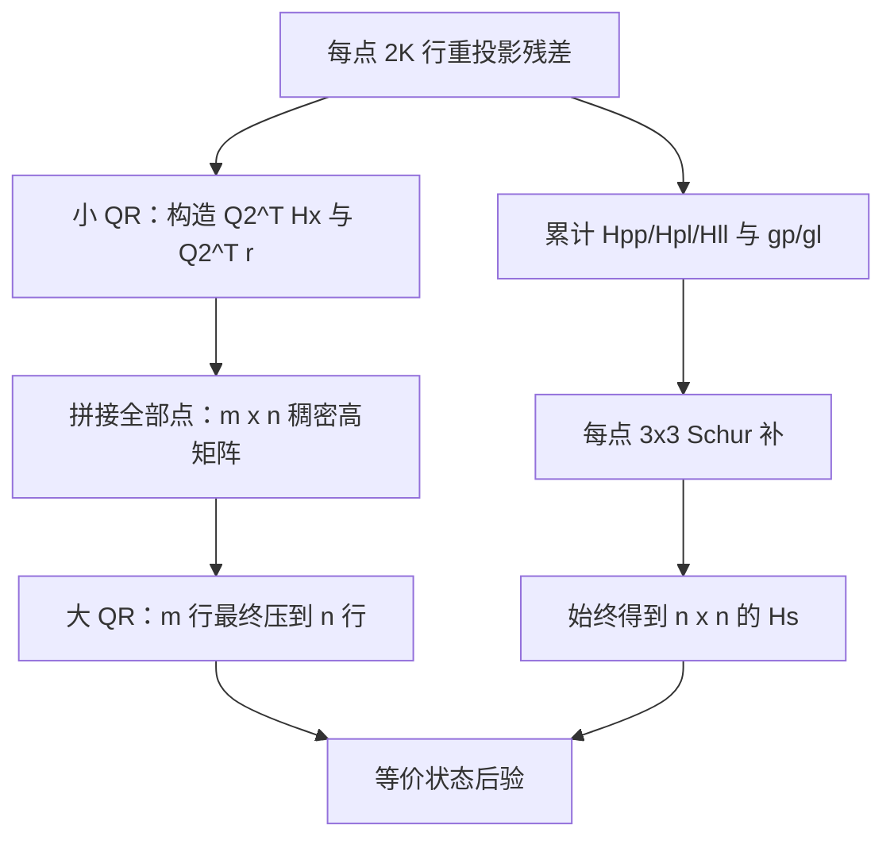

# 为什么 QR 路径比 Schur 慢 5 倍

回答三个问题：
1. MSCKF 式的两级 QR 做法有问题吗？
2. 为什么它比 Schur 慢这么多？是稀疏性的原因吗？
3. 还有优化空间吗？

> 本文 FLOP 表中的 198 维 Schur 状态来自开启重力估计的历史基准。当前默认关闭重力
> 估计后为 195 维；这只带来小幅常数变化，不改变 QR 保留大量量测行、Schur 提前压缩
> 到固定状态维数这一复杂度结论。

## 一、你的做法没有问题，这是标准 MSCKF

流程完全正确：

```
每个 landmark: [J_pose, J_lmk] · [dxp; dxl] = e
  对 J_lmk 做 QR  =>  Q2^T 投影掉 landmark 的 3 维
  剩下 Q2^T·J_pose·dxp = Q2^T·e   (2K − 3 行)
所有 landmark 拼成 J_STATE  =>  再做一次 QR 降维
```

这就是 MSCKF 的 null-space projection + measurement compression，
教科书做法，实现上也没有错误。**慢不是因为做错了，是这个方法本身的代价。**

对一个被 $K$ 帧观测的三维 landmark，堆叠方程为

$$
r_f=H_{x,f}\delta x+H_{f}\delta p_f+n,
\qquad H_f\in\mathbb R^{2K\times3}.
$$

薄 QR 分解 $H_f=Q_1R_f$，并补成正交基 $Q=[Q_1\;Q_2]$。左乘 $Q^T$ 后，
$Q_2^TH_f=0$，因此与特征点无关的约束为

$$
r_f^o=Q_2^Tr_f=Q_2^TH_{x,f}\delta x+Q_2^Tn,
\qquad r_f^o\in\mathbb R^{2K-3}.
$$

白噪声下，Schur 消元使用的投影矩阵

$$
\Pi_f=I-H_f(H_f^TH_f)^+H_f^T
$$

恰好等于 $Q_2Q_2^T$，所以

$$
H_{x,f}^T\Pi_fH_{x,f}
=(Q_2^TH_{x,f})^T(Q_2^TH_{x,f}).
$$

也就是说，在相同线性化、权重与秩阈值下，QR 与 Schur 保存的是同一份状态信息；两者
主要差别是**何时把量测行压缩成状态信息矩阵**。



## 二、慢的根因：不是稀疏性，是"信息压缩的时机"

### 先看实测的规模

```
mean lmk per update  = 325.9
mean K (obs per lmk) = 14.8
mean J_STATE rows    = 8678      <- 实测
```

推导对得上：每个 landmark 有 `2K = 30` 行观测，小 QR 消掉 3 维后剩 `2K − 3 = 27` 行，
`326 × 27 ≈ 8700`。

> 更正：`OPT_QR_PATH.md` 早先写的"约 3200 × 180"是算错的，实际是 **8678 × 180**。

### FLOP 对比

| 运算 | 复杂度 | GFLOP |
|---|---|---|
| **QR: `J_STATE` 分解** | `2·m·n²` = 2×8678×180² | **0.56** |
| Schur: 补运算 | `L·n²·3` = 326×198²×3 | 0.04 |
| Schur: `Hpp` LDLT | `n³/3` = 198³/3 | 0.0026 |

**QR 比 Schur 多算 14 倍的浮点运算**，与实测耗时比（61.8 s vs 11.9 s ≈ 5 倍，
考虑到两者其余阶段成本相近）吻合。

### 根本差异

```
Schur 路径:
  Hpp = Σ_obs J_pose^T · J_pose      <- 观测被【立即】压缩进 198×198
  无论 4825 个观测还是 48250 个，Hpp 尺寸恒为 198×198
  后续 Schur 补、LDLT、序贯更新全都与观测数【无关】

QR 路径:
  J_STATE 保留全部 8678 行            <- 观测数【直接进入】矩阵行数
  QR 复杂度 O(m·n²) 与 m 线性相关
```

**这就是全部原因。** Schur 用"信息矩阵累加"把 N 个观测立刻折叠成固定尺寸；
QR 把它们摊平在行方向，一路带到最后才压缩。观测越多，差距越大。

小 QR 的压缩率也很有限：`9650 行 → 8678 行`，只压掉 10%
（每个 landmark 只消掉 3 行，而它贡献 30 行）。

### 稀疏性只是次要因素

你猜测"是不是没考虑稀疏性"——**方向对，但不是主因**。

`J_STATE` 中每个 landmark 的 27 行里，只有它被观测到的 K 帧对应的列非零：

```
非零列 = 6K = 6 × 14.8 ≈ 89  (共 180 列)
稀疏度 = 89/180 = 49%
```

**只有 2 倍稀疏度**，即使完美利用也最多省 50%，
远不足以抹平 14 倍的 FLOP 差距。

（这和之前 `Hpl` 稀疏化失败是同一个原因：窗口 30 帧而平均每个 landmark
被 14.8 帧观测到，稀疏度天然只有 2 倍。见 `OPT_SCHUR_PATH.md` §三。）

## 三、还有优化空间吗——试了两条路，都不成功

### 尝试 1：正规方程 `J^T·J` + Cholesky（失败：发散）

**思路**：QR 的目的只是求 `R`（180×180）和 `Q^T·e`，而 `R` 满足 `J^T·J = R^T·R`。
所以可以先算 Gram 矩阵（`rankUpdate`，高度优化的 GEMM），
再对 180×180 做 Cholesky。理论上省一半，且 GEMM 常数远小于 Householder 序列。

**实测**：`big QR` 45.0 s → **13.7 s（3.3×）**，但**结果发散**：

| 实现 | 末帧 POS |
|---|---|
| `LLT` | `nan nan nan` |
| `LDLT` + 零空间过滤（阈值 `1e-12`） | `2.8e8 -5.3e8 3.2e8` |

**原因**：正规方程使条件数**平方**。`J_STATE` 本身秩亏（含 gauge 零空间），
`J^T·J` 的条件数直接超出 double 的表示能力。换 `LDLT`、调阈值都救不回来——
这是方法本身的数学缺陷，不是实现 bug。

> 这也从反面印证了 Householder QR 的价值：它的数值稳定性正是我们付那 45 s 买来的。

### 尝试 2：增量式 QR（失败：无稳定收益）

**思路**：`J_STATE` 只有 180 列，超过 180 行的部分数学上冗余。
与其累加到 8678 行再一次性 QR，不如边累加边压缩回 180 行，
峰值行数控制在几百。全程只用 Householder，**数值安全**。

**实测**（分阶段计时，比总耗时稳定）：

| 压缩阈值 | per-lmk 阶段 | big QR 阶段 | 两者之和 |
|---|---|---|---|
| 不压缩 | 9.0 / 9.4 s | 84.3 / 85.4 s | **93 ~ 95 s** |
| 每 360 行压缩 | 88.2 s | 0.8 s | ~89 s |
| 每 2160 行压缩 | 67.2 / 100.1 s | 5.5 / 7.9 s | **73 ~ 108 s** |

`big QR` 确实从 45 s 压到 0.8 s，**但压缩本身的成本（计入 per-lmk 阶段）
把收益全吃掉了**，两者之和没有稳定改善。

**原因**：每次压缩都要对 `(已有180行 + 新增行) × 181` 重做一次 Householder QR。
虽然单次便宜，但做了很多次，总 FLOP 并没有真正下降——
只是把工作从"一次大的"挪成"很多次小的"，而小矩阵 QR 的常数开销更差。

> 真正能省的做法是利用"前 180 行已经是上三角"这个结构（Givens 旋转逐行更新，
> 每行只需 O(n) 而非 O(n²)）。但这需要手写 Givens 序列，
> Eigen 没有现成接口，工程量大而上限仅约 2 倍 —— 不划算。

## 四、结论与建议

**QR 路径的慢是方法固有的，不是实现问题。**

| | Schur | QR |
|---|---|---|
| 观测压缩时机 | 立即（累加进 `Hpp`） | 最后（QR 降维） |
| 主导复杂度 | `O(L·n²)`，与观测数弱相关 | `O(m·n²)`，与观测数线性相关 |
| 数值稳定性 | 较好（信息矩阵形式） | **更好**（不构造 `J^T·J`） |
| 实测耗时 | **11.9 s** | 61.8 s |

**建议：这条轨迹下用 Schur 路径。** QR 的优势在数值稳定性——
当观测数少、或问题病态时它更可靠。当前场景（326 landmark × 14.8 观测）
观测量很大，正是 QR 最吃亏的情形。

若一定要用 QR 路径，还剩的合理优化：
- **限制每个 landmark 的观测数**（如只用最近 8 帧）。
  `m` 线性下降，QR 时间同比例下降。代价是精度，属于取舍。
- **限制参与更新的 landmark 数**。同上。

这两条都是"少算"而非"算得更快"，会影响精度，需要你决定是否接受。

## 相关

- [OPT_QR_PATH.md](OPT_QR_PATH.md) — QR 路径已做的优化
- [OPT_SCHUR_PATH.md](OPT_SCHUR_PATH.md) — Schur 路径已做的优化
- [README.md](README.md) — 总览
