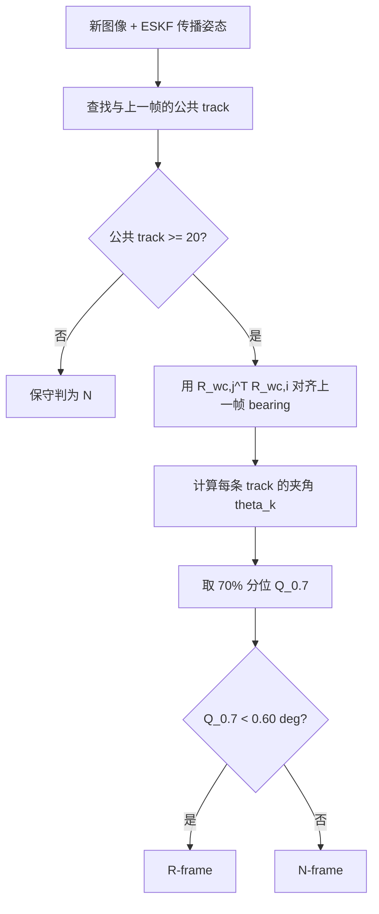
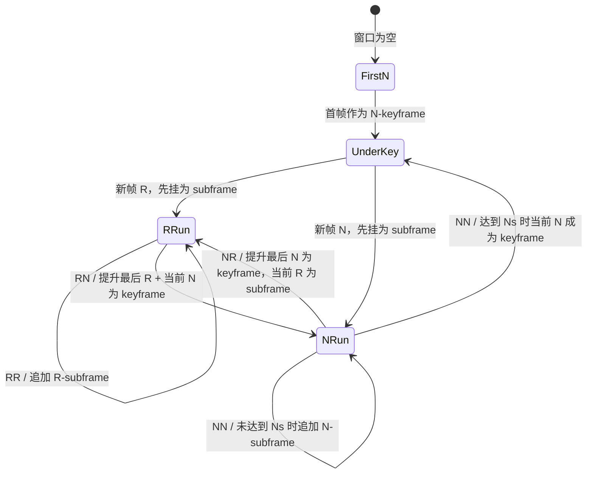
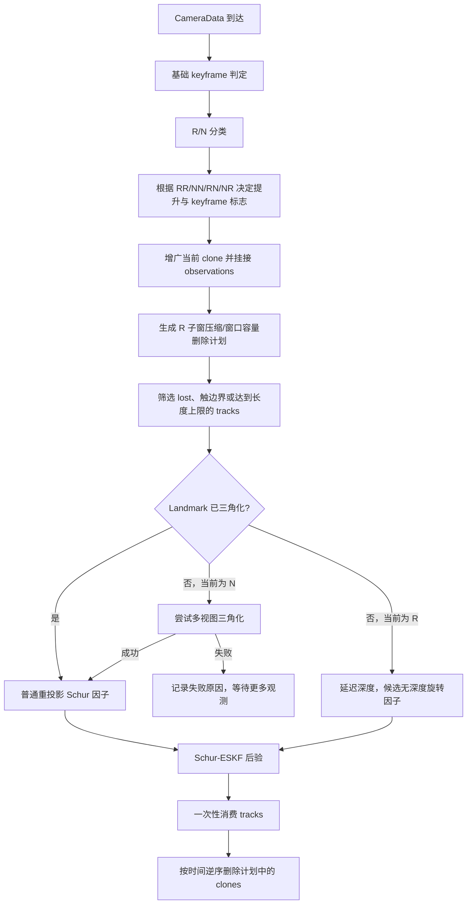
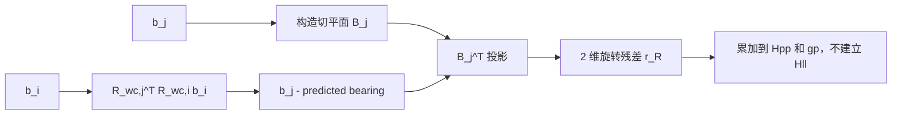
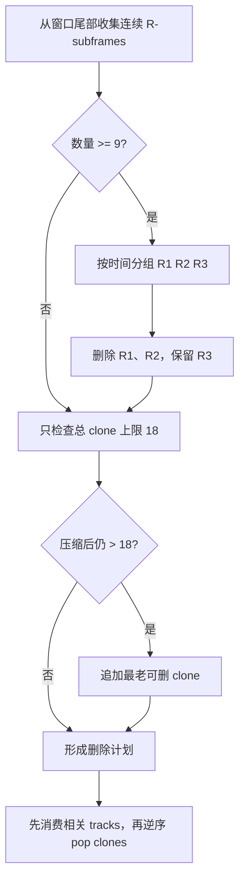
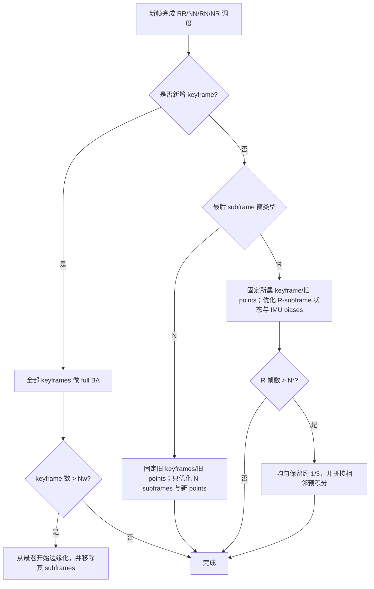

# RD-VIO R/N 分层调度：论文原理与 Schur-ESKF 适配

## 1. 实现边界

当前代码实现的是 RD-VIO 中能够一致迁移到 Schur-ESKF 的部分，而不是完整复刻论文的非线性优化器。

| 模块 | RD-VIO 论文 | 当前项目 |
|---|---|---|
| 动态外点剔除 | IMU-PARSAC、空间分箱、track longevity 权重 | 未实现，仿真直接提供匹配 ID |
| R/N 判定 | 视觉匹配估计旋转，使用最大视线夹角 | ESKF/IMU 姿态补偿，使用 70% 分位夹角 |
| 延迟三角化 | R 帧只保存 bearing 和锚帧，深度后估计 | R 帧不初始化深度；N 帧提供基线后再三角化 |
| 帧管理 | keyframe + 同类型 subframe 层次 | 扁平 clone 窗口，用标志模拟 keyframe/subframe |
| R 子窗优化 | 重投影 + bearing 旋转项 + IMU 预积分 + ZUPT | 深度自由旋转项 + 可选零平移伪量测 |
| R 子窗压缩 | 均匀保留约 1/3，并拼接 IMU 预积分 | 每 3 帧保留 1 帧，不存在预积分因子拼接 |
| 全窗求解 | keyframe BA 与边缘化先验 | Schur-ESKF 后验和 clone 删除 |

因此 `RDVIO` 是实验宏，生产默认仍是 `MSCKF`：

```powershell
cmake -S . -B cmake-build-release `
  -DSCHUR_VIO_VISUAL_SCHEDULER=RDVIO
```

## 2. 为什么要区分 R 帧和 N 帧

设相邻相机中心的平移为 `t`，空间点到平移直线的垂距为 `D`。RD-VIO 论文给出的几何上界是

\[
\theta\le 2\arctan\frac{\lVert t\rVert}{2D}.
\]

当 `||t|| << D` 时，两帧对同一点的视线经旋转对齐后几乎平行，视差角趋近零。此时：

- 姿态仍可由 bearing 方向约束；
- 深度不可可靠估计；
- 强行三角化会产生很远的点、病态 `Hll` 或虚假的小协方差；
- 若把大量 R 帧当普通 keyframe 填满窗口，会增加计算量却不增加深度信息；
- 若直接丢弃 R 帧，又会损失连续 IMU bias 约束和姿态观测。

RD-VIO 的核心不是简单“少选关键帧”，而是让 R 帧进入一条不依赖深度的处理支路。

## 3. R/N 判定

### 3.1 论文判定

论文通过第三次视觉 RANSAC 从匹配点估计相对旋转 `R_ij`。对匹配 bearing `b_i^k,b_j^k`，计算

\[
\theta_k=arccos\left(
(b_j^k)^TR_{ji}b_i^k
\right),
\qquad
\theta_{max}=\max_k\theta_k.
\]

若

\[
\theta_{max}\le\theta_{rot},
\]

则把新帧标为 R-frame，否则为 N-frame。最大值要求几乎所有匹配都能被一个纯旋转解释，因此依赖论文前端先进行强外点剔除。

### 3.2 当前工程判定

本项目没有 IMU-PARSAC 前端，直接使用 ESKF 传播姿态和外参构造相机旋转：

\[
R_{wc,i}=R_{wi,i}R_{ic},
\qquad
R_{i\rightarrow j}=R_{wc,j}^{T}R_{wc,i}.
\]

对公共轨迹计算旋转补偿后的夹角

\[
\hat b_j^k=R_{i\rightarrow j}b_i^k,
\qquad
\theta_k=\arccos\left((b_j^k)^T\hat b_j^k\right).
\]

工程判据为

\[
Q_{0.7}(\{\theta_k\})<\theta_R
\quad\Longrightarrow\quad R\text{-frame},
\]

其中当前默认 `theta_R=0.60 deg`，公共轨迹少于 20 时保守判为 N。70% 分位数用于降低单个误匹配的影响；它与论文的 `theta_max` 不同，是当前无完整鲁棒前端时的适配。



## 4. RR、NN、RN、NR 状态机

记最新 subframe 类型为第一位，新帧类型为第二位。论文希望保持两个结构不变量：

1. 最新 keyframe 最终是 N-frame；
2. 同一个 subframe 段内不混合 R 和 N。

当前 ESKF 没有嵌套 subframe 容器，使用 `is_key_frame=false` 的 clone 表示 subframe，并按下面的状态机进行提升与追加。



具体规则：

| Case | 操作 | 几何含义 |
|---|---|---|
| RR | 当前 R 作为 subframe 追加 | 保留连续旋转阶段的姿态和 IMU bias 演化 |
| NN | 未达到 `Ns=3` 时追加 N-subframe；达到后当前 N 成为 keyframe | 平移充分，但限制全窗计算规模 |
| RN | 提升最后 R-subframe，并把当前 N 设为 keyframe | 关闭 R 段，切换到可三角化的 N 段 |
| NR | 提升最后 N-subframe，当前 R 挂为 subframe | 固化最后一个有平移基线的状态，再进入 R 段 |

如果上一帧本身已经是 keyframe，新帧无论 R/N 都先作为 subframe；这样下一次转移才有明确的“当前段类型”。

### 单帧调度完整流程



## 5. R 帧延迟三角化

两视图三角化的深度方差与视差角近似满足

\[
\operatorname{Var}(z)\propto
\frac{\sigma_{uv}^{2}z^{4}}
{f^2\lVert t\rVert^2}
\sim \frac{1}{\sin^2\phi},
\]

其中 `phi` 是两条世界视线的夹角。纯旋转时 `||t|| -> 0`、`phi -> 0`，深度方差发散。

因此当前策略是：

- 未三角化轨迹在 R 帧只积累 bearing，不估计位置；
- N 帧到来、观测数增加且视差达到门限后再调用三角化；
- 已经由历史 N 帧可靠初始化的老点，R 帧仍可使用普通重投影，因为其深度信息来自先前有效基线；
- 三角化失败不会永久封死，只有观测数增加后才重试，避免重复无效计算。

## 6. 无深度旋转约束

本节保留 RD-VIO 调度语境下的简要公式。关于该因子为什么不需要 Landmark 深度、非零小平移
为什么产生约为 $B_j^Tt/\lambda$ 的模型偏差、切平面最小残差、FEJ 雅可比、噪声近似和一次性
像素生命周期，见 [无深度纯旋转约束](DEPTH_FREE_ROTATION_CONSTRAINT.md)。

对尚无深度、即将一次性消费的 R 轨迹，设

\[
v_{ij}=R_{wc,j}^{T}R_{wc,i}b_i.
\]

构造与当前 bearing `b_j` 正交的二维切平面基 `B_j`：

\[
B_j^TB_j=I_2,
\qquad
B_j^Tb_j=0.
\]

残差为

\[
r_R=B_j^T(b_j-v_{ij}).
\]

它消除了沿视线方向的冗余分量，不包含 Landmark 深度，只约束相对姿态。当前左乘姿态误差下，代码使用的两帧雅可比可以写成

\[
J_i=-B_j^TR_{wc,j}^{T}[R_{wc,i}b_i]_\times,
\qquad
J_j=-J_i.
\]

若两帧 bearing 噪声独立且协方差均近似为 `sigma_b^2 I`，差分残差协方差约为

\[
R_R\approx 2\sigma_b^2I_2,
\]

所以归一化正规方程权重取 `1/2`。每条轨迹只选择最近的一次有效 R 转换；用过的两个观测立即增加消费计数，随后整条轨迹删除，保持 `reused_observations=0`。



## 7. 零平移约束及风险

论文在 R 子窗中允许 ZUPT-like 正则项。当前实现使用相邻 clone 的位置差：

\[
r_p=-(p_j-p_i),
\qquad
J_i=\begin{bmatrix}0&-I\end{bmatrix},
\qquad
J_j=\begin{bmatrix}0&I\end{bmatrix},
\]

\[
R_p=\sigma_p^2I_3,
\qquad
\sigma_p=0.03\ \mathrm{m}.
\]

这不是传感器直接测得的零速度/零位移，而是依赖 R/N 分类成立的模型正则。一旦缓慢平移被误判为 R，该因子会把真实位移压回零。`rotation_translation` 场景正是为了暴露这种错误。

因此它的调参必须联合考虑：

- `theta_R`：R/N 角度阈值；
- 公共 track 最小数量；
- `sigma_p`：零平移约束强度；
- 平移阶段的 NEES、ATE 和 RPE；
- R 段长度及误分类连续性。

## 8. R 子窗压缩

论文在 R-frame 数超过 `Nr` 后均匀保留约三分之一，并把被删帧之间的 IMU 预积分拼接起来。当前 ESKF 没有显式 clone 间预积分因子，因此只能保留状态/观测生命周期的一致部分。

当前规则：

1. 从最新帧向前收集连续的、非 keyframe 的 R clones；
2. 数量达到 9 后，每组三帧删除前两帧、保留第三帧；
3. 先消费所有触及待删 clone 的轨迹；
4. 再按时间逆序释放 clone，避免索引移动；
5. 若压缩后仍超过 18 个 clone，再删除最老的未计划帧。



与论文相比，当前做法缺少“预积分拼接”这一关键动态模型步骤。因此压缩比和阈值不能直接照搬论文参数，必须依靠仿真和真实数据重新标定。

### 论文中的分层优化调度

RD-VIO 不会在每张普通 subframe 到来时都执行完整滑窗 BA，而是根据“是否产生新
keyframe”和最后一个 subframe 段的类型选择不同规模的优化：



论文的 R-subframe 局部目标可概括为

$$
\min_{\{s_i\}}
\sum_i\sum_{k:d_k\ne0}E_{reproj}(i,k)
+\sum_i\sum_{k:d_k=0}E_{rot}(i,k)
+\sum_iE_{motion}(i,i+1)
+\sum_iE_{ZUPT}(i),
$$

其中 $d_k=0$ 表示尚未恢复深度的延迟三角化点，

$$
E_{rot}(i,k)=
\left\|
R(q_i)^TR(q_{r_k})\frac{K^{-1}\bar u_{r_kk}}{\|K^{-1}\bar u_{r_kk}\|}
-\frac{K^{-1}\bar u_{ik}}{\|K^{-1}\bar u_{ik}\|}
\right\|^2,
\qquad
E_{ZUPT}(i)=\|p_i-p_{i-1}\|^2.
$$

`E_motion` 是相邻 subframe 的 IMU 预积分误差，负责把 R 段中的姿态、速度和 bias 串成
连续动态链。`E_rot/E_ZUPT` 稳住退化视觉几何，`E_motion` 让纯旋转期间的 bias 仍可被
局部优化；这也是为什么论文压缩 R 子窗时必须拼接预积分，而不能只删除中间位姿。

当前项目把 `E_reproj/E_rot/E_ZUPT` 转成 Schur-ESKF 信息增量，但没有显式
`E_motion` 因子链和“局部 BA / full BA”两层求解器。IMU 只通过 ESKF 先验协方差进入
后验，因此调度结构虽然相似，数值行为不会与论文完全相同。

## 9. ESKF 中的正规方程结构

普通已三角化点提供联合状态/点信息：

\[
\begin{bmatrix}
H_{pp}&H_{pl}\\H_{lp}&H_{ll}
\end{bmatrix},
\]

经 Schur 消元后进入状态后验。无深度旋转因子和零平移因子没有 Landmark 增量，直接累加到

\[
H_{pp}\leftarrow H_{pp}+J^TWJ,
\qquad
g_p\leftarrow g_p+J^TWr.
\]

这就是它们能够在“不估计深度”的前提下仍修正 clone 姿态/位置的原因。

## 10. 实验结论

8 s、250 点、相同图像噪声和一次性观测生命周期下：

| 场景 | MSCKF 对齐 ATE / m | RD-VIO 对齐 ATE / m | MSCKF 1 s RPE / m | RD-VIO 1 s RPE / m |
|---|---:|---:|---:|---:|
| Circle-out | 0.2454 | **0.2114** | 0.1584 | **0.1152** |
| Circle-in | 0.9907 | **0.6955** | 0.5093 | **0.3126** |
| Helix-3D | 0.2784 | **0.0909** | 0.1498 | **0.0646** |
| Stop-go | **0.2093** | 0.2613 | **0.1385** | 0.2876 |
| Rotation/translation | - | 3.1152 | - | 2.9848 |

普通前三个场景改善，但 Stop-go 恶化，专门的 R/N 场景还出现较大的 NEES。这说明当前移植能验证调度思想，却不能替代完整 RD-VIO 前端、预积分链和分层 BA。

### 默认 MSCKF 的复用边界

R/N 运动分类和第 6 节的无深度旋转残差只依赖相邻 bearing、clone 姿态与相机外参，不依赖
RD-VIO 的四 Case 窗口，也不依赖 BA。因此默认 MSCKF 现在复用这两部分，但明确不复用：

- RR/NN/RN/NR 关键帧转换；
- R 子窗 3:1 压缩；
- 零平移伪量测；
- RD-VIO 的局部/全局 BA 和预积分拼接。

默认路径中，低视差轨迹只有在准备消费时才尝试旋转因子；若轨迹仍可见，则消费最新一对旋转
观测后保留剩余观测等待平移。若轨迹已丢失，则保存只用于影子候选筛选的首尾射线摘要。完整
状态机和交叉协方差边界见 [影子候选与持久 Landmark](SHADOW_LANDMARKS.md)。

## 11. 对应代码与回归

- `eskf/rdvio_scheduler.cpp`：R/N 判定、四 Case 和压缩计划；
- `eskf/rdvio_constraints.cpp`：旋转与零平移因子；
- `eskf/schur_vins_visual.cpp`：轨迹消费、旋转因子分流、Schur 后验及 clone 删除；
- `eskf/schur_vins_track_archive.cpp`：低视差丢失轨迹摘要和跨轨迹候选筛选；
- [通用视觉调度与观测生命周期](VISUAL_UPDATE_SCHEDULING.md)；
- [多视图三角化](TRIANGULATION.md)。

```powershell
powershell -ExecutionPolicy Bypass `
  -File tools/run_scheduler_analysis.ps1 -Quick
```

结果写入 `out/scheduler_summary.csv`，报告同时展示 Case 计数、R/N 帧数、压缩帧数、旋转因子、
零平移因子、轨迹摘要复用和持久点更新数量。

## 12. 参考来源

- Jinyu Li et al., *RD-VIO: Robust Visual-Inertial Odometry for Mobile Augmented Reality in Dynamic Environments*, IEEE TVCG, DOI `10.1109/TVCG.2024.3353263`；
- 论文中的 IMU-PARSAC、分层 BA 与预积分拼接属于原系统，当前代码未实现的部分已在第 1 节逐项标明。
