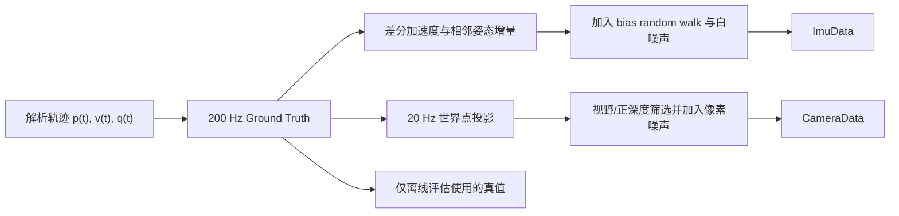

# 仿真场景与统一噪声配置

分析工具统一使用 Schur 视觉后验，并提供五个互补场景：

| 场景 | 轨迹 | 相机视线 | 主要用途 |
|---|---|---|---|
| [Circle-out](SIM_CIRCLE_OUT.md) | 5 m 匀速圆周 | 主要朝外 | 常规转弯、短 track、频繁三角化 |
| [Circle-in](SIM_CIRCLE_IN.md) | 10 m 匀速圆周 | 朝圆心 | 长 track、内向几何、重复观测 |
| [Helix-3D](SIM_HELIX_3D.md) | 三维起伏圆周 | 朝中心并滚转 | 完整三轴激励、最大误差检查 |
| [Stop-go](SIM_STOP_GO.md) | 往返与静止交替 | 朝走廊前方 | 弱激励、低视差、鲁棒性 |
| [Rotation-translation](SIM_ROTATION_TRANSLATION.md) | 4 s 纯旋转 / 6 s 平移周期交替 | 连续偏航与轻微俯仰/滚转 | 覆盖 RD-VIO 的 RR/NN/RN/NR 与慢平移误判 |

`rotation_translation` 的位置在纯旋转段严格不动，平移段用余弦速度轮廓在 `x=-4 m` 与
`x=4 m` 之间往返；姿态在全部阶段连续变化。特征点分布在轨迹周围 5–13 m 的三维环带，
避免只朝一个方向布点导致旋转半周后完全无观测。该场景主要是调度和可观性压力测试，
不应与普通轨迹的 ATE 直接平均。

## 轨迹生成方程

Helix-3D 的真值位置与速度直接按解析式生成。令 $r=6$、$\omega=0.2$、
$\phi=\omega t$：

$$
p(t)=
\begin{bmatrix}
r\cos\phi\\r\sin\phi\\1.5+\sin(0.5\phi)
\end{bmatrix},\qquad
v(t)=
\begin{bmatrix}
-r\omega\sin\phi\\r\omega\cos\phi\\0.5\omega\cos(0.5\phi)
\end{bmatrix}.
$$

Stop-go 以 $T=20\,\mathrm{s}$ 为周期、$T_m=6\,\mathrm{s}$ 为单次移动时间，
$\tau=t\bmod T$。其横向位置为

$$
x(\tau)=
\begin{cases}
-5+5\left[1-\cos(\pi\tau/T_m)\right],&0\le\tau<T_m,\\
5,&T_m\le\tau<10,\\
5-5\left[1-\cos(\pi(\tau-10)/T_m)\right],&10\le\tau<10+T_m,\\
-5,&10+T_m\le\tau<T.
\end{cases}
$$

余弦速度轮廓让起停边界处 $v_x=0$，避免用不连续速度人为制造无限加速度。Rotation-
translation 使用同样的平滑轮廓，但周期被划分为

$$
\underbrace{[0,4)}_{R}\rightarrow
\underbrace{[4,10)}_{N}\rightarrow
\underbrace{[10,14)}_{R}\rightarrow
\underbrace{[14,20)}_{N},
$$

其中 R 段 $p$ 固定但姿态继续变化，N 段平移与转动同时存在，从而持续触发 RD-VIO 的
RR、RN、NN、NR 四种边界组合。

姿态由 `lookAt(position,target,roll)` 构造。相机 $z$ 轴指向目标，$x/y$ 轴由参考
竖直方向叉乘得到，再叠加绕光轴滚转。该构造确保 $R_{wc}$ 与轨迹几何一致，而不是独立
插值一条与视线无关的姿态曲线。



## 统一传感器参数

| 参数 | 数值 |
|---|---:|
| IMU / 相机频率 | 200 Hz / 20 Hz |
| 加速度白噪声密度 | 0.02 m/s²/√Hz |
| 角速度白噪声密度 | 0.002 rad/s/√Hz |
| 加速度计偏置随机游走 | 0.0005 |
| 陀螺仪偏置随机游走 | 0.0001 |
| 图像噪声 | 1 pixel |
| 重力 | `(0,0,9.81) m/s²` |

连续时间白噪声密度 `sigma_c` 在采样周期 `dt` 下离散为
`sigma_sample=sigma_c/sqrt(dt)`；偏置随机游走增量标准差为
`sigma_bias=sigma_rw sqrt(dt)`。旧实现把白噪声除以 `sqrt(rate)`，会低估 `rate` 倍的
离散方差，现已统一修正。

仿真 IMU 量测由相邻真值状态生成：

$$
a_m=R_{wi}^T(a_w-g)+b_a+n_a,
\qquad
\omega_m=\frac{\operatorname{Log}(R_{wi,k-1}^TR_{wi,k})}{\Delta t}+b_g+n_g,
$$

$$
b_{a,k+1}=b_{a,k}+\sigma_{ba}\sqrt{\Delta t}\,\epsilon_{ba},
\qquad
b_{g,k+1}=b_{g,k}+\sigma_{bg}\sqrt{\Delta t}\,\epsilon_{bg},
$$

其中各 $\epsilon\sim\mathcal N(0,I)$。世界点 $p_f$ 的相机量测为

$$
p_c=R_{wc}^T(p_f-p_{wc}),\qquad
\begin{bmatrix}u\\v\end{bmatrix}=
\begin{bmatrix}f_xx_c/z_c+c_x\\f_yy_c/z_c+c_y\end{bmatrix}+n_{pix}.
$$

代码先按像素边界和 \(z_c>0.05\,\mathrm m\) 做可见性筛选，再把含噪像素转换成归一化
坐标。一次性 MSCKF/RD-VIO 直接使用由像素噪声换算的归一化方差：

\[
\sigma_u^2=\sigma_{pix}^2/f_x^2,\qquad
\sigma_v^2=\sigma_{pix}^2/f_y^2.
\]

`uv_var` 只在重复窗口对照中保留历史信息密度语义。因此 MSCKF/RD-VIO 下多场景
脚本跳过 `uv_var` 扫描，避免生成标签不同但实际后验完全相同的重复行。

特征几何、偏置随机游走、IMU 白噪声和图像噪声使用四个相互独立的固定随机数流。因此改变
特征点数量不会改变 IMU 噪声，参数扫描的每一行也使用完全相同的输入随机序列，便于做
可复现的 A/B 对比。

仿真重力真值与 ESKF 初值完全一致，所以默认 `ESTIMATE_GRAVITY=false`。这不是对真实设备
的通用建议：真实数据需要可靠的静止初始化，若重力方向或初始姿态仍有误差，应恢复重力
估计并设计有充分激励的数据集。

运行全部场景与参数扫描：

```powershell
tools/run_multi_scenario_analysis.ps1 -Duration 30 -Features 600
```

结果写入 `out/*.csv` 和 `out/report.html`。

100 秒长时稳定性回归：

```powershell
tools/run_multi_scenario_analysis.ps1 -Duration 100 -Features 600
```

默认 MSCKF 使用 KeyframeOnly、保留 20 个 clone、一次性轨迹最小三角化视差 2°，并启用
Hybrid 持久点与无深度旋转约束。2026-08-11 在当前算法端点重新运行后，Circle-out、
Circle-in、Helix-3D、Stop-go 的位置 RMSE 分别为 0.3262、0.3124、0.0867、0.0604 m；
四个场景的 reused 和 blocked 均为 0，neg_cov 均为 0。Stop-go 产生 5772 个无深度旋转
约束。

固定 MSCKF 后端的帧策略对比：

```powershell
tools/run_frame_policy_analysis.ps1 -Duration 100 -Features 600 -RetainedClones 20
```

该脚本额外运行 `rotation_translation`，输出 `out/frame_policy_summary.csv`，并在结束时恢复 `MSCKF + AUTO + WORLD_XYZ` 默认构建。
