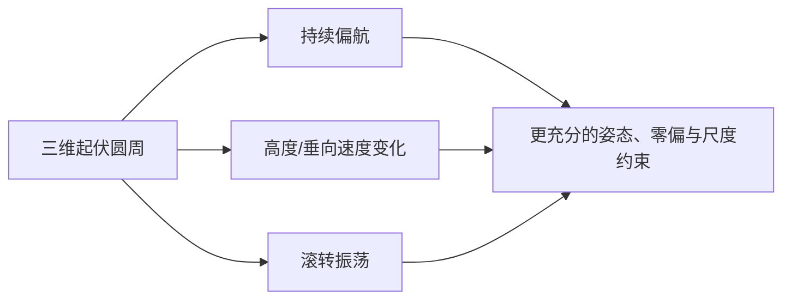

# Helix-3D 仿真模型

实现：`VIORepresentativeSimulator::Trajectory::Helix3D`；分析场景名：`helix_3d`。

## 轨迹与朝向

轨迹在半径 `6 m` 的圆周上运动，同时叠加竖直正弦起伏：

```math
\alpha=0.2t,
\qquad p(t)=[6\cos\alpha,\ 6\sin\alpha,\ 1.5+\sin(0.5\alpha)]^T.
```

相机持续看向中心附近的动态目标点，并叠加 `0.15 sin(0.7 alpha)` 的滚转。因此偏航、
俯仰、滚转和三轴速度均有激励，是四个场景中最适合检查完整三维可观性的一类。



## 特征点

特征点随机分布在圆心附近半径 `1.5–5 m`、高度约 `[-1,4] m` 的三维体中。相机由外围
向内观察，能形成较大基线和明显的深度变化。

## 主要验证目标

- 三轴运动下姿态、速度、加速度计零偏的联合收敛；
- 高度变化是否被视觉正确修正；
- 三维特征布局下三角化协方差是否合理；
- 低 `uv_var` 或病态点是否造成偶发大修正。

历史扫描中该场景曾暴露“平均误差看似正常但单次更新产生大尖峰”的问题，因此报告同时
展示 RMSE 和最大位置误差。
