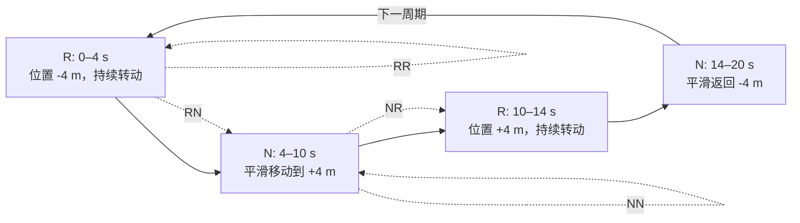

# Rotation-translation 仿真模型

实现：`VIORepresentativeSimulator::Trajectory::RotationTranslation`；分析场景名：
`rotation_translation`。

该场景不是为了生成最小 ATE，而是专门覆盖 RD-VIO 的 RR、RN、NN、NR 调度边界，以及
“速度接近零但姿态持续变化”时的低视差、纯旋转和误分类问题。

## 1. 周期与 R/N 分段

一个周期为 \(T=20\,\mathrm{s}\)，令

\[
\tau=t\bmod T,
\qquad T_R=4\,s,
\qquad T_N=6\,s.
\]

位置始终位于 (y=-4\,m,z=1.5\,m)，横向坐标为

\[
x(\tau)=
\begin{cases}
-4,&0\le\tau<4,\\
-4+4\left[1-\cos\left(\pi\frac{\tau-4}{6}\right)\right],
&4\le\tau<10,\\
4,&10\le\tau<14,\\
4-4\left[1-\cos\left(\pi\frac{\tau-14}{6}\right)\right],
&14\le\tau<20.
\end{cases}
\]

对应速度为

\[
v_x(\tau)=
\begin{cases}
0,&0\le\tau<4,\\
\frac{4\pi}{6}\sin\left(\pi\frac{\tau-4}{6}\right),
&4\le\tau<10,\\
0,&10\le\tau<14,\\
-\frac{4\pi}{6}\sin\left(\pi\frac{\tau-14}{6}\right),
&14\le\tau<20.
\end{cases}
\]

余弦轮廓让每个边界处速度连续为零，避免用速度阶跃人为制造无限加速度。理想分段为

\[
R_{[0,4)}\rightarrow N_{[4,10)}
\rightarrow R_{[10,14)}\rightarrow N_{[14,20)}.
\]



阶段内部产生 RR 或 NN，相邻阶段边界产生 RN 或 NR。由于 N 段起止速度也为零，阈值分类
不会在解析边界瞬间完美切换；这正好测试“慢平移被判成 R”的鲁棒性。

## 2. 姿态为何在所有阶段持续变化

定义

\[
\psi(t)=0.28t,
\]

\[
d(t)=
\begin{bmatrix}
\sin\psi(t)\\
\cos\psi(t)\\
0.10\sin(0.37t)
\end{bmatrix}.
\]

`lookAt()` 令相机 +Z 光轴指向

\[
p(t)+8d(t),
\]

并叠加绕光轴滚转

\[
\phi_r(t)=0.06\sin(0.21t).
\]

因此：

- R 段位置严格不动，但 yaw、轻微 pitch 和 roll 继续变化，是真正的纯旋转数据；
- N 段同时平移和旋转，不是过分简单的“固定朝向平移”；
- 姿态在分段边界连续，不会把人为姿态跳变误当成调度信号。

## 3. 特征点分布

特征点使用独立固定随机流，分布在以 ((0,-4,1.5)) 为中心的三维环带：

\[
r\sim\mathcal U(5,13),
\quad
\theta\sim\mathcal U(0,2\pi),
\quad
z\sim\mathcal U(-1,5),
\]

\[
p_f=
\begin{bmatrix}
r\cos\theta\\
-4+r\sin\theta\\
z
\end{bmatrix}.
\]

宽环带保证相机持续转动一周时各朝向仍有可见点，并同时包含远点和较近点：远点容易让小
平移表现成近似纯旋转，近点则能提供更强视差，适合检查 R/N 阈值。

## 4. 传感器量测

IMU 200 Hz、相机 20 Hz，重力、白噪声密度、bias 随机游走和像素噪声与其它代表性场景
完全一致。IMU 由相邻解析真值差分：

\[
a_m=R_{wi}^T(a_w-g)+b_a+n_a,
\qquad
\omega_m=\frac{\operatorname{Log}(R_{k-1}^TR_k)}{\Delta t}+b_g+n_g.
\]

图像只保留正深度和 640×640 视野内的点，再加入 1 pixel 白噪声并转换为归一化坐标。
特征、bias、IMU 白噪声和图像噪声使用彼此独立的固定随机种子。

## 5. 预期触发的后端路径

| 几何阶段 | 深度状态 | 预期处理 |
|---|---|---|
| R 段、旧深度不可用 | 低视差 | 延迟轨迹或无深度旋转约束 |
| R 段、已有持久点 | 点深度已在联合状态 | 保守直接重投影更新仍可进行 |
| N 段中部 | 平移视差充分 | 三角化与普通 MSCKF Schur |
| R→N | 深度逐渐恢复 | RN 调度、延迟轨迹重新尝试 |
| N→R | 新视差停止增长 | NR 调度、避免强行坏三角化 |

当前默认 MSCKF 只复用 R/N 分类和无深度旋转因子，不启用完整 RD-VIO 四 Case 压窗；显式
`RDVIO` 模式才运行 RR/NN/RN/NR 调度与 R 子窗压缩。两者必须分开比较。

## 6. 主要验证目标

- RR、RN、NN、NR 是否都被计数覆盖；
- R 段是否出现错误深度更新或大量坏三角化；
- N 段是否及时恢复平移/尺度信息；
- 已用于无深度旋转的像素是否被普通 Schur 重复使用；
- 慢平移误判时，保守信息倍率是否防止旋转因子压过真实平移；
- R 子窗压缩后是否仍遵守 clone/轨迹删除顺序；
- `reused=0`、`blocked=0`、`neg_cov=0` 是否成立；
- ATE/RPE、NIS/NEES 与调度计数是否方向一致。

该场景含长纯旋转段，和普通圆周/螺旋轨迹的几何难度不同，不应把它的 ATE 与四个主场景
简单平均后作为默认算法排名。

## 7. 复现实验

固定 MSCKF 后端的帧策略脚本会自动包含该场景：

```powershell
tools/run_frame_policy_analysis.ps1 -Duration 100 -Features 600 -RetainedClones 20
```

重点读取 `out/frame_policy_summary.csv` 中的 R/N、四 Case、旋转约束、零平移约束、压缩帧和
轨迹丢弃统计。算法流程见 [RDVIO_SCHEDULING.md](RDVIO_SCHEDULING.md)，统一噪声见
[SIMULATION_SCENARIOS.md](SIMULATION_SCENARIOS.md)。
