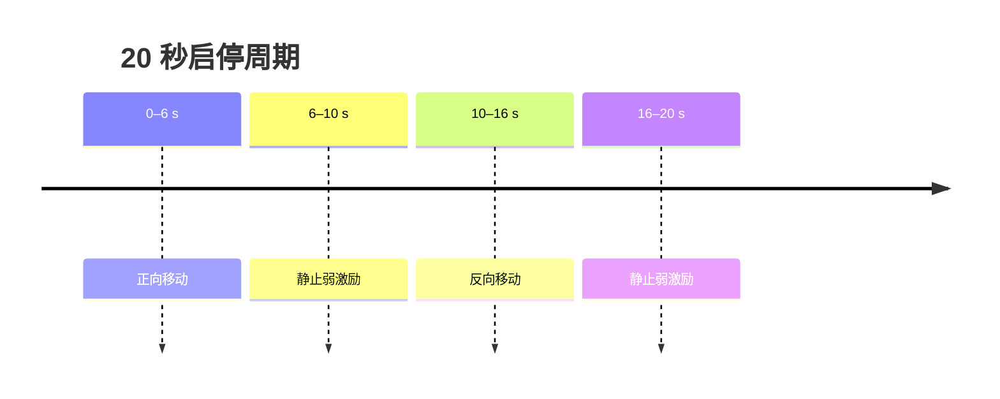

# Stop-go 仿真模型

实现：`VIORepresentativeSimulator::Trajectory::StopGo`；分析场景名：`stop_go`。

## 轨迹与朝向

每 `20 s` 为一个周期：

1. `0–6 s`：由 `x=-5 m` 平滑加速、减速到 `x=5 m`；
2. `6–10 s`：静止；
3. `10–16 s`：反向返回 `x=-5 m`；
4. `16–20 s`：再次静止。

移动段使用余弦缓入缓出，例如正向段

```math
u=t/6,\quad x=-5+5(1-\cos\pi u),\quad
v_x=\frac{5\pi}{6}\sin\pi u.
```

平台位于 `y=-6 m,z=1.5 m`，相机看向 `(0,3,1.5)` 附近，并叠加小幅周期滚转。



## 特征点

特征点均匀分布在 `x∈[-8,8] m`、`y∈[-1,12] m`、`z∈[-1.5,4.5] m` 的走廊体中。
往返运动会重复看到相同区域，静止段则几乎没有新的三角化基线。

## 主要验证目标

- 静止/低视差阶段是否错误初始化深度；
- 加速、减速和反向时 IMU 过程模型是否一致；
- 视觉权重过大时是否在弱激励段发散；
- Huber 与硬残差门限能否限制错误更新。

该场景是 `uv_var` 稳健性选择的主要约束：较小值在圆周轨迹上可能得到更低 RMSE，却会
在启停轨迹中放大弱几何或线性化误差。
