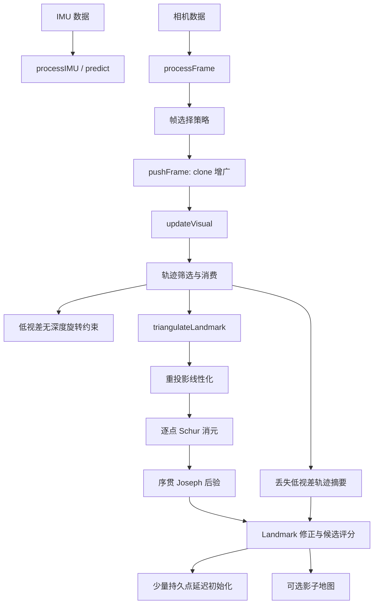

# SchurVINS 源码布局

## 1. 拆分目标

早期实现把外层数据流、IMU 传播、三角化、视觉正规方程、Schur 消元、状态后验和
Landmark 后处理集中在 `eskf/schur_vins.cpp`。这种组织方式的问题不是算法错误，而是：

- 单个编译单元过大，阅读时难以区分状态传播和视觉后验；
- 修改局部算法时容易误触无关路径；
- 数学文档难以对应到稳定的源码入口；
- 编译器需要反复处理整段 Eigen 模板代码，增量编译成本较高。

本轮拆分只改变文件边界，不改变默认算法、矩阵装配顺序和浮点运算顺序。

## 2. 文件职责

| 文件 | 主要职责 | 关键入口 |
|---|---|---|
| `eskf/schur_vins.cpp` | 外层数据流、状态注入、状态设置 | `processFrame()`、`updateState()` |
| `eskf/schur_vins_imu.cpp` | IMU 名义状态积分、误差转移、协方差传播 | `processIMU()`、`predict()` |
| `eskf/schur_vins_triangulation.cpp` | 多视图三角化、重投影精化、初始协方差 | `triangulateLandmark()` |
| `eskf/schur_vins_visual.cpp` | clone 管理、帧策略、轨迹生命周期、视觉线性化、Schur/Joseph 后验 | `pushFrame()`、`updateVisual()` |
| `eskf/schur_vins_persistent.cpp` | 几何质量评分、影子候选池、持久点延迟初始化、联合 EKF 更新 | `evaluateTrackGeometry()`、`promotePersistentLandmark()`、`updatePersistentLandmarks()` |
| `eskf/schur_vins_track_archive.cpp` | 低视差轨迹首尾射线摘要、跨丢失轨迹候选三角化 | `archiveDeferredTrack()`、`updateShadowCandidateFromArchive()` |
| `eskf/schur_vins_shadow.cpp` | 与导航解耦的影子 Landmark 后处理 | `updateShadowLandmarks()` |
| `eskf/frame_selection_policy.{h,cpp}` | FIFO、关键帧和 VINS-Mono 帧选择策略 | `decide*Frame()` |
| `eskf/rdvio_scheduler.{h,cpp}` | 与后验解耦的 R/N 运动分类、RD-VIO 四 Case 和压窗计划 | `decideRDVIOFrame()`、`planRDVIOFrameRemovals()` |
| `eskf/rdvio_constraints.{h,cpp}` | 无深度旋转约束和 RD-VIO 可选零平移约束 | `accumulateRDVIOConstraints()` |
| `eskf/visual_update_scheduler.h` | 一次性/重复窗口视觉后验语义 | 编译期枚举与辅助函数 |

## 3. 调用流程

## 4. 为什么视觉文件仍然较长

`schur_vins_visual.cpp` 仍是最大的编译单元，因为一次视觉后验需要共享同一批：

- 被选轨迹、观测计数与生命周期统计；
- `Hpp/Hpl/Hll/gp/gl` 正规方程缓冲区；
- FEJ 零空间、有效子空间和 NIS 日志；
- Landmark 回代所需的线性化中间量。

当前保持这些数据在一个函数作用域内，可以避免引入大规模共享上下文对象，也能确保拆分前后
浮点累加顺序不变。若将来继续拆分，建议先引入显式的 `VisualUpdateContext`，再按“轨迹准备、
线性化、Schur 求解、地图回代”四阶段提取私有函数，并以数值等价回归作为前置条件。

## 5. 数学文档对应关系

| 数学主题 | 源码 | 文档 |
|---|---|---|
| IMU 积分与协方差传播 | `schur_vins_imu.cpp` | [MATHEMATICAL_PIPELINE.md](MATHEMATICAL_PIPELINE.md) |
| 三角化与初始协方差 | `schur_vins_triangulation.cpp` | [TRIANGULATION.md](TRIANGULATION.md) |
| 帧选择与轨迹生命周期 | `frame_selection_policy.cpp`、`schur_vins_visual.cpp` | [VISUAL_UPDATE_SCHEDULING.md](VISUAL_UPDATE_SCHEDULING.md) |
| 混合 MSCKF 状态扩维、筛选、晋升和联合更新 | `schur_vins_visual.cpp`、`schur_vins_persistent.cpp`、`schur_vins_imu.cpp` | [HYBRID_MSCKF.md](HYBRID_MSCKF.md) |
| 无深度纯旋转约束 | `rdvio_constraints.cpp`、`rdvio_scheduler.cpp`、`schur_vins_visual.cpp` | [DEPTH_FREE_ROTATION_CONSTRAINT.md](DEPTH_FREE_ROTATION_CONSTRAINT.md) |
| 低视差延迟与轨迹摘要 | `schur_vins_visual.cpp`、`schur_vins_track_archive.cpp` | [HYBRID_MSCKF.md](HYBRID_MSCKF.md)、[RDVIO_SCHEDULING.md](RDVIO_SCHEDULING.md) |
| Schur、有效子空间与 Joseph 更新 | `schur_vins_visual.cpp` | [MATHEMATICAL_PIPELINE.md](MATHEMATICAL_PIPELINE.md) |
| 独立影子地图与候选/持久点边界 | `schur_vins_persistent.cpp`、`schur_vins_shadow.cpp` | [SHADOW_LANDMARKS.md](SHADOW_LANDMARKS.md)、[HYBRID_MSCKF.md](HYBRID_MSCKF.md) |

## 6. 维护约定

- 新算法先放入职责对应的源文件，不再把实现回填到 `schur_vins.cpp`；
- 注释优先解释坐标系、误差定义、公式与数值门限，不重复逐行翻译 C++；
- 改动 `updateVisual()` 的矩阵累加顺序时，必须运行默认 smoke、调度快速消融和长时场景回归；
- 可再生的 `out/*.csv`、`out/*.html`、`out/*.log` 不进入版本库；
- 早期一次性调试记录统一放入 `docs/archive/legacy_debug/`，当前结论以专题文档为准。
