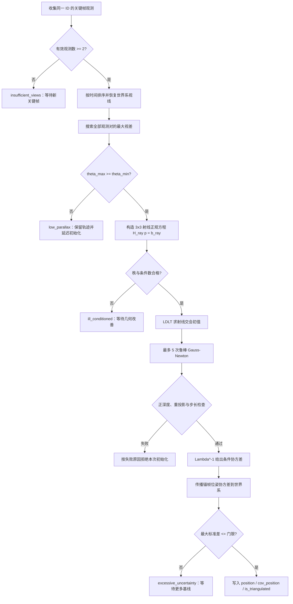

# 多视图特征点三角化

`SchurVINS::updateVisual` 已不再使用仿真特征点真值初始化 `Landmark::position`。真值只在
`enable_logging_=true` 时进入离线日志，用于评估初始化与后续 landmark 修正，不参与任何
在线求解、门限或权重计算。

## 1. 坐标、相机模型与雅可比

关键帧保存 IMU 到世界的姿态 `R_wi` 和 IMU 世界位置 `p_wi`；外参 `R_ic,t_ic`
把相机坐标变换到 IMU 坐标。相机世界位姿为

```math
R_{wc}=R_{wi}R_{ic},\qquad
p_{wc}=p_{wi}+R_{wi}t_{ic}.
```

对世界点 `p_w`，相机坐标和归一化像平面预测是

```math
p_c=R_{wc}^{T}(p_w-p_{wc})=[x,y,z]^T,
\qquad \pi(p_c)=\begin{bmatrix}x/z\\y/z\end{bmatrix}.
```

投影雅可比为

```math
J_\pi=\frac{\partial\pi}{\partial p_c}=
\begin{bmatrix}1/z&0&-x/z^2\\0&1/z&-y/z^2\end{bmatrix},
\qquad
J_l=J_\pi R_{wc}^T.
```

观测 `Observation::un_pt` 是归一化像平面坐标，不是像素坐标。仿真相机噪声为
`1 pixel`，焦距约 `184.75 pixel`，所以归一化标准差约为

```math
\sigma_{uv}=\sigma_{px}/f\approx 0.0054.
```

这对应 `triangulation_uv_std=0.0054`。当前一次性 MSCKF/RD-VIO 路径统一以

```math
R_{uv}=\texttt{triangulation\_uv\_std}^2
       \max(\texttt{msckf\_visual\_noise\_scale},1)I_2
```

作为普通轨迹原始残差方差；Schur 特征方向上的伪量测方差还会按该方向的信息特征值缩放，
但**不除以**相机周期。`uv_var/dt` 只属于 Legacy/VINS-Mono 等重复窗口历史对照，不能拿来
解释默认 MSCKF。完整的调度分支语义见
[视觉残差与噪声模型](VISUAL_RESIDUAL_NOISE_MODEL.md)。

## 2. 射线最小二乘初值

第 `i` 帧相机中心为 `C_i=p_wc,i`，世界系单位视线为 `d_i`。点到射线的垂直残差为

```math
e_i=(I-d_i d_i^T)(p_w-C_i).
```

因为 `I-d_i d_i^T` 是幂等的正交投影矩阵，最小化
`sum ||e_i||²` 可得到 3×3 正规方程

```math
\underbrace{\sum_i(I-d_i d_i^T)}_{H_{ray}}p_w
=\sum_i(I-d_i d_i^T)C_i.
```

若所有视线近似平行，`H_ray` 沿共同视线方向的特征值趋近 0，深度不再可观。因此代码
先计算所有观测对的最大视差

```math
\theta_{max}=\max_{i,j}\arccos(\operatorname{clamp}(d_i^Td_j,-1,1)),
```

门限由调度器决定：当前默认 MSCKF/RD-VIO 为 2°，Legacy/SchurVINS/VINS-Mono
兼容模式为 8°。此外还检查 `H_ray` 的最小特征值和条件数。使用所有观测对而不只比较
首末帧，可正确处理轨迹回头和中间观测中断。

## 3. 带位姿不确定度的鲁棒 Gauss–Newton

射线解只提供快速初值，随后最多进行 5 次重投影优化。第 `i` 个残差为

```math
r_i=z_i-\pi(p_{c,i}).
```

clone 位姿误差按 `[delta_theta,delta_p]` 排列，对位姿的雅可比为

```math
J_{pose,i}=\begin{bmatrix}J_l[p_w-p_{wi}]_\times&-J_l\end{bmatrix}.
```

以最老观测帧 `a` 为锚，clone 相对位姿协方差近似为

```math
P_{rel,i}=P_{ii}+P_{aa}-P_{ia}-P_{ai}.
```

这会抵消共同的全局平移、旋转 gauge 模态，避免把同一份全局不确定度在每个观测中重复
计数。单观测残差协方差和权重为

```math
S_i=\sigma_{uv}^2I+J_{pose,i}P_{rel,i}J_{pose,i}^T,
\qquad W_i=S_i^{-1}.
```

白化残差的 Mahalanobis 范数 `m_i=sqrt(r_i^T W_i r_i)` 使用 3-sigma Huber 权重

```math
w_i=\begin{cases}1,&m_i\le3\\3/m_i,&m_i>3.\end{cases}
```

正规方程为

```math
\Lambda=\sum_i J_{l,i}^T(w_iW_i)J_{l,i},\qquad
b=\sum_i J_{l,i}^T(w_iW_i)r_i,\qquad
\Delta p=\Lambda^{-1}b.
```

由于实现使用 `r=measurement-estimate`、`J=d(estimate)/dp`，更新符号是
`p <- p + Delta p`。每次迭代都检查正深度、有限性、LDLT 主元和步长，避免病态点污染
后续 Schur 更新。

## 4. 初始协方差

在给定相对 clone 位姿的条件下，点协方差为

```math
P_{l|a}=s\Lambda^{-1},\qquad
s=\max\left(1,\frac{\sum_i r_i^TW_ir_i}{2N-3}\right).
```

`s` 是残差驱动的协方差膨胀，只允许增大、不允许为了得到更好看的 NEES 而缩小。点最终
存储在世界系，因此还需传播锚点的绝对位姿不确定度

```math
G_a=\begin{bmatrix}-[p_l-p_a]_\times&I\end{bmatrix},\qquad
P_{l,world}\approx P_{l|a}+G_aP_{aa}G_a^T.
```

质量门限只检查 `P_l|a`，否则全局 gauge 不确定度会把几何上可靠的点错误拒绝；写入
`Landmark::cov_position` 的是 `P_l,world`。这是保持每点小矩阵开销的工程近似。严格模型
还应保留 landmark 与所有 clone 的交叉协方差，并构造联合残差协方差。

### 从观测轨迹到可用 Landmark 的完整流程



流程中的“失败”不是永久删除特征。除明显误匹配外，低视差和病态通常只是当前时刻的
几何条件不足；`last_triangulation_frame_id` 让算法仅在最新观测帧变化后重试，从而兼顾
延迟三角化的成功率与运行时间。

## 5. 失败分类与重试

| 状态 | 触发条件 | 后续行为 |
|---|---|---|
| `insufficient_views` | 有效关键帧观测少于 2 | 等新观测 |
| `low_parallax` | 最大视差小于调度器门限（默认 MSCKF 为 2°） | 等基线增大 |
| `ill_conditioned` | 射线/重投影信息矩阵病态 | 等几何改善 |
| `negative_depth` | 任一参与视图深度小于 0.05 m | 拒绝本次初始化 |
| `high_reprojection_error` | 归一化 RMSE 大于 0.03 | 拒绝疑似误匹配/坏初值 |
| `excessive_uncertainty` | 最大位置标准差大于 50 m | 等更多约束 |

`last_triangulation_frame_id` 保证同一组最新观测只尝试一次；即使滚动窗口的观测数量保持不变，只要新帧替换旧帧便会重试。低视差
通常在 3×3 射线求解之前退出，所以失败重试的时间成本很低。

## 6. 复杂度与实时性

对一个有 `N` 个观测的特征点：

- 视差搜索当前是 `O(N²)`，但滑窗最多 30 帧；
- 射线初始化、每次重投影迭代和协方差累计均为 `O(N)`；
- 所有分解仅为 2×2 或 3×3；
- 最多 5 次 Gauss–Newton，收敛步长小于 `1e-6 m` 时提前结束。

因此三角化通常不是视觉后验的主要耗时，Schur 的大状态信息矩阵构造与序贯更新仍占主导。
报告中的 `time_us`、P50/P95 和累计时间用于持续验证这一判断。

## 7. 报告与真值隔离

`VinsAnalysis` 为每个场景生成
`out/triangulation_<scenario>_<tag>.csv`，记录失败原因、视差、条件数、重投影 RMSE、
耗时、初始/最终/真值位置、初始协方差、NEES 和修正次数。

`VinsReport` 的详细三角化页默认展示 `circle_out/base`，并在多场景表中汇总各仿真的
成功率。真值只在 `logTriangulationAttempt` 的日志分支中读取，关闭日志后在线算法完全
不访问 `lmk_map` 的位置值。
## 8. 最大视差对锚点与确定性

`Landmark::frm2fet` 使用无序容器，不能把遍历到的第一个观测当作稳定锚点。当前实现先按 clone 顺序排序，再遍历所有观测对寻找最大视差对；在该观测对的两个端点中，选择位姿协方差 trace 较小者作为不确定度传播锚点。

该选择不改变全部视线参与的射线最小二乘和重投影优化，只影响相对位姿协方差

$$
P_{i-a}=P_{ii}+P_{aa}-P_{ia}-P_{ai}
$$

以及条件点协方差向世界系传播时使用的绝对锚点协方差。这样既利用了对深度最敏感的基线，也消除了结果对哈希遍历顺序的依赖。

## 9. 调度感知的视差默认值

早期 30 秒 Circle-out 扫描在持续窗口量测生命周期下选择了 8°。该门限不能原样搬到
一次性 MSCKF：轨迹触及 clone 边界后若被拒绝，整批像素会永久丢弃。

当前 MSCKF/RD-VIO 默认使用 2°，Legacy/SchurVINS/VINS-Mono 兼容模式仍保留 8°；
显式命令行值可以覆盖调度默认值。一次性路径还把 clone 预算从 10 增至 20，在 20 Hz 下
提供约 1 秒基线。

历史 100 秒 / 600 点 Circle-out 回归中，10 clone + 8° 只接受 488/20739 个三角化候选，
位置 RMSE 达 238.94 m；修正为 20 clone + 2° 后接受 10342/10680 个候选，RMSE 降到
约 0.64 m。后续 Hybrid MSCKF 的 2026-08-11 当前回归进一步降到 0.3262 m。
重投影、正深度、条件数和位置不确定度门限仍继续拒绝弱几何，降低视差门限并不等于无条件
接受所有点。

扫描可通过 `tools/run_triangulation_threshold_analysis.ps1` 复现，汇总写入
`out/triangulation_threshold_summary.csv`。
