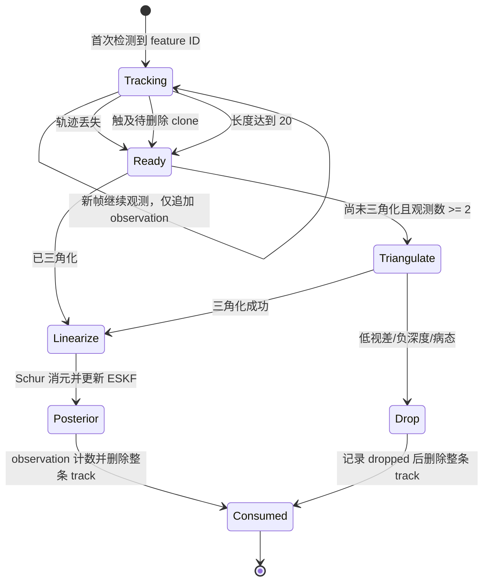
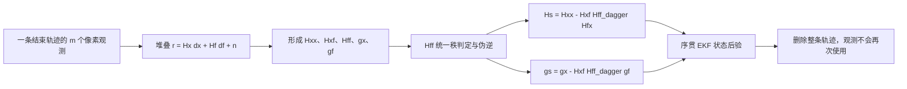
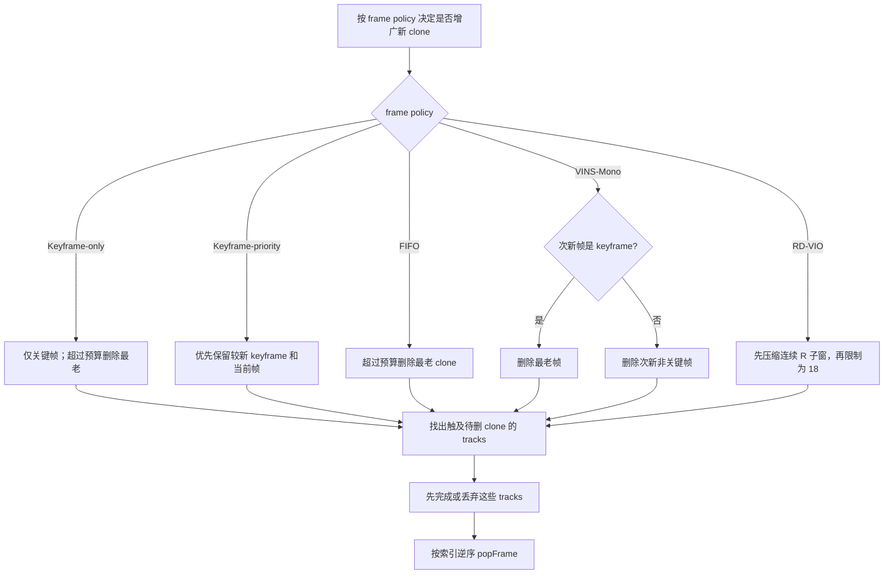

# 视觉后验调度与观测生命周期

## 结论

默认采用 `MSCKF` 一次性后验，并使用 `KEYFRAME_ONLY` 帧策略：只有关键帧进入 clone 窗口；一条特征轨迹只在结束、触及滑窗边界或达到最大长度时进入一次 Schur 后验，更新后整条轨迹立即消费并释放。同一个像素观测不会被当作新的独立量测重复送入 ESKF。

视觉后验生命周期由 `SCHUR_VIO_VISUAL_SCHEDULER` 控制，关键帧判断与删帧规则由独立的 `SCHUR_VIO_FRAME_POLICY` 控制。这样可以固定同一个 MSCKF 后端，只替换 Legacy/FIFO/SchurVINS/VINS-Mono/RD-VIO 帧策略，避免把量测复用和噪声语义混入帧策略排名。

`VINS_MONO` scheduler 仍是本 ESKF 内的重复后验对照，不是完整的 VINS-Mono 非线性优化器；`VINS_MONO` frame policy 只复用其旋转补偿视差关键帧判断和次新帧删除规则。

## 为什么一次性消费是长期默认方案

设先验为 \(p(x)\)，一批视觉观测为 \(z\)，正常的一次后验是

\[
p(x\mid z) \propto p(z\mid x)p(x).
\]

若下一相机时刻没有新增该特征的观测，却再次把同一批 \(z\) 当成独立量测更新，相当于

\[
\tilde p(x\mid z) \propto p(z\mid x)^2p(x),
\]

继续重复则似然被提升到更高次幂。均值不一定立刻明显错误，但协方差会过度收缩，NIS/NEES 和后续增益会失真。若希望像滑窗优化那样反复重线性化历史残差，就必须保留并一致地边缘化旧信息因子，而不能把每次重求解都当作一次新的 EKF 量测。

MSCKF 模式仍使用当前项目的 Schur 消元。对一条轨迹的线性化方程

\[
r = H_x\delta x + H_f\delta f + n
\]

构造联合正规方程后消去特征增量：

\[
H_{xx}^{s}=H_{xx}-H_{xf}H_{ff}^{\dagger}H_{fx},\qquad
g_x^{s}=g_x-H_{xf}H_{ff}^{\dagger}g_f.
\]

这和经典 MSCKF 的左零空间投影在保留相同有效秩时等价；区别只是本项目继续复用已经优化好的 Schur 路径。

## 一次性轨迹的生命周期状态机

MSCKF 调度并不是“每帧都用所有特征”，而是每帧只维护轨迹，等轨迹信息完整或即将丢失时再做一次批量后验。对 Landmark `k`，触发条件是

\[
\operatorname{consume}(k)=
\operatorname{lost}(k)
\lor
\operatorname{touchBoundary}(k)
\lor
\bigl(|\mathcal O_k|\ge N_{track}\bigr),
\]

其中 `O_k` 是该轨迹尚未消费的观测集合，当前 `N_track=20`。FIFO 策略在 20 Hz 下约提供 1 秒 clone 跨度；默认关键帧-only 策略受 200 ms 关键帧门控控制，在相同 clone 预算下保留更长时间基线。



每个 `Observation` 都保存 `visual_update_count`。对于一次性策略，线性化前要求

\[
\texttt{visual\_update\_count}=0,
\]

成功写入正规方程后立即加一。若同一对象再次到达线性化器，防御检查会计入 `duplicate_observations_blocked` 并拒绝它。

低视差轨迹的无深度旋转分流是唯一的有意例外：对应像素同时标记
`used_by_depth_free_rotation=true`。后续轨迹获得深度时，线性化器会主动跳过这些像素，只使用
尚未消费的观测；这种正常分流不计入 `duplicate_observations_blocked`。

轨迹消费后会删除 Landmark、Feature 和 Observation 对象。前端以后即使重新使用同一个数值 ID，地图中建立的也是一条新轨迹和一组新像素量测。真正需要禁止的是同一个 Observation 对象被第二次送入后验，而不是永久禁止某个整数 ID。

## Schur 一次性更新的矩阵流程



当量测噪声为 `R=sigma^2 I` 时，QR 左零空间法和 Schur 法在保留相同有效子空间的精确算术下等价：

\[
Q_2^TH_f=0,
\qquad
r_o=Q_2^Tr,
\qquad
H_o=Q_2^TH_x,
\]

\[
H_o^TH_o
=H_x^TH_x-H_x^TH_f(H_f^TH_f)^\dagger H_f^TH_x.
\]

本项目使用后一个表达式，是因为 `Hff` 天然由独立 `3x3` Landmark 块组成。

## 五种可切换策略

| 策略 | 增广 | 何时更新 | 轨迹生命周期 | 窗口处理 | 定位 |
|---|---|---|---|---|---|
| `LEGACY` | 仅关键帧 | 每个相机时刻都解当前关键帧批次 | 持久，历史观测会重复进入后验 | 满 30 帧后删最老帧 | 原实现回归基线 |
| `SCHURVINS` | 每张图像 | 每张图像解活跃轨迹 | 持久并可重复线性化 | 更新时最多 4 帧参与，随后保留最新帧和较新的关键帧，共 3 帧 | 论文/官方代码风格对照 |
| `MSCKF` | 由 frame policy 决定；默认仅关键帧 | 轨迹丢失、触及待删 clone 或长度达到 20；低视差时可先用无深度旋转约束 | 普通轨迹更新一次后删除；低视差可延迟或归档；少量稳定点晋升为联合 SLAM 点 | 默认保留 20 个关键帧 clone | 默认混合后端，保持一次性生命周期 |
| `VINS_MONO` | 每张图像 | 每张图像解当前批次 | 本 ESKF 对照模式中仍会重复 | 次新帧是关键帧则删最老帧，否则删次新非关键帧 | 仅帧调度 A/B |
| `RDVIO` | 每张图像 | N 轨迹用 Schur；未三角化 R 轨迹用无深度旋转因子 | 与 MSCKF 一样一次性消费 | RR/NN/RN/NR 分层保留，长 R 子窗按 3:1 压缩 | 实验模式，详见 `RDVIO_SCHEDULING.md` |

### SchurVINS 模式的边界

官方 SchurVINS 每张图像执行状态增广和 Schur 更新，并使用很小的状态窗口；论文中的地图点协方差更新不保存完整 \(P_{xl}\)。本实现复现其调度思想并保留现有 Schur/landmark 实验接口，但不会声称已经逐行复刻官方前端、关键帧选择和地图管理。

### VINS-Mono 模式的边界

VINS-Mono 在固定窗口内反复优化同一组残差是合理的，因为它是在重求解同一个代价函数；窗口满后还会把被删除状态和相关量测压缩成边缘化先验。本项目目前没有等价的非线性边缘化因子，因此这里只实现其帧删除规则：

- 次新帧为关键帧：边缘化最老帧；
- 次新帧为非关键帧：删除次新帧的视觉状态，保留最新帧。

该模式用于隔离“窗口调度”带来的影响，不应作为生产默认值。

### ROVIO/RVIO 与 RD-VIO 适配的边界

ROVIO/RVIO 的核心差异不是“什么时候调用同一个 `updateVisual`”：它们涉及直接光度残差、robocentric 状态或不同前端，仍不能只靠帧删除顺序复刻。`RDVIO` 模式已实现可一致迁移的 R/N 分类、四 Case、延迟三角化、无深度旋转量测和子窗压缩。当前又把“R/N 分类 + 无深度旋转因子”与 RD-VIO 调度解耦：默认 MSCKF 可复用旋转信息，但仍使用 Keyframe-only 窗口，不添加零平移先验，也不压缩 R 子窗。没有前端支持的 IMU-PARSAC 与完整 BA 明确留在实现边界之外，详见 `RDVIO_SCHEDULING.md` 和 `SHADOW_LANDMARKS.md`。

## Clone 保留与删除流程

调度器先生成“按时间顺序的待删索引”，视觉更新结束后再统一删除。这样三角化失败、没有有效轨迹等提前返回路径也会执行同一套资源回收逻辑。



窗口有两个不同索引：

\[
\text{chronological index}
\xrightarrow{\texttt{active\_idx}}
\text{physical covariance slot}.
\]

删除 clone 时释放的是物理 slot；状态注入和雅可比写块必须始终使用 `Frame::ordering`，不能用当前时间序号代替。

## 宏与构建方式

视觉后端公共数值宏定义在 `eskf/visual_update_scheduler.h`；独立帧策略宏定义在 `eskf/frame_selection_policy.h`。

```cpp
#define SCHUR_VIO_SCHEDULER_LEGACY 0
#define SCHUR_VIO_SCHEDULER_SCHURVINS 1
#define SCHUR_VIO_SCHEDULER_MSCKF 2
#define SCHUR_VIO_SCHEDULER_VINS_MONO 3
#define SCHUR_VIO_SCHEDULER_RDVIO 4
```

默认后端是 `SCHUR_VIO_SCHEDULER_MSCKF`，`AUTO` 帧策略会解析为 `KEYFRAME_ONLY` 和 20 个 retained clones。推荐通过 CMake 选择，它最终仍生成编译期宏，不产生运行时分支：

```powershell
cmake -S . -B cmake-build-release `
  -DSCHUR_VIO_VISUAL_SCHEDULER=MSCKF `
  -DSCHUR_VIO_FRAME_POLICY=KEYFRAME_ONLY `
  -DSCHUR_VIO_FRAME_WINDOW_SIZE=20
cmake --build cmake-build-release --target VinsAnalysis -j 4
```

后端可选 `LEGACY`、`SCHURVINS`、`MSCKF`、`VINS_MONO`、`RDVIO`；帧策略可选 `AUTO`、`KEYFRAME_ONLY`、`FIFO`、`KEYFRAME_PRIORITY`、`VINS_MONO`、`RDVIO`。`SCHUR_VIO_FRAME_WINDOW_SIZE=0` 使用策略默认预算，正整数则用于统一预算消融。

## 审计与回归

每个 `Observation` 保存 `visual_update_count`。分析程序输出：

- `new_observations`：第一次进入后验的有效观测数；
- `reused_observations`：再次进入后验的观测数；
- `duplicate_observations_blocked`：MSCKF 防御性检查拦截的重复观测数；
- `depth_free_rotation_constraints`：低视差轨迹使用的无深度旋转因子数；
- `tracks_consumed / tracks_dropped`：一次性结束的轨迹数和未成功进入后验的轨迹数；
- `max_window`：更新时参与的最大 clone 数；
- `keyframes / nonkeyframes / frames_stored`：帧策略判定与实际增广数量；
- `r_frames / n_frames / compressed_frames`：RD-VIO 帧策略的 R/N 分类和压缩数量。

MSCKF 的两个硬性回归条件为

\[
N_{reused}=0,\qquad N_{blocked}=0.
\]

运行四策略对比：

```powershell
powershell -ExecutionPolicy Bypass -File tools/run_scheduler_analysis.ps1 -Quick
```

完整四场景对比去掉 `-Quick`。结果写入 `out/scheduler_summary.csv`；脚本最后会把构建目录恢复为默认 `MSCKF`。

固定 MSCKF 后端、统一 20 clones 的帧策略消融使用：

```powershell
tools/run_frame_policy_analysis.ps1 -Duration 100 -Features 600 -RetainedClones 20
```

结果写入 `out/frame_policy_summary.csv`，并进入 HTML 报告的独立帧策略表。

### 当前快速回归结果

在 Circle-out、5 s、150 个特征点、最小三角化视差 3° 的 Release 冒烟实验中：

| 策略 | 新观测 | 重复观测 | 重复率 | NIS 均值 | 后验耗时 | 更新时最大窗口 |
|---|---:|---:|---:|---:|---:|---:|
| Legacy | 449 | 22691 | 98.1% | 0.00033 | 0.121 s | 25（短实验尚未到 30） |
| SchurVINS | 69 | 179 | 72.2% | 0.754 | 0.018 s | 4 |
| VINS-Mono 风格 | 1382 | 13274 | 90.6% | 0.00027 | 0.101 s | 11 |
| MSCKF | 1608 | 0 | 0% | 0.942 | 0.027 s | 21 |

这个短实验只用于验证调度和信息生命周期，不能按位置 RMSE 给算法排名。Legacy/VINS-Mono 风格的重复后验会人为增强信息，而且为保留历史行为仍使用 `uv_var/dt` 信息密度；MSCKF/SchurVINS 使用归一化图像观测方差。不同噪声语义下的单个 RMSE 不是严格同变量消融。

### 100-second starvation regression

The first one-shot MSCKF default combined a 10-clone track limit with the 8-degree parallax gate inherited from persistent-window experiments. At 20 Hz, tracks were consumed after about 0.5 s before most low-parallax features became usable.

| Scenario | Old RMSE / m | Fixed RMSE / m | Fixed max error / m | Drop rate | Mean NIS |
|---|---:|---:|---:|---:|---:|
| Circle-out | 238.9374 | 0.6409 | 1.7504 | 3.4% | 0.981 |
| Circle-in | 70.0672 | 2.8183 | 4.5911 | 0.1% | 0.994 |
| Helix-3D | 1.8628 | 0.6934 | 1.0568 | 0.0% | 0.950 |
| Stop-go | 409.8012 | 0.4838 | 1.0600 | 42.1% | 0.930 |

The fixed default retains 20 clones and uses a 2-degree one-shot parallax gate. All four 100 s / 600 feature runs keep `reused=0` and `blocked=0`. `VinsAnalysis` now warns when more than 80% of one-shot tracks are dropped before an update.

The previous Legacy result was numerically stable but reused about 5.46 million historical observations and had mean NIS near 0.001, so it is not a valid replacement for the corrected one-shot lifecycle.

### 固定 MSCKF 后端的帧策略消融

条件：100 s、600 点、WORLD_XYZ、20 retained clones、2° 三角化门限，所有策略保持 `reused=0`、`blocked=0`。

| Frame policy | Circle-out | Circle-in | Helix-3D | Stop-go | Rotation-translation | 五场景平均 RMSE | 轨迹丢弃率 |
|---|---:|---:|---:|---:|---:|---:|---:|
| Keyframe-only | **0.3443** | **0.4179** | **0.2013** | 0.6688 | **8.4281** | **2.0121** | 11.5% |
| FIFO | 0.6409 | 2.8183 | 0.6934 | **0.4838** | 8.9361 | 2.7145 | 17.5% |
| RD-VIO R/N policy only | 0.6409 | 2.8183 | 0.6934 | **0.4838** | 9.1508 | 2.7574 | 21.4% |
| VINS-Mono deletion | 8.4877 | 81.4191 | 8.2053 | 818.0468 | 657.2634 | 314.6845 | 96.8% |
| Keyframe-priority | 305.8914 | 331.3672 | 17.2669 | 1138.3720 | 460.4144 | 450.6624 | 99.4% |

因此默认 MSCKF 改用 Keyframe-only，而不是 FIFO。它在四个常规场景的平均 RMSE 为 0.4081 m，已接近此前 3° 调度实验中的 Legacy 参考 0.3698 m；两者不是严格同噪声/同门限比较，但新默认同时保持严格的一次性量测生命周期。VINS-Mono/Keyframe-priority 在 MSCKF 下的失败不是“关键帧思想无效”，而是它们持续删除次新/时间帧，使尚未形成足够基线的 one-shot 轨迹提前触碰边界并被消费。

### VINS-Mono 三角化重试修复

旧代码以 `observation_count` 判断是否出现新几何；窗口满后新帧加入且旧帧删除，计数可保持不变，第一次低视差失败后便永不重试。现在改为记录 `last_triangulation_frame_id`，最新观测帧变化即可重试。

修复后的完整 `VINS_MONO` scheduler 在 100 s / 600 点下，Circle-out、Circle-in、Helix-3D、Stop-go 的 RMSE 分别为 0.3211、0.1234、0.0348、0.1661 m；Stop-go 从零视觉更新恢复到 1994 次更新。其 mean NIS 仍约为 0.001，因为该 ESKF 对照模式仍重复使用窗口残差，不能据此替代默认 MSCKF。

## 代码结构

- [HYBRID_MSCKF.md](HYBRID_MSCKF.md)：默认混合 MSCKF 的状态扩维、普通 Schur 因子、持久点
  筛选/晋升、低视差延迟和联合更新完整推导；
- [DEPTH_FREE_ROTATION_CONSTRAINT.md](DEPTH_FREE_ROTATION_CONSTRAINT.md)：一般两视图模型到无深度
  旋转因子的完整推导、小平移近似误差、切平面噪声、正规方程和一次性像素边界；
- `eskf/visual_update_scheduler.h`：视觉后端与量测生命周期；
- `eskf/frame_selection_policy.h/.cpp`：关键帧判定、帧策略和统一 clone 预算；
- `SchurVINS::updateVisual`：轨迹触发条件、一次性消费和帧删除计划；
- `SlidingWindow::active_idx`：把时间顺序与固定协方差物理 slot 解耦；
- `Map::removeLandmark`：安全删除轨迹在 frame/feature/observation 两侧的所有引用；
- `SchurVINS::updateState`：使用 `Frame::ordering` 更新对应的物理协方差块，支持删除任意时间位置的 clone。

## 参考实现

- [SchurVINS 官方仓库](https://github.com/bytedance/SchurVINS)
- [OpenVINS 官方仓库（MSCKF 轨迹消费与 clone 边缘化）](https://github.com/rpng/open_vins)
- [VINS-Mono 官方仓库](https://github.com/HKUST-Aerial-Robotics/VINS-Mono)
